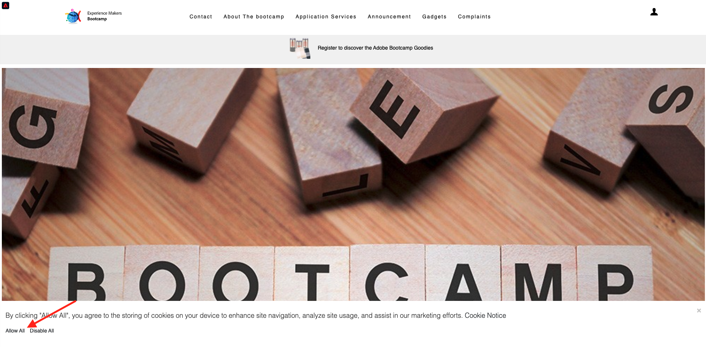

# 1.1 De desconocido a conocido en el sitio web

## Contexto

El recorrido de desconocido a conocido es uno de los temas más importantes entre las marcas en estos días, al igual que el recorrido del cliente desde la adquisición hasta la retención.

Adobe Experience Platform juega un papel enorme en este recorrido. La plataforma es el cerebro de la comunicación, la **sistema de registro de experiencias**.

Platform es un entorno en el que la palabra cliente es más amplia que solo los clientes conocidos. Un visitante desconocido en el sitio web también es cliente desde la perspectiva de Platform y, como tal, todo el comportamiento como visitante desconocido también se envía a Platform. Gracias a este enfoque, cuando este visitante finalmente se convierte en un cliente conocido, una marca también puede visualizar lo que sucedió antes de ese momento. Esto ayuda desde la perspectiva de la atribución y la optimización de la experiencia.

## Flujo de recorrido del cliente

Vaya a [https://bootcamp.aepdemo.net](https://bootcamp.aepdemo.net). Haga clic en **Permitir todo**.

Haga clic en el icono del logotipo de Adobe en la esquina superior izquierda de la pantalla para abrir el Visor de perfiles.

Consulte el panel Visualizador de perfiles y el perfil del cliente en tiempo real con el **ID de Experience Cloud** como identificador principal para este cliente actualmente desconocido.

También puede ver todos los eventos de experiencias que se recopilaron en función del comportamiento del cliente. La lista está vacía actualmente, pero eso cambiará pronto.

Vaya a la **Servicios de aplicaciones** y haga clic en el producto **Real-Time CDP**.

A continuación, verá la página de detalles del producto. Un evento de experiencia de tipo **Vista del producto** se ha enviado a Adobe Experience Platform mediante la implementación del SDK web que revisó en el módulo 1. Abra el panel Visor de perfiles y eche un vistazo a su **Eventos de experiencias**.

Vaya a la **Servicios de aplicaciones** y haga clic en el producto **Adobe Journey Optimizer**. Se ha enviado otro evento de experiencia a Adobe Experience Platform.

Abra el panel Visor de perfiles . Ahora verá dos eventos de experiencia de tipo **Vista del producto**. Aunque el comportamiento es anónimo, se realiza un seguimiento de cada clic y se almacena en Adobe Experience Platform. Una vez que el cliente anónimo sea conocido, podremos fusionar todo el comportamiento anónimo automáticamente con el perfil conocido.

Ahora analicemos su perfil de cliente y luego usemos su comportamiento para personalizar su experiencia de cliente en el sitio web.

Paso siguiente: [1.2 Visualizar su propio perfil de cliente en tiempo real: IU](./ex2.md)

[Volver al flujo de usuario 1](./uc1.md)

[Volver a todos los módulos](../../overview.md)
