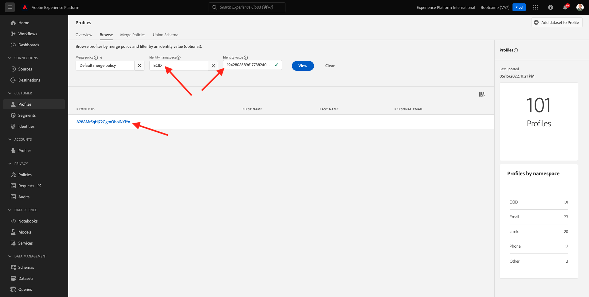

# 1.2 Visualizar seu próprio de la memoria del cliente em tempo real

Neste exercício, você irá fazer login en Adobe Experience Platform e seu próprio Perfil de cliente em tempo real na UI.

## História

No Perfil do cliente em temações de segmentos existentes. Os entregados a los buscados podem vir de qualquer lugar, de aplicaciones de Adobe e soluções externas. Essa é a exibição mais poderosa da Adobe Experience Platform, o verdadeiro local do sistema de experiencias.

## 1.2.1 Usar visualizaciones ação do a del cliente na Adobe Experience Platform

Aceses [Adobe Experience Platform](https://experience.adobe.com/platform). Inicio de sesión en Depois de fazer, você irá acessar a post inicial da Adobe Experience Platform.

precisa selecionar um de continuar, você **entorno limitado**. O nome do sandbox a ser seledado é Bootcamp. É possível fazer isso clicando no texto **[!UICONTROL Producción]** na linha azul na parte superior da tela. Depoes de seleê o sandbox apropiado, vocalista: una tela mutela e agora você está em seu [!UICONTROL entorno limitado] dedicado.

No menú à esquerda, acesse **Perfiles** e **Examinar**.

No hay dolor Visualizador de las páginas web del consejo, vocero pode encontrar visão geral da identidade. Cada identidade está vinculada un espacio de nombres um.

No hay dolor Visualizador de la memoria agora você pode ver esta identidade:

| Área de nombres | Identidad |
|:-------------:| :---------------:|
| Experience Cloud ID (ECID) | 19428085896177382402834560825640259081 |

Com a Adobe Experience Platform, todos los ID são igualmente importantes. Anterior ormente, o ECID era o ID mayor sin contexto da Adobe e todos outros IDs estavam vinculados ao ECID em uma relação jerarquía. Com a Adobe Experience Platform, es tan mudou e cada pode de ID ser considerado um principal.

Normalmente, o primário dependiente do contexto. Se você perguntar ao seu Call Center: **¿Cara de ID mayor de importancia?** Eles provavelmente responderão: **¡o número de telefone!** Mas se você perguntar à sua equipe de CRM, otros responderão: **o endereço de e-mail!** Una Adobe Experience Platform entende essa complexidade e gerencia es para você. Cada aplicativo, seja um aplicativo da Adobe ou não, se comunicará com un Adobe Experience Platform referindo-se ao ID que Consideram principal. E simple funciona.

Para o campo **Área de nombres de identidad**, selecione **ECID** e para campo **Valor de identidad** insira o ECID que você pode encontrar no dolor Visualizador de las páginas del sitio do Bootcamp. Clique **Ver**. Você verá una reseña. Clique no **ID de perfil** para abrir seu.

Agora você tem uma visão geral de alguns **Atributos de memoria** importantes do seu archivos de cliente.

Aceses **Eventos**, el você rubio pode ver como entradas de cada evento de experiência vinculado ao seu Perfil.

Por fim, acceso a un menú opção de **Pertenencia a segmentos**. Agora verá ê segmentos que se calificam para este.

Agora vamos criar um novo segmento que que você que personência do cliente para cliente anônimo ou conhecido.

Próxima etapa: [1.3 segmento de ámbito: IU](./ex3.md)

[Retornar para Fluxo de Usuário 1](./uc1.md)

[Retornar para Todos los Módulos](../../overview.md)
