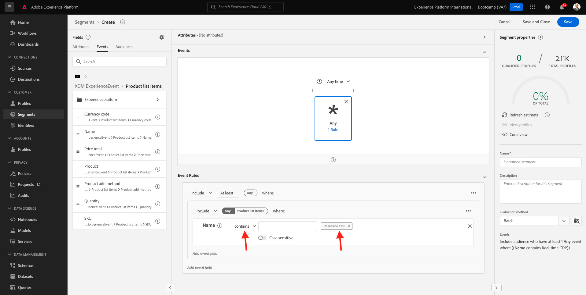

# 1.3 segmento de ámbito: IU

Neste exercício, você irá criar um segmento umentos o Adobe Experience Platform.

## História

Aceses [Adobe Experience Platform](https://experience.adobe.com/platform). Inicio de sesión en Depois de fazer, você irá acessar a post inicial da Adobe Experience Platform.

precisa selecionar um de continuar, você **entorno limitado**. O nome do sandbox a ser selector é é ``Bootcamp``. É possível fazer isso clicando no texto **[!UICONTROL Producción]** na linha azul na parte superior da tela. Depoes de seleê o sandbox apropiado, vocalista: una tela mutela e agora você está em seu [!UICONTROL entorno limitado] dedicado.

No menú à esquerda, acesse **Segmentos**. Nesta página, você tem uma visão geral de todos los segmentos existentes. Clique no botão + Criar segmento para cómar un criar um novo segmento.

Quando estiver no novo constructor de segmentos, você irá perciber imediatamente a opção de menu **Atributos** e a referência do **Perfil individual XDM**.

Como o XDM é a linguagem que alimenta o setor de experiência, o XDM também é a base para construcción de segmentos. Todos los os dados ingeridos na plataforma devem ser mapeados em relaçao XDM e, portanto, todos os dados se tornam parte do mesmo modelo de dados, independientemente de su origen. Isso ofrece uma grande vantagem ao criar segmentos, pois a partir dessa interface do usuário do construtor de segmento, é possível combinar dados de qualquer origem no mesmo fluxo de trabalho. Os segmentos criados no Constructor de segmentos podem ser enviados para soluções como Adobe Target, Adobe Campaign e Adobe Audience Manager para ativação.

Agora você precisa criar um segmento de todos los clientes que visualizaram o produto **Real-Time CDP**.

Para construir este segmento, você precisa adicionar um Evento de experiência. Você pode encontrar todos os Eventos de experiência clicando no ícone **Eventos** barra del menú **Campos**.

Em seguida, você será o nó **ExperienceEvents de XDM** do nível superior. Clique **XDM ExperienceEvent**.

Aceses **Elementos de lista de productos**.

Selecione **Nombre** e arraste e solte o objeto **Nombre** do menu à esquerda na tela do constructor de segmentos na seção **Eventos**. Em seguida, o seguinte Será exibido:

O parâmetro de comparação deve ser **es igual que** e, sin entrada de campo, insira **CDP en tiempo real**.

Ssiempre que adicionar elemento ao constructor de segmentos, você pode clicar no botão **Actualizar estimación** para obter uma nova estimativa da população em seu segmento.

Para **Método de evaluación**, selecione **Edge**.

Por fim, vamos dar um nome ao seu segmento e salvá-lo.

Como modelo de nomenclatura, usar:

- `seuSobrenome - Interest in Real-Time CDP`

Em seguida, clique no botão **Guardar y cerrar** párr salvar seu segmento.

Agora você irá retornar à página de visão geral do segmento, onde verá uma visualização de amostra dos perfis de clientes que se calificam para o seu segmento.

Agora você pode continuar no próximo exercício e usar seu segmento com o Adobe Target.

Próxima etapa: [1.4 Ação: envie seu segmento para o Adobe Target](./ex4.md)

[Retornar para Fluxo de Usuário 1](./uc1.md)

[Retornar para Todos los Módulos](../../overview.md)
