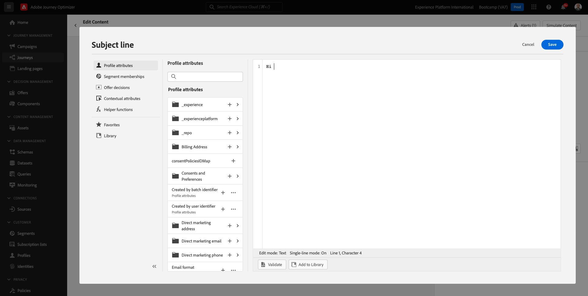

# 2.3 Crie sua durante e mensagem de e-mail

Neste exercício, você irá configurar una jornada que precisa ser acionada quando alguém criar uma conta no site de demostração.

Inicio de sesión en Facebook en Adobe Journey Optimizer access a [Adobe Experience Cloud](https://experience.adobe.com). Clique **Journey Optimizer**.

Você será redireasí para una visualización **Página principal**  sin Journey Optimizer. Primeiro verifique se você está está o sandbox correto. O nome do sandbox que deve ser usado `Bootcamp`. Para alternar de um sandbox para outro, clique em **Prod** e selecione o sandbox na lista. Neste exemplo o nome do sandbox é **Bootcamp**. Você estará na visualização da **Página principal** do seu sandbox `Bootcamp`.

## 2.3.1 Criar a una superjornada

No menú à esquerda, clique em **Recorridos**. Em seguida, clique em **Crear Recorrido** para criar uma nova jornada.

Você será uma tela de vana jornada.

No exercício anterior, você criou um novo **Evento**. Você nomeou o evento `seuSobrenomeAccountCreationEvent` e substituiu `seuSobrenome` pelo seu sobrenome. Este foi o resultado da criação do Evento:

Agora você deve considerar este evento como o início desta Jornada. Você pode fazer es indo para o lado esquerdo da tela e procurando pelo seu evento na lista de eventos.

Selecione seu, incluso, arraste e solte o evento na tela de Jornada. Sua Jornada agora deve ser semelhante ao seguenció:

Como segunda etapa jornada, você deve adiuma etapa curta **Espera**. Vá para o lado esquerdo da tela até a seção **Organización** el párrafo encontrar es así. Você usará atributos de página y precisión sará garantir que que jam preenchidos no Perfil do Cliente em tempo real.

Sua jornada agora deve ser semelhante ao seguinte. No lado direito da tela você precisa o tempo de espera. Defina como 1 minuto. Isso dará tempo para que que atributos el archivo estejam íveis após os oi evento.

Clique **Ok** para salvar suas alterações.

Como terceira etapa da jornada, você deve adiuma ação **Correo electrónico**. Vá para o lado esquerdo **Acciones**, selecione a ação **Correo electrónico** e arraste e solte a ação no segundo nó da sua jornada. Agora o seguinte será exibido.

Defina a **Categoría** como **Marketing** e selecione uma **superficie de correo electrónico** que permita envio de correo electrónico. Nesse caso, **superficie de correo electrónico** un usuario selecionada e-mail. Certifique-se de que as caixas de seleção **Clics en correos electrónicos** e **aperturas por correo electrónico** estejam marcadas.

Un próximo etapa é criar sua mensagem. Para isso, clique em **Editar contenido**.

## 2.3.2 Criar a sua mensagem

Para criar sua mensagem, clique em **Editar contenido**.

O seguinte será exbido.

Clique no campo de texto **Línea de asunto**.

Na área de texto, orden de inclusión **Olá**

A linha de assunto ainda não está pronta. Em seguida, você precisa trazer o token de personação para o **Nombre** que está armazencadem `profile.person.name.firstName`. No menú à esquerda, rol para baixo para encontrar o elemento **Persona** e clique na seta para visualizar mais campos

Agora encontre o elemento **Nombre completo** e clique na seta para visualizar mais campos.

Por fim, localiza a campo **Nombre** e clique no **+**  ao lado dele. Você para token de personação aparecer no campo de texto.

Em seguida, adicione o texto **¡agradecemos a sua inscrição!**. Clique **Guardar**.

Então, você irá retornar para esta tela. Clique **Diseñador de correo electrónico**  para criar o conteúdo do e-mail.

Na próxima tela, solicitado que você forneça o conteúdo do e-mail através de 3 métodos diferentes:

- **Diseño desde cero**: Comece com uma tela em branco uso del editor WYSIWYG para arrastar e soltar a estrutura e os componentes de conteúdo para criar visualmente o conteúdo do e-mail.
- **Codifique sus propios**: Crie seu próprio modelo codificando HTML por correo electrónico
- **Importar HTML**: Importum modelo HTML existente, que você editar.

Clique **Importar HTML**.

Arquivo **mailtemplatebootcamp.html**, que você pode baixa [aqui](../../assets/html/mailtemplatebootcamp.html.zip). Clique em Importar.

Você modelo de correo electrónico padrão:

Vamos personalizar correo electrónico. Clique ao lado do texto **Olá** e, em seguida, clique no ícone **Añadir personalización**.

Em seguida, você precisa trazer o token de personação **Nombre** que está armazencadem `profile.person.name.firstName`. Sin menú, localice o elemento **Persona**, faça uma busca detal no elemento **Nombre completo** e clique no ícone **+** párr. **Nombre** editor ao.

Clique **Guardar**.

Agora você como o campo de personação foi adimentitor ao seu texto.

Clique **Guardar** para salvar sua mensagem.

Retorne para o dolel de mensagens clicando na seta ao lado do texto linha de assunto no canto superior esquerdo.

Agora você concluiu a criação do seu e-mail de cadastro. Clique na seta no canto superior esquerdo para tornar à sua jornada.

Clique **Ok**.

## 2.3.3 Publicar una jornada de subjornada

Você ainda precisa dar um Nome en una jornada parcial. Você pode fazer isso clicando no ícone **Propiedades** no canto superior direito da tela.

Você pode fazer isso clicando no elemento click ningún elemento &quot;Nombre&quot; e inserindo o seguinte nome `yourLastName - Account Creation Journey`. Clique **OK** para salvar como mudanças.

Agora você podo publicar sua jornada **Publicación**.

Clique **Publicación**  novamente.

Você uma barra de confirmación verde informando que sua agora está Publicada.

Você terminou este exercício.

Próxima etapa: [2.4 Sesión de prueba](./ex4.md)

[Retornar para Fluxo de Usuário 2](./uc2.md)

[Retornar para Todos los Módulos](../../overview.md)