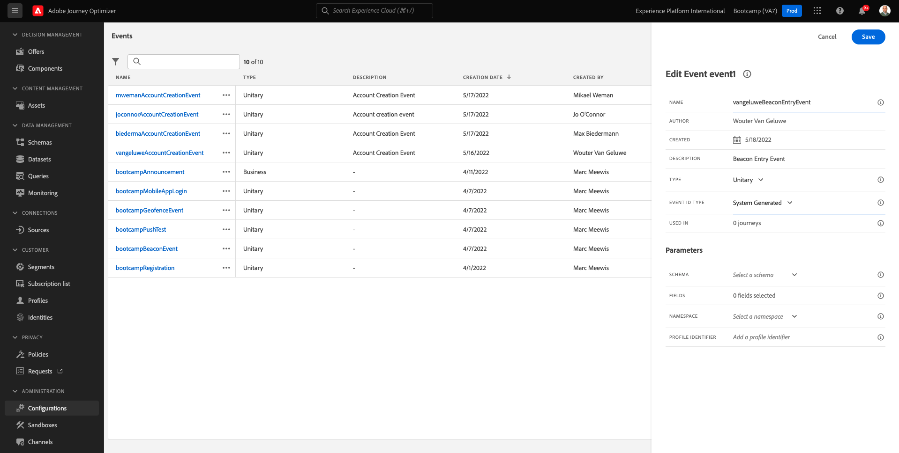

# 3.2 Cría de eventos

Iniciar sesión en Adobe Journey Optimizer acessando a [Adobe Experience Cloud]. Clique em **Journey Optimizer**.

Você será reorientado para a **Inicio** no hay Journey Optimizer. Primeiro, verifique se você está usando sandbox correto. O nome do sandbox que deve ser usado é `Bootcamp`. Para alternar de um sandbox para outro, clique em **Prod** e selecione o sandbox na lista. Neste ejemplo, o nome do sandbox é **Bootcamp**. Você estará en visualización da **Inicio** zona protegida de do seu `Bootcamp`.

No menu à esquerda, role para baixo e clique em **Configuraciones**. Em, grupo no botão **Administrar** em Eventos.

Você verá uma visão geral de todos los eventos disponíveis. Clique em **Crear evento** para venir a criar seu próprio evento.

Uma nova janela de evento vazia.

Em primeiro lugar, dê um nome ao seu evento como, por ejemplo: `yourLastNameBeaconEntryEvent` e adicione uma descripción como, por ejemplo: `Beacon Entry Event`.

Em, certifica-se de que **Tipo** está definido como **Unitario** e, para a seleção de **Tipo de ID de evento**, selecione **Sistema generado**.

Una etapa seguinte é a seleção do schema. Um esquema para preparar este ejercicio. Uso del esquema `Demo System - Event Schema for Mobile App (Global v1.1) v.1`.

Depois de selecionar o Schema, você verá vários campos sendo selecionados na seção **Campos**. Agora você deve passar o mouse sobre a seção **Campos** e três ícones pop-up serão exibidos. Categoría no disponible de **Editar**.

Você va uma janela pop-up de **Campos**, onde você deve selecionar algunos s dos campos que precisamos para personalizar una jornada. Escolheremos outros de perfil, os dados já existe na Adobe Experience Platform

Role para baixo até ver o objeto `Place context` e marque a caixa de seleção. Com isso, todo o contexto da localização do cliente será disponibilizado para a jornada. Clique em **Ok** para salvar sus alteraciones.

Em, el você deverá ver a tela abaixo. Clique em **Guardar** mais uma vez para salvar suas alterações.

Seu evento agora está e salvo.

Clique no seu evento novamente para abrir una tela **Editar evento** mais uma vez. Pasa el ratón sobre **Campos** para ver os 3 ícones. Clique no ícone **Ver**.

Ágora você verá um ejemplo do payload esperando.
Seu evento tem um eventID de orquestração único, que você pode encontrar rolando para baixo nessa carga útil até visualiza `_experience.campaign.orchestration.eventID`.

O eventID é o que deve ser publicado à Adobe Experience Platform para acionar a jornada que você construir em um dos próximos exercícios. Lembre-se deste eventID, você pode precisar dele posteriormente.
`"eventID": "e76c0bf0c77c3517e5b6f4c457a0754ebaf5f1f6b9357d74e0d8e13ae517c3d5"`

Clique em **Ok** e, em, clique em **Cancelar**.

Você terminou este ejercicio.

Próxima etapa: [3.3 Crie sua jornada e notificação push](./ex3.md)

[Hoteles cerca de Fluxo de Usuário 3](./uc3.md)

[Retornar para Todos los Módulos](../../overview.md)
