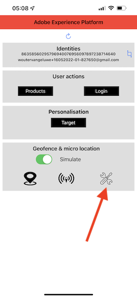
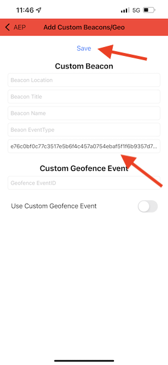

# 3.4 Probar el recorrido

Para probar el recorrido, deberá utilizar el ID de evento del evento que creó en el ejercicio 3.2, que tiene este aspecto.

El ID de evento es lo que debe enviarse a Adobe Experience Platform para almacenar en déclencheur el recorrido. En este ejemplo, eventID es:
`e76c0bf0c77c3517e5b6f4c457a0754ebaf5f1f6b9357d74e0d8e13ae517c3d5`.

Abra la aplicación móvil y vaya a la página principal. Haga clic en el icono **Configuración**.

Pegar el eventID en el campo **ID de evento de señalización** y haga clic en **Guardar**.

Antes de continuar, abra esta página web en su equipo: [https://bootcamp.aepdemo.net/content/aep-bootcamp-experience/language-masters/en/screen.html](https://bootcamp.aepdemo.net/content/aep-bootcamp-experience/language-masters/en/screen.html)

Verá esto:

A continuación, vuelva a la página principal. Haga clic en el **señalización** icono.

Entonces verás esto. Primero, seleccione **Señalización de pantalla de Bootcamp** y, a continuación, haga clic en la **entrada** botón. Esto le permite simular una entrada de señalización.

Ahora, echen un vistazo a la pantalla de la tienda. Verá que el último producto que vio aparece allí en 5 segundos.

También habrá recibido la notificación push.

Ya has terminado este ejercicio.

[Volver al flujo de usuario 3](./uc3.md)

[Volver a todos los módulos](../../overview.md)
