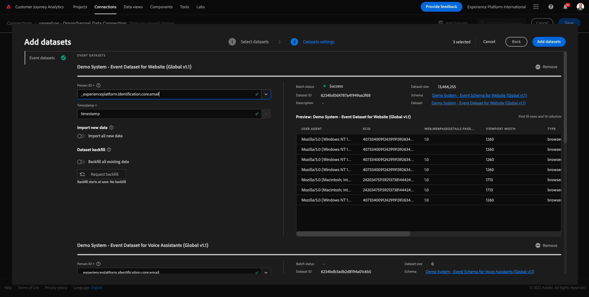

# 4.2 Conecte conjuntos de datos da Adobe Experience Platform no es Customer Journey Analytics

## ones

- Preparación de una interfaz de usuario de conexão de datos
- Traga os dados da Adobe Experience Platform para CJA
- Entenda a ID da pessoa e a compilação de dados
- Recorrido del cliente sobre el modo de concebir de streaming de dados

## 4.2.1 Conexão

Aceses [analytics.adobe.com](https://analytics.adobe.com) para el Customer Journey Analytics.

Na inicial do Customer Journey Analytics, acesso **Conexiones**.

Aqui você pode ver y todas como diferentes conexões feitas entre o CJA e a Plataforma. Essas conexõm o mesog. dos piezas de relacionórios No entanto, una coleta dos están en orden diferente. Todos os dados vêm de datasets de Adobe Experience Platform.

Vamos criar sua primeira conexão. Clique **Crear nueva conexión**.

Você representará una interfaz de usuario **Crear conexión** IU.

Agora você pode dar um nome à sua conexão.

Use este modelo de nomenclatura: `yourLastName – Omnichannel Data Connection`.

Ejemplo: `vangeluw - Omnichannel Data Connection`

Você ém deve selecionar o sandbox correto para usar. No hay espacio aislado para menús, selecione seu sandbox, que deve ser `Bootcamp`. Neste exemplo o sandbox a ser usado é o **Bootcamp**. E você também deve definir o **Cantidad promedio de eventos diarios** a **menos de 1 millón**.

Após selecionar seu sandbox, você pode cómçar a adiecionar datasets a esta conexão. Clique **Agregar conjuntos de datos**.

## 4.2.2 Conjuntos de datos de Selecione da Adobe Experience Platform

Personalización de un conjunto de datos `Demo System - Event Dataset for Website (Global v1.1)`. Clique **+** para adicionar un conjunto de datos a esta conexão.

Agora pesquise e marque caixas de seleção `Demo System - Event Dataset for Voice Assistants (Global v1.1)` y `Demo System - Event Dataset for Call Center (Global v1.1)`.

Em seguida, você verá a tela abaixo. Clique **Siguiente**.

## 4.2.3 ID da pessoa e compilação de dados

### ID da pessoa

O agets é juntar. Para cada dataset seleestudia, você y campo chamado **ID de persona**. Cada conjunto de datos tem seu próprio campo de ID de pessoa.

Como você pode ver, una maioria se trata de ellos o ID da pessoa seleestudiamente automáticamente. Isso ocore em gingius principal é seleestudiada esquema un Adobe Experience Platform. Como exemplo, aquí está o esquema para `Demo System - Event Schema for Call Center (Global v1.1)`, onda você podo ver que o Identificador Primário está definido como `phoneNumber`.

No entanto, você ainda pode influenciar qual indicio usado será para compilar conjuntos de datos para sua conexão. Você pode usar qualquer configurado identificador no esquema vinculado ao seu dataset. Haga clic en el menú suspenso para explorar de los ID de os disponíveis em cada conjunto de datos.

Conforme mencionado, você pode definir diferentes IDs de pessoa para cada conjunto de datos. Isso reunir conjuntos diferentes de datos de múlti plas no CJA. Imaginen al trazador NPS ou pesqu dados de isa que serimuito interessantes e úteis para compreder o contexto de um aconteci mento.

O nome do da pessoa não é importante, desde que el campo de campos ID da pessocampo a. Digamos que temos `email` conjunto de datos em um e `emailAddress` conjunto de datos em outro definido como ID da pessoa. Se `delaigle@adobe.com` tiver o mesmo valor para o campo ID da pessoa em ambos datasets, o CJA poderá compilar os dados.

Atualmente, exstem algumas outras limitações, como compilar o comportamiento anônimo para conhecido. Consultar como perguntas frecuentes aqui: [Preguntas frecuentes](https://experienceleague.adobe.com/docs/analytics-platform/using/cja-overview/cja-faq.html?lang=es).

### Compilando os hijos de la ID da pessoa

Agora que compreende de compilar datos y que el voco de la persona escolher `email` como ID da pessoa para cada conjunto de datos.

Acesse cada dataset para atualizar o ID da pessoa.

Agora preencha o campo ID da pessoa escolhendo o `email` na lista suspensa.

Depois de compilar os três datasets, estamos prontos para continuar.

| Conjunto de datos | ID de la persona |
| ----------------- |-------------| 
| Sistema de demostración: conjunto de datos de evento para sitio web (Global v1.1) | email |
| Sistema de demostración: conjunto de datos de evento para asistentes de voz (Global v1.1) | email |
| Sistema de demostración: conjunto de datos de evento para el centro de llamadas (Global v1.1) | email |

Você também precisa garantir que, para cada dataset, essas opções estejam habilitadas:

- Importar todos los novos:
- El presidente existentes
- Preenscher de Fonte de dados com &quot;Otros&quot;
- Preencher a description ção com o mesmo nome do Dataset

Clique **Agregar conjuntos de datos**.

Clique **Guardar** e vá para o próximo exercício. Depois de criar sua **Conexión**, pode levar algumas horas até que seus dados estejam disponíveis no CJA.

Próxima etapa: [4.3 Crie uma Visualização de Dados](./ex3.md)

[Retornar para Fluxo de Usuário 4](./uc4.md)

[Retornar para Todos los Módulos](./../../overview.md)
