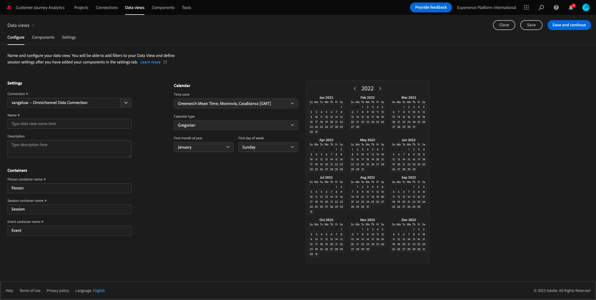
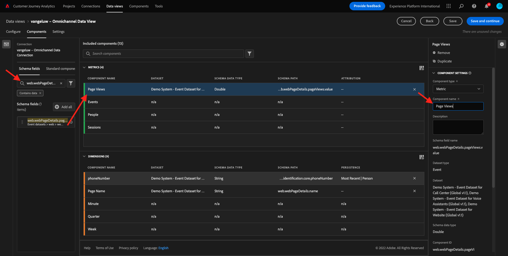

# 4.3 Crie uma Visualização de Dados

## ones

- Entenda a UI de Visualização de Dados
- Compreenda como configurações básicas de definición de visita
- Compreenda a attribute ição e a Persistência em uma Visualização de

## 4.3.1 Visualización de la ção de Dados

Agora, com sua conexão concluída, é possível progredir para influenciar una visualización. Uma diferença entre o Adobe Analytics e o CJA é que o CJA precisa de uma visualização de dados para limpar e preparar os dados dados da visualização.

Uma Visualização de Dados é semelhante ao conceito de Virtual Report Suites no Adobe Analytics, onde você establece como definições de visita com reconhecimento de contexto, filtragem e também os como são chamados.

Será necesario, no, uma Visualização de Dados por conexão. No entanto, para alguns casos de uso, é ótimo ter múlti plas Visualizações de Dados para a mesma conexão, com o de fornecer insights diferentes para equipamientos distintas Se você deseja que sua empresa seja orientada por dados, deve adaptar un forma como os dados são vistos em cada equipo. Alguns extempla:

- Métrica de UX para un equipo de UX
- Use os mesmos nomes para KPI e para o Google Analytics e para o Customer Journey Analytics, para que a equie de álise digital fale métricas análogo 1.
- Visualização de Dados filtrada, por mostrar exemplo, Apenas para mercado, ou uma marca, ou Apenas Dispositivos Móveis.

Na tela **Conexiones** marque a caixa de seleção da conexão que você acabou de criar. Clique  **Crear vista de datos**.

Você será redirecierto para fluxo de trabalho **Crear vista de datos** flujo de trabajo.

## 4.3.2 Definição de Visualização de Dados

Agora você pode configurar como definições básicas para sua Visualização de dados.

A **Conexión** que você criou no exercício anterior já está selecionada. Sua conexão se chama `yourLastName – Omnichannel Data Connection`.

Em seguida, dê um nome à sua Visualização de ados seguindo este modelo de nomenclatura: `yourLastName – Omnichannel Data View`.

Insira o mesmo valor para una descripción: `yourLastName – Omnichannel Data View`.

| Nombre | Descripción |
| ----------------- |-------------| 
| `yourLastName – Omnichannel Data View` | `yourLastName – Omnichannel Data View` |

Para **Zona horaria**, selecione o fuso horário **Berlim, Estocolmo, Roma, Berna, Bruxelas, Viena, Amsterdã GMT+01:00**. Este é um cenário realmente interessante, pois algumas empresas operam em diferentes. e geografias. Alocar o horário certo para cada país evitará erros políticos de dados, por exemplo, acreditar que a maioria das pessoas compra camisetas às 4h en Perú.

Você também pode modificación a nomenclatura das métricas principios (Pessoa, Sessão e Evento). Isso não é obrigatório, mas alguns clientes gostam de usar Pessoas, Visitas e Acessos em vez de Pessoa, Sessão e Eventos (convención de la nomenclatura del Customer Journey Analytics).

Agora você deve ter as seguintes configurações definidas:

Clique **Guardar y continuar**.

## 4.3.3 Componentes da Visualização de Dados

Neste exercício, vocirá configurar los componentes necesarios para analisar los dados e visualizá os los idea de Analysis Workspace. Nesta IU, há três y principios:

- Lado esquerdo: acerca de los selepers de conjuntos de datos
- Meio: Contadores à Visualização de Dados
- Lado direito: Configurações do

>[!IMPORTANT]
>
>Se você não encontrar uma ou dimensão específica, verifique se o campo `Contains data` foi removido de sua visualização de dados. Caso contrário, exclua esse campo.
>
>

Agora você precisa arrastar e soltar os componentes necesarios para a análida nos **Componentes añadidos**. Para isso, você deve seleos componentes no menú à esquarrastá-los soltá-los no meio.

Vamos com com o primeiro ¿Qué pasa? **Nombre (web.webPageDetails.name)**. Pesquise esse e arraste-o e solte-o na tela

Esse como vocar da leitura do campo do campo `(web.webPageDetails.name)`.

No entanto, utilizar **Nombre** como o nome não é a melhor convocção de la nomenclatura para usuário corporate preender rápidamente essa dimensão.

Vamos mudar o nome para **Nombre de la página**. Clique no e renomeie na **Configuración de componentes**.

Como Configurações de persistência são **Configuración de persistencia**. Os conceitos de eVars e prop não existem no CJA, mas as configurações de Persistência possibilitam um comportamiento semelhante.

Se você não alterar essas configuraões, o CJA interprete a dimensão como um um **Prop** (nível de ocorência). Além disso, puede alterar a Persistência para tornar a dimensão uma **eVar** (persistir al valor de longo da durante la jornada).

Se você não estiver familiarizado com eVars e Props, [leia mais sobre isso na documentação](https://experienceleague.adobe.com/docs/analytics/landing/an-key-concepts.html)...

Vamos deixar de Nome da Página como Prop. Dessa forma, você não precisa alterar nenhuma **Configuración de persistencia**.

| Nombre del componente para buscar | Nuevo nombre | Configuración de persistencia |
| ----------------- |-------------| --------------------| 
| Nombre (web.webPageDetails.name) | Nombre de página |  |

Em seguida, escolha a dimensão **phoneNumber** e solte-a na tela. O novo nome deser **Número de teléfono**.

Por fim, vamos alterar como Configurações de persistência, pois o Número do Celular deve persistir no nível do usuário.

Para alterar a Persistência, rol para baixo no menu à direita e abra a aba aba **Persistencia**:

Marque a caixa de seleção para modificar como configurações de persistencia. Selecione **Más reciente** e o escopo **Persona (ventana Sistema de informes)**, pois nos aaamos com com o último número de segmento da pessoa. Se o cliente não preencher o celuem visitas, você ainda esse valor preenchido.

| Nombre del componente para buscar | Nuevo nombre | Configuración de persistencia |
| ----------------- |-------------| --------------------| 
| phoneNumber | N.º de teléfono | Más reciente, Persona (ventana de informes) |

próximo. `web.webPageDetails.pageViews.value`.

No hay menú a esquerda, pesquise `web.webPageDetails.pageViews.value`. Arraste e solte esa noche.

Altere o nome para **Vistas de páginas** en el **Configuración de componentes**.

| Nombre del componente para buscar | Nuevo nombre | Configuración de atribución |
| ----------------- |-------------| --------------------| 
| web.webPageDetails.pageViews.value | Page Views |  |

Para como configurações de attribute ição, deixaremos em branco.

Observação: Como configurações de persistência nas métricas também podem ser alteradas en Analysis Workspace. Em alguns casos, você pode optar por configurá-las aqui para evitar que os usuários de negócios tenham que pensar qual é o melhor modelo de persistencia.

Em seguida, você terá que configurar várias Dimensões e Métricas, indicado una tabela abaixo.

### DIMENSIONES Y SINTAXIS

| Nombre del componente para buscar | Nuevo nombre | Configuración de persistencia |
| ----------------- |-------------| --------------------| 
| brandName | Nombre de la marca | Más reciente, sesión |
| llamada | Sensación de llamada |  |
| ID de llamada | Tipo de interacción de llamada |  |
| callTopic | Tema de llamada | Más reciente, sesión |
| ecid | ECID | Más reciente, Persona (ventana de informes) |
| email | ID de correo electrónico | Más reciente, Persona (ventana de informes) |
| Tipo de pago | Tipo de pago |  |
| Método de adición de productos | Método de adición de productos | Más reciente, sesión |
| Tipo de evento | Tipo de evento |  |
| Nombre (productListItems.name) | Nombre del producto |  |
| SKU | SKU (sesión) | Más reciente, sesión |
| El ID de transacción | El ID de transacción |  |
| URL (web.webPageDetails.URL) | URL |  |
| Agente de usuario | Agente de usuario | Más reciente, sesión |

### MÉTRICA

| Nombre del componente para buscar | Nuevo nombre | Configuración de atribución |
| ----------------- |-------------| --------------------| 
| Cantidad | Cantidad |  |
| commerce.order.priceTotal | Ingresos |  |

Sua configuração deve ser semelhante ao seguenció:

Não se esqueça de Salvar sua Visualização de Dados. Então clique em **Guardar**.

## 4.3.4 Métricas calculadas

Embora tenhamos organizados todos os componentes na Visualização de dados, você ainda deve adaptar alguns para que os usuários de negócios estejam prontos para iniciar como análises.

Se você se lembra, não trouxemos específicamente Métodos Médicos como Adicionar ao Carrinho, Visualização do produto ou Compras para a Visualização de dados. Sin entanto, temos uma dimensão chamada: **Tipo de evento**. Então, vamos derivar ess de interação criando 3 métricas calculadas.

Vamos cómçar com a primeira Métrica: **Vistas del producto**.

No lado esquerdo, pesquise **Tipo de evento** e selecione a dimensão. Em seguida, arraste-o e solte-o na tela **Componentes incluidos**.

Clique para selecionar una nova contra el rey **Tipo de evento**.

Agora altere o a describe ção do para os seguintes.

| Nombre del componente | Descripción del componente |
| ----------------- |-------------| 
| Vistas del producto | Vistas del producto |

Agora vamos a cumplir con pena de muerte **Vistas del producto**. Para fazer isso, función para baixo em **Configuración de componentes** Té ver valores de **Incluir valores de exclusión**. Certifique-se de habilitar a opção **Definir valores de inclusión/exclusión**.

Como Apenas **Vistas del producto**, especifique **commerce.productViews** nos critérios.

Agora un sua calculada está pronta!

Em seguida, repita o mesmo processo para os eventos **Agregar al carro** e **Compra**.

### Agregar al carro

Primeiro, arraste e solte a mesma dimensão **Tipo de evento**.

Você um alerta pop-up de Campo Duplicado, pois acerca de mesma variável Clique **Agregar de todos modos**:

Agora, siga o mesmo procesque fizemos para una vida Visualizações producto:
- Primeiro altere o nome e a description.
- Por fim, adicione **commerce.productListAdd** como critério para Agregar al carro

| Nombre | Descripción | Criterios |
| ----------------- |-------------| -------------|
| Agregar al carro | Agregar al carro | commerce.productListAdds |

### Compras

Primeiro, arraste e solte a mesma dimensão **Tipo de evento** como fizemos para as duas métricas anteriores.

Você um alerta pop-up de Campo Duplicado, pois acerca de mesma variável Clique **Agregar de todos modos**:

Agora, siga o mesmo processo que fizemos para como métricas Vistas de productos e Añadir al carro:
- Primeiro altere o nome e a description.
- Por fim, adicione **commerce.purchases** como critérios para contabili zar as compras

| Nombre | Descripción | Criterios |
| ----------------- |-------------| -------------|
| Compras | Compras | commerce.purchases |

Sua configuração final deve ser semelhante ao seguinte. Clique **Guardar y continuar**.

## 4.3.5 Componentes da Configuração de Dados

Você deve ser redirecierto para esta tela:

Nesta aba, você pode modificación algumas configurações importantes para alterar un forma como los dados são processados. Vamos por definir **Tiempo de espera de sesión** como 30 min. Graças ao registro de datos e hora de cada evento de experiência, você pode estender o concierto de uma sessão em todos os canais. Por exemplo o que acontece se cliente ligar para o call center depois de visitar o site? Usando Tempão de Sessão, você tem muflexibilidade para decidir o que é uma sessão e como essa sessão irá mesclar os dados.

Noutras como filtrar esta você segmento/filtro. Você não precisará fazer isso neste exercício.

Quando terminar, clique em **Guardar y finalizar**.

>[!NOTE]
>
>Você pode voltar a esta Visualização de posteriormente e alterar como configurações e os componentes a qualquer mejor momento. Como alterações afetarão a forma como os históricos são buscados.

Agora você pode continuar com a parte de visualização e análise!

Próxima etapa: [4.4 Preparação de dados em Customer Journey Analytics](./ex4.md)

[Retornar para Fluxo de Usuário 4](./uc4.md)

[Retornar para Todos los Módulos](./../../overview.md)
