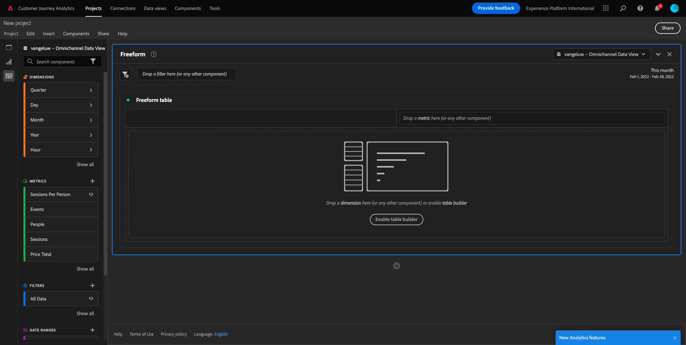

# 4.4 Preparación de datos en Customer Journey Analytics

## Objetivos

- Entenda a UO do Analysis Workspace no CJA
- Entenda los conceptos de preparación de datos en Analysis Workspace
- Aprenda un fazer de datos

## 4.4.1 IU hacer Analysis Workspace en CJA

O Analysis Workspace eliminar todas como limitações típicas de um único relatório do Analytics. Ele fornece uma tela robusta e flexível para criar projetos de analytics personalizados. Arraste e solte qualquer número de tabelas de dados, visualizações e componentes (dimensões,, e granularidades de tempo) para um projeto. Criação instantânea de avarias e, criação de cortes para análise, criação de alertas, comparação de, análise de fluxo e de falhas e relatórios de curadoria e agendamento para compartilhar com qualquer pessoa em seu negócio.

O Customer Journey Analytics traz essa solución além dos dados da plataforma. Ése recomienda que asista a este vídeo de visão geral de quatro minutos:

>[!VIDEO](https://video.tv.adobe.com/v/35109?quality=12&learn=on&enablevpops)

Se você nunca usou o Analysis Workspace antes, se habla en inglés, se habla en inglés, se habla en inglés:

>[!VIDEO](https://video.tv.adobe.com/v/26266?quality=12&learn=on&enablevpops)

### Proyecto Crie Seu

Agora é hora de criar seu primeiro projeto do CJA. Vá para a aba de projetos dentro do CJA. Haga clic en **Crear nuevo**.

Em, el você va a tela abaixo. Seleccione **Proyecto en blanco** ficha **Crear**.

Você verá um projeto vazio.

Primeiro, certifique-se de selecionar a Visualização de dados correta no canto superior direito da tela. Neste ejemplo, a Visualização de dados a ser selecionado é `vangeluwe - Omnichannel Data View`.

Em, você va a salvar el proyecto de dar un nombre a otro. Você pode usar o seguinte comando para salvar:

| Sistema operativo | Método abreviado |
| ----------------- |-------------| 
| Windows | Control + S |
| Mac | Comando + S |

Você verá este pop-up:

Utiliza este modelo de nomenclatura:

| Nombre | Descripción |
| ----------------- |-------------| 
| `yourLastName - Omnichannel Analysis` | `yourLastName - Omnichannel Analysis` |

Em, grupo **Guardar**.

## 4.4.2 Métricas calculadas

Embora tenhamos organizado todos los componentes na Visualização de dados, você ainda deve algunos deles para que os usuários de negócios estejam prontos para iniciar suas análises. Além disso, durante qualquer processo de analytics, você pode criar cálculos para profundizar a descoberta de insights.

Como ejemplo, criaremos uma Taxa de conversão calculada usando una métrica/evento Compras que definimos na Visualização de dados.

## Taxa de conversación

Vamos começar a abrir o construtor de métricas calculadas. Clique em **+** para criar sua primeira Métrica calculada en Analysis Workspace.

O **Creador De Métricas Calculadas**:

Encontre **Purchases** na lista de indicadores no menu do lado esquerdo. Em **Métricas** grupo em **Mostrar todo**

Agora arraste e solte a métrica **Compras** na definição da métrica calculada.

, taxa de conversación significa **Conversiones / Sesiones**. Então, vamos fazer o mesmo calculada... Encontre a métrica **Sessions** e arraste e solte-a no criador de definição, no evento **Purchases**.

Observe que o operador de divisão é selecionado automáticamente.

A taxa de conversão é comumente representada em porcentaje agem. Então, vamos mudar o formato para el porcentaje y selección de 2 casas decimais.

Finalmente, cambie el nombre y la descripción de la métrica calculada:

| Título | Descripción |
| ----------------- |-------------| 
| Tasa de conversión | Tasa de conversión |

Por fim, altere o nome e a descripción da métrica calculada:

Não se esqueça de **Salvar** a Métrica calculada.

## 4.4.3 Dimensiones calculadas: Filtros (segmentação) e intervalos de datos

### Filtros: Dimensões calculadas

No hay nada que ver con el resto de los. Antes de iniciar qualquer análise, também é interessante criar algumas **Calculated Dimensions**. Esto significa, esencialmente, **segmentos** en Adobe Analytics. No hay Customer Journey Analytics, las están en chamados de **Filters**.

A criação de filtros ajudará os usuários de negócios a iniciar o analytics com algumas dimensões calculadas valiosas. Isso algumas tarefas, além de ajudar na parte de adoção. Abaixo estão some s exSERVICE:

1. Mídia Própria, Mídia Paga,
2. Visitas novas x recorrentes
3. Clientes com carrinho abandonado

Esses filtros podem ser criados antes ou durante a parte de análise (o que você fará no próximo exercício).

### Intervalos de datos: Dimensões de tempo calculadas

Como dimensiones de tiempo são outro tipo de dimensiones calculadas. Uno de los temas más importantes de la vida diaria es la lucha contra la pobreza.

Essas Dimensões de tempo ajudarão analistas e usuários de negócios a lembrar datas importantes e usá-las para e alterar o tempo de relatório. Perguntas e dúvidas típicas quando fazemos análises:

- Quando foi a Black Friday do ano passado? ¿Entre los días 21 y 29?
- Quando veiculamos aquela campanha de TV em dezembro?
- De quando a quando fizemos as vendas de verão de 2018? Quero comparar com 2019. A propósito, você sabe os dias exatos em 2019?

Agora você concluiu o exercício de preparação de dados usando o Analysis Workspace do CJA.

Próxima etapa: [4.5 Visualização usando Customer Journey Analytics](./ex5.md)

[Hoteles cerca de Fluxo de Usuário 4](./uc4.md)

[Retornar para Todos los Módulos](./../../overview.md)
