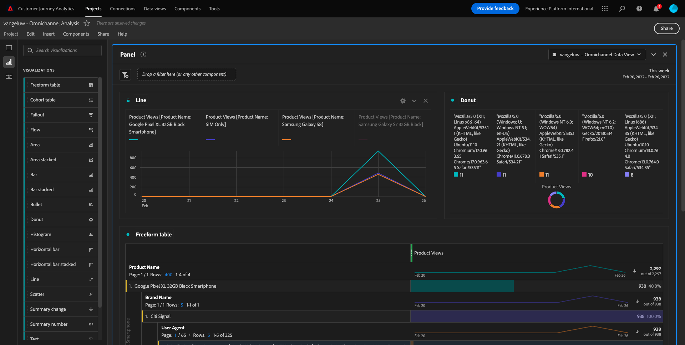

# 4.5 Visualización del uso del Customer Journey Analytics

## Objetivos

- Entenda una interfaz de usuario para Analysis Workspace
- Conheça some s recursos que tornam o Analysis Workspace tão diferente.
- Aprenda a analizar no CJA usando o Analysis Workspace

## Contexto

Neste exercício, você o Analysis Workspace no CJA para analisar visualizaciones de productos, funis de productos, rotatividade, etc.

Vamos a usar o projeto que você criou em  [4.4 Preparación de datos en Analysis Workspace](./ex4.md), então access [https://analytics.adobe.com](https://analytics.adobe.com).

Abra seu projeto `yourLastName - Omnichannel Analysis`.

Com seu projeto aberto e Visualização de dados `yourLastName - Omnichannel Analysis` selecionado, você está pronto para venir a construir como primeiras visualizaciones.

## Quantas visualizaciones de productos temos diariamente?

Em primeiro lugar, precisamos selecionar as datas certas para analisar os dados. Acceso al menú suspenso do calendario no lado direito da tela. Clique nele e selecione o de datos aplicados.

>[!IMPORTANT]
>
>Selecione um de datos como **Esta semana** ou **Este mes**. Os dados disponíveis mais recentes foram absorvidos em 19 de setembro de 2022.

No menu do lado esquerdo (área de componentes), encontrado como calculadas de forma **Vistas del producto**. Selecione-as e arraste e solte na tela, no canto superior dirección de la tabla de forma livre.

Automáticamente una dimensión **Día** será adicionada para criar sua primeira. Agora você pode ver sua pergunta respondida imediatamente.

Em, la banda com o botão direito do mouse no resumo da métrica.

Clique em **Visualizar** e selecione **Línea** como visualización.

Você verá as suas visualizações de produto por dia.

Você pode alterar o escopo de tempo para o dia clicando em **Configuración** una visualización.

Clique no ponto ao lado de **Línea** e **Administrar la fuente de datos**.

Em, grupo em **Bloquear selección** e selecione **Elementos seleccionados** para ver esta visualización para que la siempre exiba uma linha do tempo de Visualizações de produtos.

## 5 productos más vistos

Quais são os 5 productos mais vistos?

Lembre-se de guardar o projeto de tempos em tempos.

| SO | Método abreviado |
| ----------------- |-------------| 
| Windows | Control + S |
| Mac | Comando +S |

Vamos a encontrar los 5 productos mais vistos. No menu do lado esquerdo, encontre o Nome do produto - Dimensão.

Agora arraste e solte **Nombre del producto** para sustituir una dimensión **Día**:

Este será un resultado.

Em,, tente, um dos produtos por Nome da marca. pesquesa **brandName** e arraste para baixo do primeiro nome do produto.

Em, faça um detallhamento usando o Agente de usuário. pesquesa **Agente de usuario** e arraste-o para baixo do nome da marca.

Em, será exibida a tela abaixo:

Por fim, você pode adicionar mais visualizações. No lado esquerdo, em visualizações, pesquise `Donut`. Pegue `Donut`, arraste e solte na tela soltar una visualización **Línea** 

A continuación, en la Tabla, seleccione los 5 primeros **Agente de usuario**  filas del desglose que hemos realizado en **Smartphone Google Pixel XL negro de 32 GB** > **Señal de Citi**. Mientras selecciona las 5 filas, mantenga pulsada la tecla **CTRL** (en Windows) o el botón **Comando** botón (en Mac).

Em, na Tabela, selecione as primeiras 5 linhas de **Agente de usuario** hacer detalles que fizemos em **Smartphone Google Pixel XL negro de 32 GB** > **Señal de Citi**. Ao selecionar como 5 linhas, segure o botão **CTRL** (sin Windows) ou o botão **Comando** (sin Mac).

Você verá o gráfico de donut alterado:

Você pode até o diseño para ser mayor legível, tornando o gráfico de diseño **Línea** e o gráfico de **Anillo** um pouco menor para que sejam exibidos lado a lado:

Clique no ponto ao lado de *Anillo** para **Administrar la fuente de datos**. Em, grupo em **Bloquear selección** Para ver el tiempo de visualización de producto, haga clic aquí para ver el producto.

Saiba mais sobre visualizações usando o Analysis Workspace em:

- [https://experienceleague.adobe.com/docs/analytics/analyze/analysis-workspace/visualizations/freeform-analysis-visualizations.html?lang=es](https://experienceleague.adobe.com/docs/analytics/analyze/analysis-workspace/visualizations/freeform-analysis-visualizations.html?lang=es)
- [https://experienceleague.adobe.com/docs/analytics/analyze/analysis-workspace/visualizations/t-sync-visualization.html](https://experienceleague.adobe.com/docs/analytics/analyze/analysis-workspace/visualizations/t-sync-visualization.html)

## Funil de interação do produto, da visualización à compra

Existem muitas formas de resolver esta pregunta. Uma delas é usar o Tipo de Interação de Produto e usá-lo em uma tabela de formato livre. Outra forma é usar uma **Visualización de abandonos**. Vamos a usar o último, pois e analisar ao mesmo tempo.

Feche o pain actual clicando aquí:

Agora adicione um novo pain em branco clicando em **+ Agregar panel en blanco**.

Clique na visualização de **Abandonos**.

Selecione o mesmo de datas do exercício anterior.

Em, el você va:

Encontrar una dimensión **Tipo de evento** no componentes no lado esquerdo:

Clique na seta para abrir una dimensión:

Você va todos os Tipos de eventos disponíveis.

Seleccione un elemento **commerce.productViews** e arraste e solte-o no campo **Añadir Touchpoint** dentro de da **Visualización de abandonos**.

Faça o mesmo com **commerce.productListAdds** y **commerce.purchases** e solte-os no campo **Añadir Touchpoint** dentro de da  **Visualización de abandonos**. Sua visualização agora deve ser semelhante ao seguinte:

Você pode fazer muitas coisas aqui. Alguno de estos ejemplos: comparar ao longo do tempo, comparar cada passo por dispositivo ou comparar por fidelidade. No entanto, se quisermos analisar coisas interessantes como porque os clientes não compram depois de adicionar um item ao carrinho, podemos usar a melhor ferramenta do CJA: clicar com o botão direito.

Clique com o botão direito do mouse no touchpoint **commerce.productListAdds**. Em, grupo em **Abandonos de desglose en este punto de contacto**.

Uma nova tabela de formato livre será criada para analisar o que as pessoas fizeram se não compraram.

Altere o **Tipo de evento** por **Nombre de página**, na nova tabela de formato livre, para ver em quais páginas eles estão indo, em vez da Página de confirmação de compra.

## O que as pessoas fazem no site antes de acessar a página Cancelar servicio?

Novamente, há muitas formas de realizar essa análise. Vamos a usar un análisis de flujo para iniciar parte da descoberta.

Feche o pain actual clicando aquí:

Agora adicione um novo pain em branco clicando em **+ Agregar panel en blanco**.

Hacer una visualización **Flujo**.

Em, será exibido:

Selecione o mesmo de datas do exercício anterior.

Encontrar una dimensión **Nombre de página** no componentes no lado esquerdo:

Clique na seta para abrir una dimensión:

Você todas las páginas vistas. Encontre o nome da página: **Cancelar servicio**.
Arraste e solte **Cancelar servicio** Una visualización de flujo en campo do meio:

Em, será exibido:

Vamos agora analisar se os clientes que visitaram a página C **Cancelar servicio** no site também ligaram para o call center e qual foi o resultado.

Nas dimensões, retorne e encontre Tipo de interação de chamada. Arraste e solte **Tipo de interacción de llamada** para substituir a primeira interação à direita em **Visualización de flujo**.

Agora você visualiza o ticket de soporte dos clientes que ligaram para a central de atendimento depois de visita a página **Cancelar servicio**.

Em, nas dimensões, procure **Sensación de llamada**. Arraste e solte para substituir a primeira interação à direita na visualização de fluxo.

Em, será exibido:

Como pode ver, execute uma análise omnichannel usando a visualização de fluxo. Graças a isso, descobrimos que some s clientes que estavam pensando em cancelar o serviço tiveram uma avaliação positiva depois de ligar para o call center. Talvez tenhamos mudado de ideia com uma promoção?

## ¿Qué es lo que hace un cliente con un contato de Call center Positivo em relação aos principipais KPI?

Primeiramente, vamos a segmentar los dados para obter apenas usuários com chamadas **positivo**. No CJA, os Segmentos são chamados de Filtros. Acceso para filtros a área de componentes (no lado esquerdo) e clique em **+**.

Dentro del Constructor de Filtro, dê um nome ao filtro

| Nombre | Descripción |
| ----------------- |-------------| 
| Sensación de llamada: positiva | Sensación de llamada: positiva |

Nos componentes (dentro do Constructor de filtro), encontre **Sensación de llamada** La solución a la definición del constructor de filtros.

Ágora selecione **positivo** como valor para o filtro.

Altere o escopo para o nível **Persona**.

Para finalizar, basta con hacer clic **Guardar**.

Então, você irá retornar para esta tela. Se ainda não retornou, feche o pain anterior.

Agora adicione um novo pain em branco clicando em **+ Agregar panel en blanco**.

Selecione o mesmo de datas do exercício anterior.

Clique em **Tabla de forma libre**.

Agora arraste e solte o filtro que você acabou de criar.

Hora de añadir a las métricas. Comece.com **Vistas del producto**. Arraste e solte na tabela de forma livre. Você também pode a métrica **Eventos**.

Faça o mesmo com **People**, **Añadir al carro** e **Compras**. Você vai acabar com uma tabela como a seguinte.

Graças à primeira análise de fluxo, uma nova pergunta surgiu. Então decidimos criar esta tabela e s KPI em um para responder a essa pergunta. Como você pode ver, o tempo de insight é muito mais rápido do que usar SQL ou usar outras soluciones de BI.

## Recapitulación de Analysis Workspace e do Customer Journey Analytics

O Analysis Workspace eliminar todas como limitaciones típicas de una relación de Analytics. Ele fornece uma tela robusta e flexível para criar projetos de analytics personalizados. Arraste e solte qualquer número de tabelas de dados, visualizações e componentes (dimensões,, e granularidades de tempo) para um projeto. Você pode criar de forma instantánea ânea filtros e analises, gráficos de coorte,, análises de fluxo e relatórios de curadoria e agendamento para comparlhar com qualquer pessoa em seu negócio.

Próxima etapa: [4.6 De insights a ação](./ex6.md)

[Hoteles cerca de Fluxo de Usuário 4](./uc4.md)

[Retornar para Todos los Módulos](./../../overview.md)
