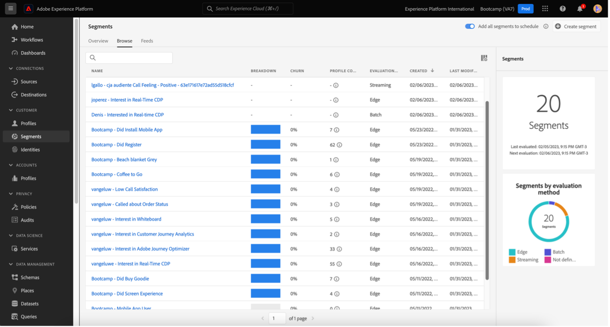

# 4.6 Dos insights à ação

## Objetivos

- Entenda como criar um público com base em uma visão coletada no Customer Journey Analytics
- Use esse público no CDP em tempo real e no Adobe Journey Optimizer

## 4.6.1 Crie uma audiência e publique-a

Em seu projeto, você criou um filtro chamado **Call Feelings** e conseguiu ver a Quantidade de usuários que tiveram suas ligações ao call center classificado como **apps**. Agora, você poderá criar um com ess usuários e ativação-los em jornadas ou em canais de comunicação.

O primeiro passo é: No pain criado no último exercício, selecione a linha **1. Sensación de llamada - Positiva**, grupo com o botão direito de seu mouse e selecione a opção **Crear audiencia a partir de la selección**:

Em, dê um nome para a sua audiência seguindo o modelo **suApellido - la llamada de la audiencia de la cia se siente positiva**:

Note que é possível ter um preview da audiência que está sendo criada:

Para finalizar, grupo **Publicar**:

## 4.6.2 Usar sua audiência como parte de um

Voltando para a Adobe Experience Platform, vá em **Segments > Browse** e você o seu criado no CJA pronto e disponível para ser usado nas suas ativações e jornadas!

¡Vamos agora usar esse en la vida activa en Facebook e em uma jornada do cliente!

## 4.6.3 Usar el tiempo real de los usuarios de la plataforma de de Real-Time CDP

Na Adobe Experience Platform, vá em **Segmentos > Examinar** e encontre a audiência que você criou no CJA:

Clique no seu e, em, clique em **Activar en destino**:

Selecione a destination chamada bootcamp-facebook e, em, clique em Siguiente:

Em, clique em Siguiente novamente:

Seleccione una opinión **Origen de su audiencia** e defina como **Directamente de los clientes** e clique em Siguiente:

Por fim, na página **Revisar** ¡Finalizar!

¡Pronto! Ágora o seu está vinculado aos públicos personalizados do Facebook.
¡Agora, vamos a utilizar esse en AJO

## 4.6.4 Uso de la segmentación de datos en Adobe Journey Optimizer

Na interface da Adobe Experience Platform clique em Journey Optimizer e, em, no menu lateral esquerdo, clique em **Recorridos** e comece a criar uma jornada clicando em **Crear Recorrido**:

Em, no menu lateral esquerdo, em Eventos, selecione **Clasificación del segmento** e arraste-o até a jornada:

Em, em **Segmento** grupo em **Editar** para selecionar um:

Seleccione una audiencia que quiera usar en CJA e clique em **Guardar**:

¡Pronto! A partir daí você pode criar uma jornada para clientes que se calificam para esse!

[Volver al flujo de usuario 4](./uc4.md)

[Voltar para todos los tiempos](./../../overview.md)
