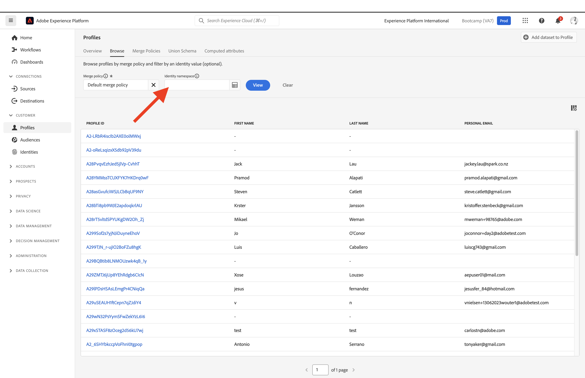
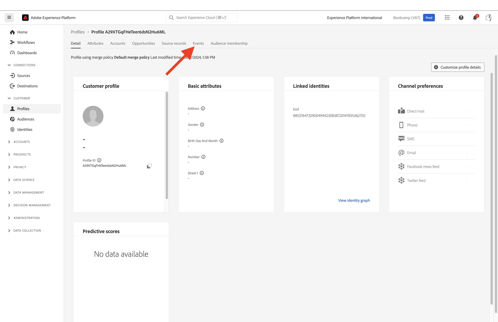

# 1.2 Visualice su propio perfil de cliente en tiempo real: interfaz de usuario

En este ejercicio, iniciará sesión en Adobe Experience Platform y verá su propio perfil de cliente en tiempo real en la interfaz de usuario.

## Historia

En el Perfil del cliente en tiempo real, todos los datos de perfil se muestran junto con los datos de evento, así como las suscripciones a audiencias existentes. Los datos mostrados pueden proceder de cualquier lugar, de aplicaciones de Adobe y soluciones externas. Esta es la vista más potente de Adobe Experience Platform, el verdadero sistema de registro de experiencias.

## 1.2.1 Uso de la vista de perfil del cliente en Adobe Experience Platform

Ir a [Adobe Experience Platform](https://experience.adobe.com/platform). Después de iniciar sesión, llegará a la página principal de Adobe Experience Platform.

Antes de continuar, debe seleccionar una **zona protegida**. La zona protegida que se va a seleccionar se denomina ``Bootcamp``. Para ello, haga clic en el texto **[!UICONTROL Producción]** en la línea azul de la parte superior de la pantalla. Después de seleccionar la [!UICONTROL zona protegida] adecuada, verá el cambio en la pantalla y ahora se encuentra en la [!UICONTROL zona protegida] dedicada.

En el menú de la izquierda, ve a **Perfiles** y a **Examinar**.

En el panel Visualizador de perfiles del sitio web, puede encontrar la descripción general de la identidad. Cada identidad está vinculada a un área de nombres.

Con Adobe Experience Platform, todos los ID son igualmente importantes. Anteriormente, el ECID era el ID más importante en el contexto de Adobe y todos los demás ID estaban vinculados al ECID en una relación jerárquica. Con Adobe Experience Platform, este ya no es el caso, y cada ID puede considerarse un identificador principal.

Normalmente, el identificador principal depende del contexto. Si le pregunta a su centro de llamadas, **¿Cuál es el ID más importante?** es probable que respondan, **el número de teléfono!** Pero si le pregunta a su equipo de CRM, responderán: **La dirección de correo electrónico!** Adobe Experience Platform comprende esta complejidad y la administra por usted. Cada aplicación, ya sea de Adobe o de no Adobe, hablará con Adobe Experience Platform haciendo referencia al ID que consideran principal. Y simplemente funciona.

Para el campo **Área de nombres de identidad**, seleccione **ECID** y para el campo **Valor de identidad**, introduzca el ECID que puede encontrar en el panel Visor de perfiles del sitio web de bootcamp. Haga clic en **Ver**. A continuación, verá su perfil en la lista. Haga clic en **ID de perfil** para abrir el perfil.

Ahora verá una descripción general de un par de **Atributos de perfil** importantes de su perfil de cliente.

Vaya a **Eventos**, donde podrá ver las entradas de todos los eventos de experiencia vinculados a su perfil.

Finalmente, vaya a la opción de menú **Suscripción a audiencias**. Ahora verá todas las audiencias que cumplen los requisitos para este perfil.

Ahora vamos a crear una nueva audiencia que le permitirá personalizar la experiencia del cliente para un cliente anónimo o conocido.

Paso siguiente: [1.3 Crear una audiencia: IU](./ex3.md)

[Volver al flujo de usuario 1](./uc1.md)

[Volver a todos los módulos](../../overview.md)
