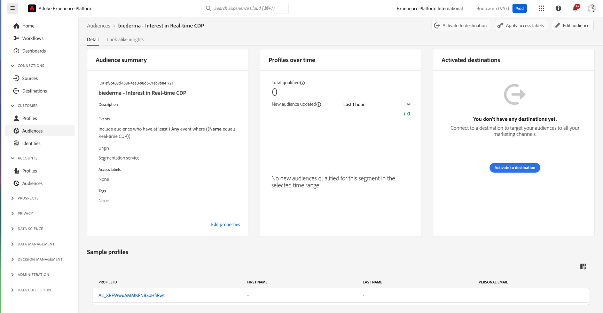

# 1.3 Crear una audiencia: IU

En este ejercicio, creará una audiencia utilizando el Generador de audiencias de Adobe Experience Platform.

## Historia

Ir a [Adobe Experience Platform](https://experience.adobe.com/platform). Después de iniciar sesión, llegará a la página principal de Adobe Experience Platform.

Antes de continuar, debe seleccionar un **espacio aislado**. La zona protegida que se va a seleccionar se denomina ``Bootcamp``. Para ello, haga clic en el texto **[!UICONTROL Producción de producción]** en la línea azul de la parte superior de la pantalla. Después de seleccionar las [!UICONTROL espacio aislado], verá el cambio de pantalla y ahora estará en su dedicado [!UICONTROL espacio aislado].

En el menú de la izquierda, vaya a **Audiencias**. En esta página, verá Paneles con información esencial acerca de **Audiencia** rendimiento.

Haga clic en **Examinar** para ver una descripción general de todas las audiencias existentes. Haga clic en **+ Crear audiencia** para empezar a crear una audiencia nueva.

Aparecerá una ventana emergente que le preguntará si desea hacerlo **&#39;Componer audiencia&#39;** o **&#39;Generar regla&#39;**. Elegir **&#39;Generar regla&#39;** para continuar y haga clic en **crear**.

![Segmentación][def]

Una vez que esté en el generador de audiencias, verá inmediatamente el **Atributos** y la opción **Perfil individual de XDM** Referencia de.

Dado que XDM es el lenguaje que potencia el negocio de la experiencia, XDM también es la base del generador de audiencias. Todos los datos que se incorporen en Platform deben asignarse a XDM y, como tales, todos los datos pasan a formar parte del mismo modelo de datos independientemente de dónde provengan. Esto le ofrece una gran ventaja a la hora de crear audiencias, ya que desde esta interfaz de usuario del generador de audiencias puede combinar datos de cualquier origen en el mismo flujo de trabajo. Las audiencias creadas en el Generador de audiencias se pueden enviar a soluciones como Adobe Target, Adobe Campaign o cualquier otro canal de activación.

Ahora debe crear una audiencia de todos los clientes que han visto el producto **Real-Time CDP**.

Para crear esta audiencia, debe añadir un Evento de experiencia. Puede encontrar todos los eventos de experiencias haciendo clic en **Eventos** en el menú **Campos** barra de menús.

A continuación, verá el nivel superior, **ExperienceEvents de XDM** nodo. Haga clic en **ExperienceEvent de XDM**.

Ir a **Elementos de lista de productos**.

Seleccionar **Nombre** y arrastre y suelte el **Nombre** del menú de la izquierda al lienzo del generador de audiencias en la **Eventos** sección. A continuación, verá esto:

El parámetro de comparación debe ser **igual a** y en el campo de entrada, introduzca **Real-time CDP**.

Cada vez que añada un elemento al generador de audiencias, puede hacer clic en el **Actualizar estimación** para obtener una nueva estimación de la población de su audiencia.

Como **Método de evaluación**, seleccione **Edge**.

Por último, pongamos un nombre a la audiencia y guárdela.

Como convención de nombres, utilice:

- `yourLastName - Interest in Real-Time CDP`

A continuación, haga clic en **Guardar y cerrar** para guardar la audiencia.

Ahora se le redirigirá a la página de información general de audiencia, donde verá una vista previa de muestra de los perfiles de clientes que cumplen los requisitos para su audiencia.

Ahora puede continuar con el siguiente ejercicio y utilizar la audiencia con Adobe Target.

Paso siguiente: [1.4 Tomar medidas: enviar la audiencia a Adobe Target](./ex4.md)

[Volver al flujo de usuario 1](./uc1.md)

[Volver a todos los módulos](../../overview.md)

[def]: ./images/segmentationpopup.png
