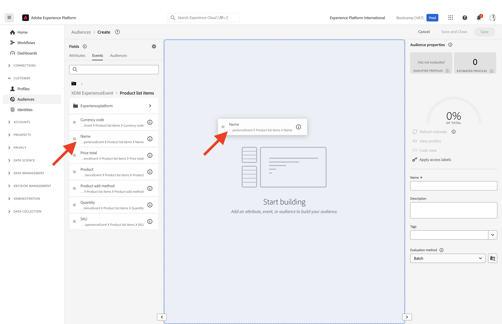

# 1.3 Crear un segmento: IU

En este ejercicio, creará un segmento utilizando el Generador de segmentos de Adobe Experience Platform.

## Historia

Ir a [Adobe Experience Platform](https://experience.adobe.com/platform). Después de iniciar sesión, llegará a la página principal de Adobe Experience Platform.

Antes de continuar, debe seleccionar un **espacio aislado**. La zona protegida que se va a seleccionar se denomina ``Bootcamp``. Para ello, haga clic en el texto **[!UICONTROL Producción de producción]** en la línea azul de la parte superior de la pantalla. Después de seleccionar las [!UICONTROL espacio aislado], verá el cambio de pantalla y ahora estará en su dedicado [!UICONTROL espacio aislado].

En el menú de la izquierda, vaya a **Segmentos**. En esta página, puede ver una descripción general de todos los segmentos existentes. Haga clic en **+ Crear segmento** para empezar a crear un nuevo segmento.

Una vez que esté en el nuevo generador de segmentos, verá inmediatamente el **Atributos** y la opción **Perfil individual de XDM** Referencia de.

Dado que XDM es el lenguaje que alimenta el negocio de la experiencia, XDM también es la base del generador de segmentos. Todos los datos que se incorporen en Platform deben asignarse a XDM y, como tales, todos los datos pasan a formar parte del mismo modelo de datos independientemente de dónde provengan. Esto le ofrece una gran ventaja a la hora de crear segmentos, ya que desde esta interfaz de usuario del generador de segmentos puede combinar datos de cualquier origen en el mismo flujo de trabajo. Los segmentos creados en el Generador de segmentos se pueden enviar a soluciones como Adobe Target, Adobe Campaign y Adobe Audience Manager para su activación.

Ahora necesita crear un segmento de todos los clientes que han visto el producto **Real-Time CDP**.

Para crear este segmento, debe añadir un Evento de experiencia. Puede encontrar todos los eventos de experiencias haciendo clic en **Eventos** en el menú **Campos** barra de menús.

A continuación, verá el nivel superior, **ExperienceEvents de XDM** nodo. Haga clic en **ExperienceEvent de XDM**.

Ir a **Elementos de lista de productos**.

Seleccionar **Nombre** y arrastre y suelte el **Nombre** del menú de la izquierda al lienzo del generador de segmentos en la **Eventos** sección. A continuación, verá esto:

El parámetro de comparación debe ser **igual a** y en el campo de entrada, introduzca **Real-time CDP**.

Cada vez que añada un elemento al generador de segmentos, puede hacer clic en el **Actualizar estimación** para obtener una nueva estimación de la población del segmento.

Como **Método de evaluación**, seleccione **Edge**.

Por último, asigne un nombre al segmento y guárdelo.

Como convención de nombres, utilice:

- `yourLastName - Interest in Real-Time CDP`

A continuación, haga clic en **Guardar y cerrar** para guardar el segmento.

Ahora volverá a la página de información general del segmento, donde verá una vista previa de muestra de los perfiles de clientes que cumplen los requisitos para su segmento.

Ahora puede continuar con el siguiente ejercicio y utilizar el segmento con Adobe Target.

Paso siguiente: [1.4 Tomar medidas: enviar el segmento a Adobe Target](./ex4.md)

[Volver al flujo de usuario 1](./uc1.md)

[Volver a todos los módulos](../../overview.md)
