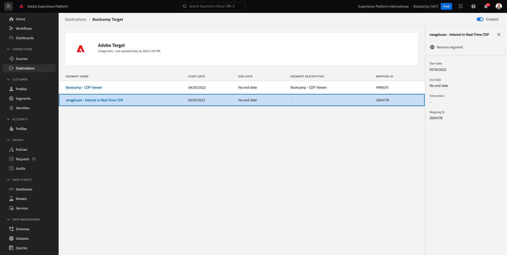
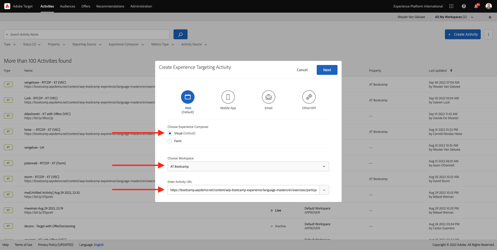
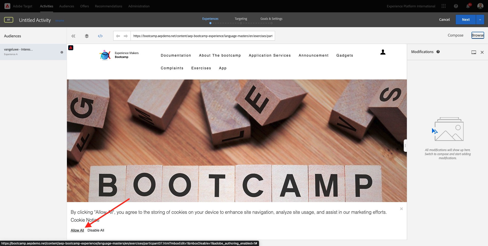
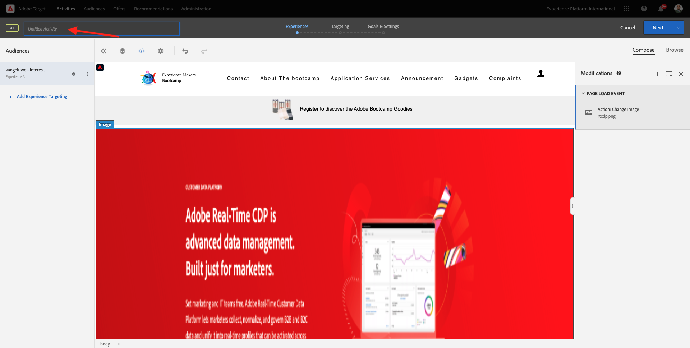

# 1.4 Tomar medidas: enviar el segmento a Adobe Target

Ir a [Adobe Experience Platform](https://experience.adobe.com/platform). Después de iniciar sesión, llegará a la página principal de Adobe Experience Platform.

Antes de continuar, debe seleccionar un **espacio aislado**. La zona protegida que se va a seleccionar se denomina ``Bootcamp``. Para ello, haga clic en el texto **[!UICONTROL Producción de producción]** en la línea azul de la parte superior de la pantalla. Después de seleccionar las [!UICONTROL espacio aislado], verá el cambio de pantalla y ahora estará en su dedicado [!UICONTROL espacio aislado].

## 1.4.1 Activación del segmento en el destino de Adobe Target

Adobe Target está disponible como destino en Real-Time CDP. Para configurar la integración de Adobe Target, vaya a **Destinos**, a **Catálogo**.

Clic **Personalización** en el **Categorías** menú. A continuación, verá el **Adobe Target** tarjeta de destino. Clic **Activar segmentos**.

Seleccionar el destino ``Bootcamp Target`` y haga clic en **Siguiente**.

En la lista de segmentos disponibles, seleccione el segmento que ha creado en [1.3 Crear un segmento](./ex3.md), que se denomina `yourLastName - Interest in Real-Time CDP`. A continuación, haga clic en **Siguiente**.

En la página siguiente, haga clic en **Siguiente**.

Haga clic en **Finalizar**.

El segmento ahora está activado para Adobe Target.

>[!IMPORTANT]
>
>Cuando haya creado su destino de Adobe Target en Real-Time CDP, el destino puede tardar hasta una hora en estar activo. Este es un tiempo de espera único, debido a la configuración del back-end. Una vez que se haya completado el tiempo de espera de 1 hora inicial y la configuración del back-end, los segmentos Edge recién añadidos que se envíen al destino de Adobe Target estarán disponibles para la segmentación en tiempo real.

## 1.4.2 Configuración de la actividad basada en formularios de Adobe Target

Ahora que el segmento de Real-Time CDP está configurado para enviarse a Adobe Target, puede configurar la actividad de segmentación de experiencias en Adobe Target. En este ejercicio configurará una actividad basada en el Compositor de experiencias visuales.

Vaya a la página principal de Adobe Experience Cloud yendo a [https://experiencecloud.adobe.com/](https://experiencecloud.adobe.com/). Clic **Target** para abrirlo.

En el **Adobe Target** Página principal, verá todas las actividades existentes.
Clic **+ Crear actividad** para crear una nueva actividad.

Seleccionar **Segmentación de experiencias**.

Seleccionar **Visual** y configure el **URL de actividad** hasta `https://bootcamp.aepdemo.net/content/aep-bootcamp-experience/language-masters/en/exercises/particpantXX.html`, pero antes de hacerlo, reemplace XX por un número entre 01 y 30.

>[!IMPORTANT]
>
>Todos los participantes de la habilitación deben utilizar una página web independiente para evitar la colisión de varias experiencias de Adobe Target. Puede elegir una página web y encontrar la URL aquí: [https://bootcamp.aepdemo.net/content/aep-bootcamp-experience/language-masters/en/exercises.html](https://bootcamp.aepdemo.net/content/aep-bootcamp-experience/language-masters/en/exercises.html).
>
>Todas las páginas comparten la misma dirección URL base y finalizan en el número del participante.
>
>Por ejemplo, el participante 1 debe utilizar la URL `https://bootcamp.aepdemo.net/content/aep-bootcamp-experience/language-masters/en/exercises/particpant01.html`, el participante 30 debe utilizar la URL `https://bootcamp.aepdemo.net/content/aep-bootcamp-experience/language-masters/en/exercises/particpant30.html`.

Seleccione el espacio de trabajo **AT Bootcamp**.

Haga clic en **Siguiente**.

Ahora se encuentra en el Compositor de experiencias visuales. Puede tardar entre 20 y 30 segundos hasta que el sitio web esté completamente cargado.

La audiencia predeterminada es **Todos los visitantes**. Haga clic en **3 puntos** junto a **Todos los visitantes** y haga clic en **Cambiar audiencia**.

Ahora está viendo la lista de audiencias disponibles y el segmento de Adobe Experience Platform que creó anteriormente y envió a Adobe Target ahora forma parte de esta lista. Seleccione el segmento que creó anteriormente en Adobe Experience Platform. Clic **Asignar audiencia**.

El segmento de Adobe Experience Platform ahora forma parte de esta actividad de segmentación de experiencias.

Para poder cambiar la imagen a pantalla completa, debe hacer clic en **Permitir todo** en el banner de la cookie.

Para ello, vaya a **Examinar**

A continuación, haga clic en **Permitir todo**.

A continuación, vuelva a **Escribir**.

Ahora vamos a cambiar la imagen a pantalla completa en la página principal del sitio web. Haga clic en la imagen a pantalla completa predeterminada del sitio web y luego en **Reemplazar contenido** y luego seleccione **Imagen**.

Buscar el archivo de imagen **rtcdp.png**. Selecciónelo y haga clic en **Guardar**.

A continuación, verá la nueva experiencia con la nueva imagen para la audiencia seleccionada.

Haga clic en el título de la actividad en la esquina superior izquierda para cambiarle el nombre.

Para el nombre, utilice:

- `yourLastName - RTCDP - XT (VEC)`

Haga clic en **Siguiente**.

Haga clic en **Siguiente**.

En el **Objetivos y configuración** - página, vaya a **Métricas de objetivo**.

Establezca el objetivo principal en **Participación** - **Tiempo en el sitio**. Haga clic en **Guardar y cerrar**.

Ahora estás en el **Resumen de actividad** página. Aún debe activar su actividad.

Haga clic en el campo **Inactivo** y seleccione **Activar**.

A continuación, recibirá una confirmación visual de que la actividad está activa.

Su actividad ya está activa y se puede probar en el sitio web de bootcamp.

Si ahora vuelve al sitio web de demostración y visita la página del producto durante **Real-Time CDP**, inmediatamente se clasificará para el segmento que ha creado y verá la actividad de Adobe Target en la página de inicio en tiempo real.

>[!IMPORTANT]
>
>Todos los participantes de la habilitación deben utilizar una página web independiente para evitar la colisión de varias experiencias de Adobe Target. Puede elegir una página web y encontrar la URL aquí: [https://bootcamp.aepdemo.net/content/aep-bootcamp-experience/language-masters/en/exercises.html](https://bootcamp.aepdemo.net/content/aep-bootcamp-experience/language-masters/en/exercises.html).
>
>Todas las páginas comparten la misma dirección URL base y finalizan en el número del participante.
>
>Por ejemplo, el participante 1 debe utilizar la URL `https://bootcamp.aepdemo.net/content/aep-bootcamp-experience/language-masters/en/exercises/particpant01.html`, el participante 30 debe utilizar la URL `https://bootcamp.aepdemo.net/content/aep-bootcamp-experience/language-masters/en/exercises/particpant30.html`.

Paso siguiente: [1.5 Tomar medidas: enviar el segmento a Facebook](./ex5.md)

[Volver al flujo de usuario 1](./uc1.md)

[Volver a todos los módulos](../../overview.md)
