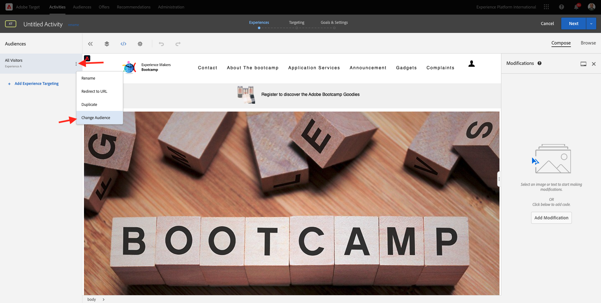

# 1.4 Tomar medidas: enviar la audiencia a Adobe Target

Ir a [Adobe Experience Platform](https://experience.adobe.com/platform). Después de iniciar sesión, llegará a la página principal de Adobe Experience Platform.

Antes de continuar, debe seleccionar una **zona protegida**. La zona protegida que se va a seleccionar se denomina ``Bootcamp``. Para ello, haga clic en el texto **[!UICONTROL Producción]** en la línea azul de la parte superior de la pantalla. Después de seleccionar la [!UICONTROL zona protegida] adecuada, verá el cambio en la pantalla y ahora se encuentra en la [!UICONTROL zona protegida] dedicada.

## 1.4.1 Activar la audiencia en el destino de Adobe Target

Adobe Target está disponible como destino en Real-Time CDP. Para configurar tu integración con Adobe Target, ve a **Destinos**, a **Catálogo**.

Haga clic en **Personalization** en el menú **Categorías**. Verá la tarjeta de destino **Adobe Target**. Haga clic en **Activar audiencias**.

Seleccione el destino ``Bootcamp Target`` y haga clic en **Siguiente**.

En la lista de audiencias disponibles, seleccione la audiencia que creó en [1.3 Crear una audiencia](./ex3.md), que se llama `yourLastName - Interest in Real-Time CDP`. A continuación, haga clic en **Siguiente**.

En la página siguiente, haz clic en **Siguiente**.

Haga clic en **Finalizar**.

La audiencia ahora está activada en Adobe Target.

>[!IMPORTANT]
>
>Cuando haya creado su destino de Adobe Target en Real-Time CDP, el destino puede tardar hasta una hora en estar activo. Este es un tiempo de espera único, debido a la configuración del back-end. Una vez que se haya completado el tiempo de espera de una hora y la configuración del back-end iniciales, las audiencias de Edge recién agregadas que se envíen al destino de Adobe Target estarán disponibles para la segmentación en tiempo real.

## 1.4.2 Configuración de la actividad basada en formularios de Adobe Target

Ahora que la audiencia de Real-Time CDP está configurada para enviarse a Adobe Target, puede configurar la actividad de segmentación de experiencias en Adobe Target. En este ejercicio configurará una actividad basada en el Compositor de experiencias visuales.

Vaya a la página principal de Adobe Experience Cloud en [https://experiencecloud.adobe.com/](https://experiencecloud.adobe.com/). Haga clic en **Destino** para abrirlo.

En la página de inicio de **Adobe Target**, verás todas las actividades existentes.
Haga clic en **+ Crear actividad** para crear una nueva actividad.

Seleccione **Segmentación de experiencias**.

Seleccione **Visual** y establezca la **URL de actividad** en `https://bootcamp.aepdemo.net/content/aep-bootcamp-experience/language-masters/en/exercises/particpantXX.html`, pero antes de hacerlo, reemplace XX por un número entre 01 y 30.

>[!IMPORTANT]
>
>Todos los participantes de la habilitación deben utilizar una página web independiente para evitar la colisión de varias experiencias de Adobe Target. Puede elegir una página web y encontrar la dirección URL aquí: [https://bootcamp.aepdemo.net/content/aep-bootcamp-experience/language-masters/en/exercises.html](https://bootcamp.aepdemo.net/content/aep-bootcamp-experience/language-masters/en/exercises.html).
>
>Todas las páginas comparten la misma dirección URL base y finalizan en el número del participante.
>
>Por ejemplo, el participante 1 debe utilizar la dirección URL `https://bootcamp.aepdemo.net/content/aep-bootcamp-experience/language-masters/en/exercises/particpant01.html`, el participante 30 debe utilizar la dirección URL `https://bootcamp.aepdemo.net/content/aep-bootcamp-experience/language-masters/en/exercises/particpant30.html`.

Seleccione el área de trabajo **AT Bootcamp**.

Haga clic en **Next**.

Ahora se encuentra en el Compositor de experiencias visuales. Puede tardar entre 20 y 30 segundos hasta que el sitio web esté completamente cargado.

La audiencia predeterminada es **Todos los visitantes**. Haz clic en **3 puntos** junto a **Todos los visitantes** y haz clic en **Cambiar audiencia**.

Ahora está viendo la lista de audiencias disponibles, y la audiencia de Adobe Experience Platform que creó anteriormente y envió a Adobe Target ahora forma parte de esta lista. Seleccione la audiencia que creó anteriormente en Adobe Experience Platform. Haga clic en **Asignar audiencia**.

La audiencia de Adobe Experience Platform ahora forma parte de esta actividad de segmentación de experiencias.

Antes de cambiar la imagen a pantalla completa, debes hacer clic en **Permitir todo** en el banner de la cookie.

Para ello, ve a **Examinar**

A continuación, haga clic en **Permitir todo**.

A continuación, vuelva a **Componer**.

Ahora vamos a cambiar la imagen a pantalla completa en la página principal del sitio web. Haga clic en la imagen a pantalla completa predeterminada del sitio web, haga clic en **Reemplazar contenido** y, a continuación, seleccione **Imagen**.

Busque el archivo de imagen **rtcdp.png**. Selecciónelo y haga clic en **Guardar**.

A continuación, verá la nueva experiencia con la nueva imagen para la audiencia seleccionada.

Haga clic en el título de la actividad en la esquina superior izquierda para cambiarle el nombre.

Para el nombre, utilice:

- `yourLastName - RTCDP - XT (VEC)`

Haga clic en **Next**.

Haga clic en **Next**.

En la página **Objetivos y configuración** - , ve a **Métricas de objetivos**.

Establezca el objetivo principal en **Participación** - **Tiempo en el sitio**. Haga clic en **Guardar y cerrar**.

Ahora se encuentra en la página **Información general de actividad**. Aún debe activar su actividad.

Haga clic en el campo **Inactivo** y seleccione **Activar**.

A continuación, recibirá una confirmación visual de que la actividad está activa.

Su actividad ya está activa y se puede probar en el sitio web de bootcamp.

Si ahora regresa a su sitio web de demostración y visita la página del producto para **Real-Time CDP**, calificará instantáneamente para la audiencia que creó y verá que la actividad de Adobe Target se muestra en la página principal en tiempo real.

>[!IMPORTANT]
>
>Todos los participantes de la habilitación deben utilizar una página web independiente para evitar la colisión de varias experiencias de Adobe Target. Puede elegir una página web y encontrar la dirección URL aquí: [https://bootcamp.aepdemo.net/content/aep-bootcamp-experience/language-masters/en/exercises.html](https://bootcamp.aepdemo.net/content/aep-bootcamp-experience/language-masters/en/exercises.html).
>
>Todas las páginas comparten la misma dirección URL base y finalizan en el número del participante.
>
>Por ejemplo, el participante 1 debe utilizar la dirección URL `https://bootcamp.aepdemo.net/content/aep-bootcamp-experience/language-masters/en/exercises/particpant01.html`, el participante 30 debe utilizar la dirección URL `https://bootcamp.aepdemo.net/content/aep-bootcamp-experience/language-masters/en/exercises/particpant30.html`.

Paso siguiente: [1.5 Realizar acción: enviar la audiencia a Facebook](./ex5.md)

[Volver al flujo de usuario 1](./uc1.md)

[Volver a todos los módulos](../../overview.md)
