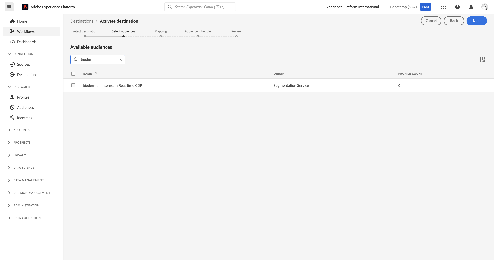

# 1.5 Acción: enviar el segmento a Facebook

Vaya a [Adobe Experience Platform](https://experience.adobe.com/platform). Después de iniciar sesión, llegará a la página principal de Adobe Experience Platform.

Antes de continuar, debe seleccionar un **entorno limitado**. El nombre del simulador de pruebas que se va a seleccionar es ``Bootcamp``. Para ello, haga clic en el texto **[!UICONTROL Producción]** en la línea azul de la parte superior de la pantalla. Después de seleccionar los elementos adecuados [!UICONTROL entorno limitado], verá el cambio de pantalla y ahora estará en su [!UICONTROL entorno limitado].

En el menú de la izquierda, vaya a **Destinos** y vaya a **Catálogo**. Verá el **Catálogo de destinos**. En **Destinos**, haga clic en **Activar segmentos** en el **Audiencia personalizada de facebook** tarjeta.

Seleccione el destino **bootcamp-facebook** y haga clic en **Siguiente**.

En la lista de segmentos disponibles, seleccione el segmento que creó en el ejercicio anterior. Haga clic en **Siguiente**.

En el **Asignación** asegúrese de que la variable **Aplicar transformación** está activada. Haga clic en **Siguiente**.

En el **Programación de segmentos** seleccione **Origen de la audiencia** y configúrelo en **Directamente de los clientes**. Haga clic en **Siguiente**.

Por último, en la **Consulte** página, haga clic en **Finalizar**.

El segmento ahora está vinculado a Audiencias personalizadas de Facebook. Cada vez que un cliente se califica para este segmento, se envía una señal al servidor de Facebook para incluir a ese cliente en la Audiencia personalizada en Facebook.

En Facebook, encontrará el segmento de Adobe Experience Platform en Audiencias personalizadas :

Ahora puede ver que su audiencia personalizada aparece en Facebook:

[Volver al flujo de usuario 1](./uc1.md)

[Volver a todos los módulos](../../overview.md)
