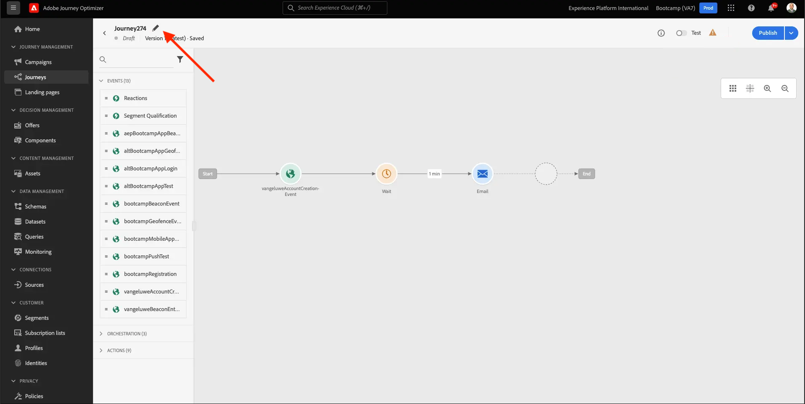

# 2.3 Crear el recorrido y el mensaje de correo electrónico

En este ejercicio, debe configurar el recorrido que debe activarse cuando alguien cree una cuenta en el sitio web de demostración.

Inicie sesión en Adobe Journey Optimizer desde [Adobe Experience Cloud](https://experience.adobe.com). Haga clic en **Journey Optimizer**.

Se le redirigirá al **Página principal**  en Journey Optimizer. En primer lugar, asegúrese de que está utilizando el simulador para pruebas correcto. El entorno limitado que se va a usar se denomina `Bootcamp`. Para cambiar de un simulador de pruebas a otro, haga clic en **Prod** y seleccione el simulador de pruebas de la lista. En este ejemplo, el simulador de pruebas recibe el nombre **Bootcamp**. Entonces estará en el **Página principal** vista del entorno limitado `Bootcamp`.

## 2.3.1 Cree su recorrido

En el menú de la izquierda, haga clic en **Recorridos**. A continuación, haga clic en **Crear Recorrido** para crear un nuevo recorrido.

A continuación, verá una pantalla de recorrido vacía.

En el ejercicio anterior, creó una **Evento**. Lo llamaste así `yourLastNameAccountCreationEvent` y sustituido `yourLastName` con su apellido. Este fue el resultado de la creación del evento:

Ahora debe tomar este evento como el inicio de este Recorrido. Para ello, vaya a la izquierda de la pantalla y busque el evento en la lista de eventos.

Seleccione el evento, arrástrelo y suéltelo en el lienzo del Recorrido. El Recorrido ahora tiene este aspecto:

Como segundo paso en el recorrido, debe añadir una **Espera** paso a paso. Vaya al lado izquierdo de la pantalla a la **Organización** para encontrarlo. Utilizará atributos de perfil y tendrá que asegurarse de que se rellenen en el perfil del cliente en tiempo real.

Tu recorrido ahora se ve así. En el lado derecho de la pantalla, debe configurar el tiempo de espera. Configúrelo en 1 minuto. Esto dará tiempo suficiente para que los atributos de perfil estén disponibles después de que se active el evento.

Haga clic en **Ok** para guardar los cambios.

Como tercer paso en el recorrido, debe añadir un **Correo electrónico** acción. Vaya al lado izquierdo de la pantalla para **Acciones**, seleccione **Correo electrónico** a continuación, arrástrela y colóquela en el segundo nodo del recorrido. Ahora ven esto.

Configure las variables **Categoría** a **Marketing** y seleccione una superficie de correo electrónico que le permita enviar correos electrónicos. En este caso, la superficie de correo electrónico que se va a seleccionar es **Correo electrónico**. Asegúrese de que las casillas de verificación de **Clics en correos electrónicos** y **aperturas por correo electrónico** están activadas.

El siguiente paso es crear el mensaje. Para ello, haga clic en **Editar contenido**.

## 2.3.2 Crear su mensaje

Para crear el mensaje, haga clic en **Editar contenido**.

Ahora ven esto.

Haga clic en el **Línea de asunto** campo de texto.

En el área de texto empiece a escribir **Hi**

La línea de asunto aún no ha finalizado. A continuación, debe introducir el token de personalización para el campo **Nombre** que se almacenan en `profile.person.name.firstName`. En el menú de la izquierda, desplácese hacia abajo para encontrar la variable **Persona** y haga clic en la flecha para ir un nivel más profundo.

Ahora, busque **Nombre completo** y haga clic en la flecha para ir un nivel más profundo.

Finalmente, busque la **Nombre** y haga clic en el botón **+** a su lado. A continuación, verá que el token de personalización aparece en el campo de texto.

A continuación, añada el texto **, gracias por registrarse!**. Haga clic en **Guardar**.

Volverás aquí. Haga clic en **Diseñador de correo electrónico** para crear el contenido del correo electrónico.

En la siguiente pantalla, se le solicitarán 3 métodos diferentes para proporcionar el contenido del correo electrónico:

- **Diseño desde cero**: Comience con un lienzo vacío y utilice el editor WYSIWYG para arrastrar y soltar componentes de estructura y contenido para crear visualmente el contenido del correo electrónico.
- **Codifique sus propios**: Cree su propia plantilla de correo electrónico codificándola con HTML
- **Importar HTML**: Importe una plantilla de HTML existente, que podrá editar.

Haga clic en **Importar HTML**. También puede hacer clic en **Plantillas guardadas** y seleccione la plantilla **Bootcamp: plantilla de correo electrónico**.

Si ha seleccionado **Importar HTML**, ahora puede arrastrar y soltar el archivo **mailtemplatebootcamp.html**, que puede descargar [here](../../assets/html/mailtemplatebootcamp.html.zip). Haga clic en Importar.

A continuación, verá esta plantilla de correo electrónico predeterminada:

Vamos a personalizar el correo electrónico. Haga clic junto al texto **Hi** y, a continuación, haga clic en la **Añadir personalización** icono.

A continuación, debe traer la variable **Nombre** token de personalización que se almacena en `profile.person.name.firstName`. En el menú , busque la **Persona** elemento, desplácese hasta el **Nombre completo** y, a continuación, haga clic en el **+** para agregar el campo Nombre al editor de expresiones.

Haga clic en **Guardar**.

Ahora notará cómo se ha agregado el campo de personalización al texto.

Haga clic en **Guardar** para guardar el mensaje.

Vuelva al panel de mensajes haciendo clic en el **flecha** junto al texto de la línea de asunto en la esquina superior izquierda.

Ya ha terminado de crear su correo electrónico de registro. Haga clic en la flecha situada en la esquina superior izquierda para volver al recorrido.

Haga clic en **Ok**.

## 2.3.3 Publicar el recorrido

Aún necesita darle un Nombre a su recorrido. Para ello, haga clic en el botón **Propiedades** en la parte superior derecha de la pantalla.

A continuación, puede introducir el nombre del recorrido aquí. Utilice `yourLastName - Account Creation Journey`. Haga clic en **OK** para guardar los cambios.

Ahora puede publicar el recorrido haciendo clic en **Publicación**.

Haga clic en **Publicación** de nuevo.

A continuación, verá una barra de confirmación verde que indica que su recorrido se ha publicado.

Ya has terminado este ejercicio.

Paso siguiente: [2.4 Probar el recorrido](./ex4.md)

[Volver al flujo de usuario 2](./uc2.md)

[Volver a todos los módulos](../../overview.md)