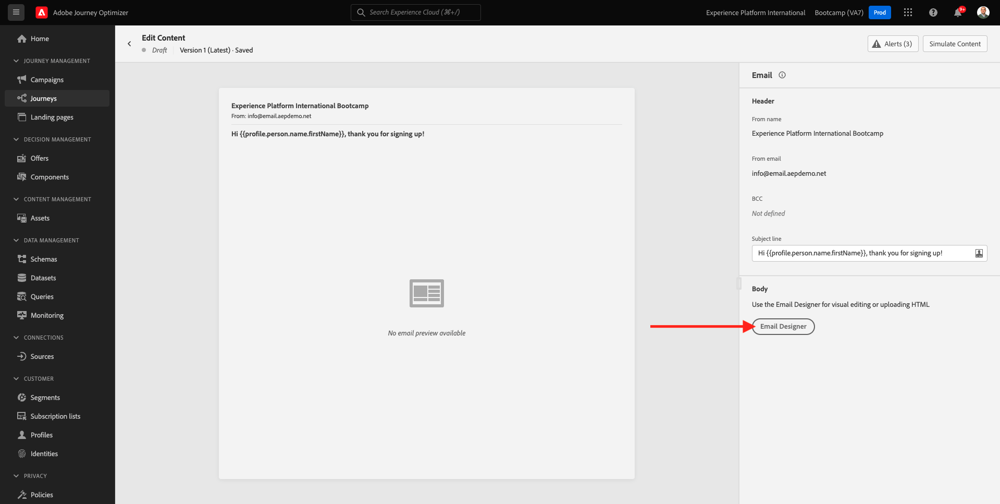

# 2.3 Crear el recorrido y el mensaje de correo electrónico

En este ejercicio, configurará el recorrido que debe activarse cuando alguien cree una cuenta en el sitio web de demostración.

Inicie sesión en Adobe Journey Optimizer accediendo a [Adobe Experience Cloud](https://experience.adobe.com). Clic **Journey Optimizer**.

Se le redirigirá a la variable **Inicio**  ver en Journey Optimizer. Primero, asegúrese de que está usando la zona protegida correcta. Se llama a la zona protegida que se va a utilizar `Bootcamp`. Para cambiar de una zona protegida a otra, haga clic en **Prod** y seleccione la zona protegida de la lista. En este ejemplo, la zona protegida se denomina **Bootcamp**. Entonces estarás en el... **Inicio** vista de la zona protegida `Bootcamp`.

## 2.3.1 Creación de un recorrido

En el menú izquierdo, haga clic en **Recorridos**. A continuación, haga clic en **Crear Recorrido** para crear un nuevo recorrido.

A continuación, verá una pantalla de recorrido vacía.

En el ejercicio anterior creó un nuevo **Evento**. Lo llamaste así `yourLastNameAccountCreationEvent` y reemplazado `yourLastName` con tu apellido. Este fue el resultado de la creación del Evento:

Ahora debe tomar este evento como inicio de este Recorrido. Para ello, vaya al lado izquierdo de la pantalla y busque el evento en la lista de eventos.

Seleccione el evento, arrástrelo y suéltelo en el lienzo de Recorrido. El Recorrido ahora tiene este aspecto:

Como segundo paso del recorrido, debe añadir un breve **Esperar** paso. Vaya al lado izquierdo de la pantalla para ver la **Orquestación** para encontrar esto. Utilizará atributos de perfil y debe asegurarse de que se rellenan en el Perfil del cliente en tiempo real.

Su recorrido ahora tiene este aspecto. En el lado derecho de la pantalla debe configurar el tiempo de espera. Configúrelo en 1 minuto. Esto le dará tiempo suficiente para que los atributos de perfil estén disponibles después de que se active el evento.

Clic **Ok** para guardar los cambios.

Como tercer paso del recorrido, debe agregar una **Correo electrónico** acción. Vaya al lado izquierdo de la pantalla para **Acciones**, seleccione la **Correo electrónico** acción y, a continuación, arrástrela y suéltela en el segundo nodo del recorrido. Ahora puede ver esto.

Configure las variables **Categoría** hasta **Marketing** y seleccione una superficie de correo electrónico que le permita enviar correos electrónicos. En este caso, la superficie de correo electrónico que se va a seleccionar es **Correo electrónico**. Asegúrese de que las casillas de verificación de **Clics en el correo electrónico** y **aperturas de correo electrónico** están habilitadas.

El siguiente paso es crear el mensaje. Para ello, haga clic en **Editar contenido**.

## 2.3.2 Crear el mensaje

Para crear el mensaje, haga clic en **Editar contenido**.

Ahora puede ver esto.

Haga clic en **Línea de asunto** campo de texto.

En el área de texto, empiece a escribir **Hola**

La línea de asunto aún no ha finalizado. A continuación, debe introducir el token de personalización para el campo **Nombre** que se almacena en `profile.person.name.firstName`. En el menú de la izquierda, desplácese hacia abajo para encontrar la **Persona** y haga clic en la flecha para profundizar un nivel.

Ahora busque el **Nombre completo** y haga clic en la flecha para profundizar un nivel.

Finalmente, encuentre el **Nombre** y haga clic en el **+** firma junto a ella. A continuación, verá aparecer el token de personalización en el campo de texto.

A continuación, añada el texto **, ¡gracias por inscribirse!**. Haga clic en **Guardar**.

Entonces volverás a estar aquí. Clic **Diseñador de correo electrónico** para crear el contenido del correo electrónico.

En la siguiente pantalla, se le solicitarán tres métodos diferentes para proporcionar el contenido del correo electrónico:

- **Diseñe desde cero**: Comience con un lienzo en blanco y utilice el editor WYSIWYG para arrastrar y soltar los componentes de estructura y contenido para crear visualmente el contenido del correo electrónico.
- **Codifique su propio código**: cree su propia plantilla de correo electrónico codificándola con un HTML
- **Importar HTML**: importe una plantilla de HTML existente que podrá editar.

Clic **Importar HTML**. También puede hacer clic en **Plantillas guardadas** y seleccione la plantilla **Bootcamp - Plantilla de correo electrónico**.

Si ha seleccionado **Importar HTML**, ahora puede arrastrar y soltar el archivo **mailtemplatebootcamp.html**, que puede descargar [aquí](../../assets/html/mailtemplatebootcamp.html.zip). Haga clic en Importar.

A continuación, verá esta plantilla de correo electrónico predeterminada:

Vamos a personalizar el correo electrónico. Haga clic junto al texto **Hola** y, a continuación, haga clic en **Añadir personalización** icono.

A continuación, debe traer el **Nombre** token de personalización que se almacena en `profile.person.name.firstName`. En el menú, busque **Persona** , explore en profundidad el **Nombre completo** y haga clic en el elemento **+** para agregar el campo Nombre al editor de expresiones.

Haga clic en **Guardar**.

Ahora notará cómo se ha agregado el campo de personalización al texto.

Clic **Guardar** para guardar el mensaje.

Vuelva al panel de mensajes haciendo clic en el **flecha** situado junto al texto de la línea de asunto, en la esquina superior izquierda.

Ha completado la creación del correo electrónico de registro. Haga clic en la flecha de la esquina superior izquierda para volver al recorrido.

Haga clic en **Ok**.

## 2.3.3 Publicar el recorrido

Aún necesita darle un Nombre a su recorrido. Para ello, haga clic en el icono **Propiedades** en la parte superior derecha de la pantalla.

A continuación, puede introducir el nombre del recorrido aquí. Utilice `yourLastName - Account Creation Journey`. Clic **OK** para guardar los cambios.

Ahora puede publicar el recorrido haciendo clic en **Publish**.

Clic **Publish** otra vez.

A continuación, verá una barra de confirmación verde que indica que el recorrido se ha publicado.

Ya ha terminado este ejercicio.

Paso siguiente: [2.4 Probar el recorrido](./ex4.md)

[Volver al flujo de usuario 2](./uc2.md)

[Volver a todos los módulos](../../overview.md)