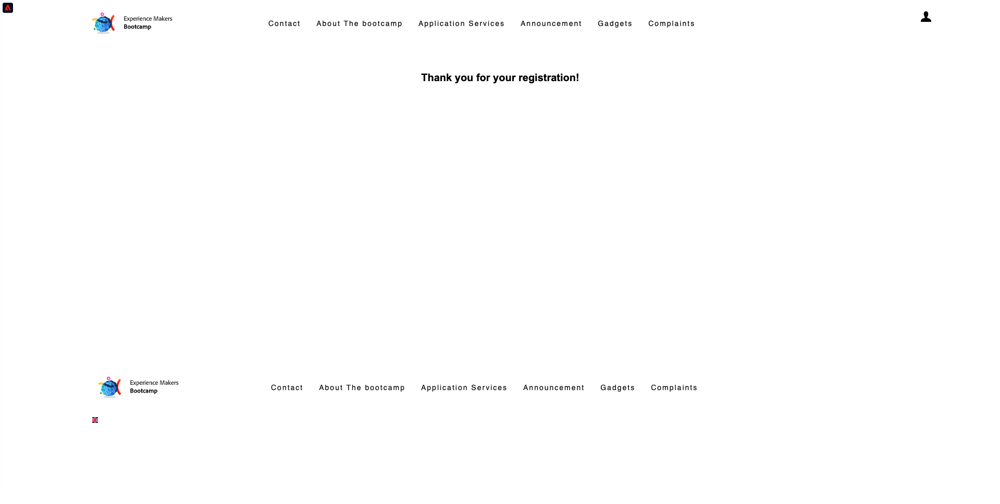

# 2.4 Probar el recorrido

## Flujo de recorrido del cliente

Abra una ventana nueva, limpia y de incógnito del explorador y vaya a [https://bootcamp.aepdemo.net](https://bootcamp.aepdemo.net). Haga clic en **Permitir todo**. En función del comportamiento de navegación en el flujo de usuario anterior, verá que la personalización se produce en la página de inicio del sitio web.

Haz clic en el icono **Perfil** en la esquina superior derecha de la pantalla.

Haga clic en **Crear una cuenta**.

Rellene todos los campos del formulario. Utilice un valor real para la dirección de correo electrónico y el número de teléfono, ya que se utilizará en ejercicios posteriores para el envío de correo electrónico y SMS.

Desplácese hacia abajo. Ahora debe introducir el eventID del evento personalizado que creó en el ejercicio 2.2. Puede encontrarlo aquí:

El ID de evento es lo que debe enviarse a Adobe Experience Platform para almacenar en déclencheur la recorrido que ha creado. Este es el eventID de este ejemplo: `19cab7852cdef99d25b6d5f1b6503da39d1f486b1d585743f97ed2d1e6b6c74f`

Complete el eventID en el campo **Id. de evento de creación de cuenta** y haga clic en **Registrar**.

Entonces verá esto...

También recibirá este correo electrónico, que es el correo electrónico que creó como parte de este ejercicio.

Ya ha terminado este ejercicio.

Siguiente paso: [2.5 Instalar y usar la aplicación móvil](./ex5.md)

[Volver al flujo de usuario 2](./uc2.md)

[Volver a todos los módulos](../../overview.md)
