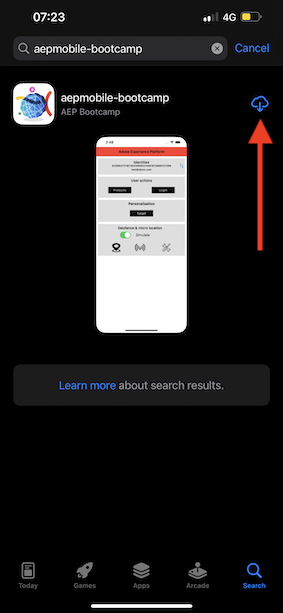
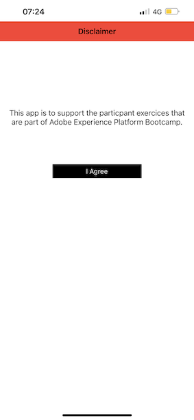
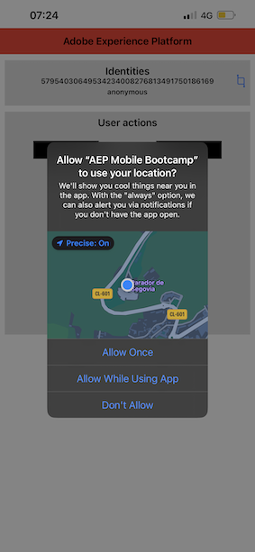

# 2.5 Instalar y utilizar la aplicación móvil

## Instalación de la aplicación móvil

Antes de instalar la aplicación, debe habilitar **Seguimiento** en el dispositivo iOS. Para ello, vaya a **Configuración** > **Privacidad y seguridad** > **Seguimiento** y asegúrese de que la opción **Permitir que las aplicaciones soliciten seguimiento**.

Vaya a la App Store de Apple y busque `aepmobile-bootcamp`. Clic **Instalar** o **Descargar**.

Una vez instalada la aplicación, haga clic en **Abrir**.

Haga clic en **Aceptar**.

Clic **Permitir**.

Clic **Estoy de acuerdo**.

Clic **Permitir mientras se utiliza la aplicación**.

Clic **Permitir**.

Ahora está en la aplicación, en la página principal, listo para pasar por el recorrido del cliente.

## Flujo de recorrido del cliente

En primer lugar, debe iniciar sesión. Haga clic en **Login**.

Después de crear la cuenta en los ejercicios anteriores, lo vio en el sitio web. Ahora debe reutilizar la dirección de correo electrónico de la cuenta que creó en la aplicación para iniciar sesión.

Introduzca aquí la dirección de correo electrónico que utilizó en el sitio web y haga clic en **Iniciar sesión**.

A continuación, recibirá una confirmación de que ha iniciado sesión y una notificación push.

Vuelva a la página principal de la aplicación y verá que aparecen funciones adicionales.

Ir a **Productos**. En este ejemplo, haga clic en cualquier producto **Café para llevar**.

Verá el... **Café para llevar** página de producto en la aplicación. Clic **Buy**.

Ahora ha terminado este ejercicio y está listo para los siguientes ejercicios.

Paso siguiente: [2.6 Personalización en el centro de llamadas](./ex6.md)

[Volver al flujo de usuario 2](./uc2.md)

[Volver a todos los módulos](../../overview.md)
