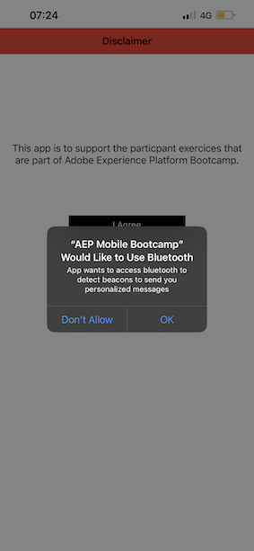
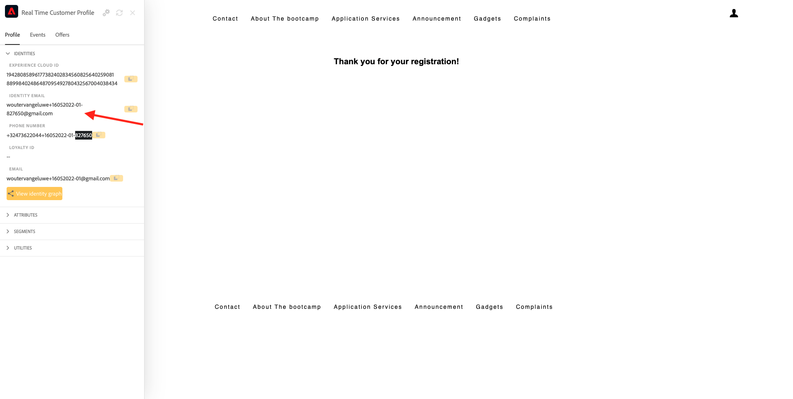

# 2.5 Instalación y uso de la aplicación móvil

## Instalación de la aplicación móvil

Antes de instalar la aplicación, debe activar **Seguimiento** en su dispositivo iOS. Para ello, vaya a **Configuración** > **Privacidad y seguridad** > **Seguimiento** y asegúrese de que la opción **Permitir que las aplicaciones soliciten rastrear**.

Vaya a Apple App Store y busque `aepmobile-bootcamp`. Haga clic en **Instalar** o **Descargar**.

Una vez instalada la aplicación, haga clic en **Apertura**.

Haga clic en **Aceptar**.

Haga clic en **Permitir**.

Haga clic en **Estoy de acuerdo**.

Haga clic en **Permitir al usar la aplicación**.

Haga clic en **Permitir**.

Ahora está en la aplicación, en la página principal, listo para pasar por el recorrido del cliente.

## Flujo de recorrido del cliente

En primer lugar, debe iniciar sesión. Haga clic en **Login**.

Después de crear su cuenta en ejercicios anteriores, lo vio en el sitio web. Ahora necesita reutilizar la dirección de correo electrónico de la cuenta creada en la aplicación para iniciar sesión.

Escriba la dirección de correo electrónico que utilizó en el sitio web aquí y haga clic en **Inicio de sesión**.

Recibirá una confirmación de que ha iniciado sesión y recibirá una notificación push.

Vuelva a la página principal de la aplicación y verá que aparecen funciones adicionales.

Vaya a **Productos**. Haga clic en cualquier producto, en este ejemplo **Café para ir**.

Verá el **Café para ir** página del producto en la aplicación. Haga clic en **Buy**.

Ya ha terminado este ejercicio y está listo para los próximos ejercicios.

Paso siguiente: [2.6 Personalización en el centro de llamadas](./ex6.md)

[Volver al flujo de usuario 2](./uc2.md)

[Volver a todos los módulos](../../overview.md)
