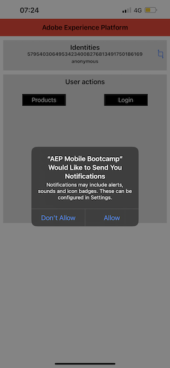

# 2.5 Instalar y utilizar la aplicación móvil

## Instalación de la aplicación móvil

Antes de instalar la aplicación, debes habilitar **Seguimiento** en tu dispositivo iOS. Para ello, ve a **Configuración** > **Privacidad y seguridad** > **Seguimiento** y asegúrate de que la opción **Permitir que las aplicaciones soliciten seguimiento**.

Vaya al App Store de Apple y busque `aepmobile-bootcamp`. Haz clic en **Instalar** o **Descargar**.

Una vez que la aplicación esté instalada, haga clic en **Abrir**.

Haga clic en **Aceptar**.

Haga clic en **Permitir**.

Haz clic en **Acepto**.

Haga Clic En **Permitir Mientras Usa La Aplicación**.

Haga clic en **Permitir**.

Ahora está en la aplicación, en la página principal, listo para pasar por el recorrido del cliente.

## Flujo de recorrido del cliente

En primer lugar, debe iniciar sesión. Haga clic en **Iniciar sesión**.

Después de crear la cuenta en los ejercicios anteriores, lo vio en el sitio web. Ahora debe reutilizar la dirección de correo electrónico de la cuenta que creó en la aplicación para iniciar sesión.

Escriba aquí la dirección de correo electrónico que utilizó en el sitio web y haga clic en **Iniciar sesión**.

A continuación, recibirá una confirmación de que ha iniciado sesión y una notificación push.

Vuelva a la página principal de la aplicación y verá que aparecen funciones adicionales.

Vaya a **Productos**. Haz clic en cualquier producto, en este ejemplo **Café para llevar**.

Verá la página de producto **Café para llevar** en la aplicación. Haz clic en **Comprar**.

Ahora ha terminado este ejercicio y está listo para los siguientes ejercicios.

Siguiente paso: [2.6 Personalization en el centro de llamadas](./ex6.md)

[Volver al flujo de usuario 2](./uc2.md)

[Volver a todos los módulos](../../overview.md)
