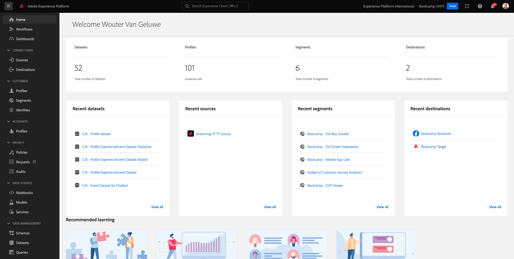

# 2.6 Personalization en el centro de llamadas

Como se ha mencionado varias veces durante el bootcamp, personalizar la experiencia del cliente es algo que debería suceder de una manera omnicanal. Un centro de llamadas a menudo está bastante desconectado del resto del recorrido del cliente y eso a menudo conduce a experiencias frustrantes del cliente, pero no es necesario. Veamos un ejemplo de cómo el centro de llamadas se puede conectar fácilmente a Adobe Experience Platform, en tiempo real.

## Flujo de Recorrido del cliente

En el ejercicio anterior, usando la aplicación móvil, compraste un producto al hacer clic en el botón **Comprar**.

Supongamos que tiene una pregunta sobre el estado de su pedido, ¿qué haría? Normalmente, llamaría al centro de llamadas.

Antes de llamar al centro de llamadas, debes saber tu **ID de fidelización**. Puede encontrar su ID de fidelización en el Visor de perfiles del sitio web.

En este caso, el **ID de fidelización** es **5863105**. Como parte de nuestra implementación personalizada de la función de centro de llamadas en el entorno de demostración, debes agregar un prefijo a tu **ID de fidelización**. El prefijo es **11373**, por lo que el identificador de fidelización que se utilizará en este ejemplo es **11373 5863105**.

Vamos a hacer eso ahora. Use su teléfono y llame al número **+1 (323) 745-1670**.

Se le pedirá que introduzca su ID de fidelidad, seguido de **#**. Introduzca su ID de fidelización.

Entonces escuchará **Hola, nombre**. Ese nombre se toma del Perfil del cliente en tiempo real en Adobe Experience Platform. A continuación, tiene 3 opciones. Pulse el número **1**, **Estado del pedido**.

Después de escuchar el estado de tu pedido, tendrás la opción de presionar **1** para volver al menú principal o bien, oprime 2. Presione **2**.

Luego se le pedirá que clasifique su experiencia con el centro de llamadas, seleccionando un número entre 1 y 5, siendo 1 bajo y 5 alto. Haga su elección.

La llamada al centro de llamadas finalizará ahora.

Ir a [Adobe Experience Platform](https://experience.adobe.com/platform). Después de iniciar sesión, llegará a la página principal de Adobe Experience Platform.

Antes de continuar, debe seleccionar una **zona protegida**. La zona protegida que se va a seleccionar se denomina ``Bootcamp``. Para ello, haga clic en el texto **[!UICONTROL Producción]** en la línea azul de la parte superior de la pantalla. Después de seleccionar la [!UICONTROL zona protegida] adecuada, verá el cambio en la pantalla y ahora se encuentra en la [!UICONTROL zona protegida] dedicada.

En el menú de la izquierda, ve a **Perfiles** y a **Examinar**.

Seleccione el área de nombres de identidad **Identity** **Correo electrónico** e introduzca la dirección de correo electrónico de su perfil de cliente. Haga clic en **Ver**. Haga clic en para abrir el perfil.

Volverá a ver el perfil de cliente. Ir a **Eventos**.

En eventos, verá dos eventos con un eventType de **callCenter**. El primer evento es el resultado de su respuesta a la pregunta **Valore la satisfacción con la llamada**.

Desplácese un poco hacia abajo y verá el evento que se registró al seleccionar la opción para comprobar el **estado del pedido**.

Vaya a **Pertenencia a segmento**. Ahora verá que dos segmentos cumplen los requisitos en su perfil, en tiempo real, según las interacciones que tuvo a través del centro de llamadas. Estas suscripciones a segmentos pueden y deben utilizarse para influir en la comunicación y personalización que se produce en cualquier otro canal.

Ya ha terminado este ejercicio.

[Volver al flujo de usuario 2](./uc2.md)

[Volver a todos los módulos](../../overview.md)
