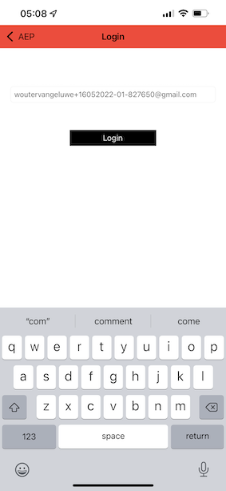

# 3.1 Uso de la aplicación móvil y déclencheur de una entrada de señalización

## Instalación de la aplicación móvil

Antes de instalar la aplicación, debe habilitar **Seguimiento** en el dispositivo iOS. Para ello, vaya a **Configuración** > **Privacidad y seguridad** > **Seguimiento** y asegúrese de que la opción **Permitir que las aplicaciones soliciten seguimiento**.

Vaya a la App Store de Apple y busque `aepmobile-bootcamp`. Clic **Instalar** o **Descargar**.

Una vez instalada la aplicación, haga clic en **Abrir**.

Haga clic en **Aceptar**.

Clic **Permitir**.

Clic **Estoy de acuerdo**.

Clic **Permitir mientras se utiliza la aplicación**.

Clic **Permitir**.

Ahora está en la aplicación, en la página principal, listo para pasar por el recorrido del cliente.

## Flujo de recorrido del cliente

En primer lugar, debe iniciar sesión. Haga clic en **Login**.

Después de crear la cuenta en los ejercicios anteriores, lo vio en el sitio web. Ahora debe reutilizar la dirección de correo electrónico de la cuenta que creó en la aplicación para iniciar sesión.

Introduzca aquí la dirección de correo electrónico que utilizó en el sitio web y haga clic en **Iniciar sesión**.

A continuación, recibirá una confirmación de que ha iniciado sesión y una notificación push.

Vuelva a la página principal de la aplicación y verá que aparecen funciones adicionales.

Primero, vaya a **Productos**. En este ejemplo, haga clic en cualquier producto **Café para llevar**.

Verá el... **Café para llevar** página de producto en la aplicación.

Ahora simulará un evento de entrada de señalización en una ubicación de tienda sin conexión. El objetivo de simular esto es personalizar la experiencia del cliente en las pantallas de las tiendas. Para visualizar la experiencia en tienda, se ha creado una página que muestra dinámicamente la información relevante para el cliente que acaba de entrar en la tienda.

Antes de continuar, abre esta página web en tu ordenador: [https://bootcamp.aepdemo.net/content/aep-bootcamp-experience/language-masters/en/screen.html](https://bootcamp.aepdemo.net/content/aep-bootcamp-experience/language-masters/en/screen.html)

A continuación, verá esto:

A continuación, vuelva a la página principal. Haga clic en **baliza** icono.

Entonces verá esto... Primero, seleccione **Señalización de pantalla de Bootcamp** y, a continuación, haga clic en **entrada** botón. Esto le permite simular una entrada de señalización.

Eche un vistazo a la pantalla de la tienda. Verá el último producto que vio aparecer allí en 5 segundos.

A continuación, vuelva a **Productos**. En este ejemplo, haga clic en cualquier producto **Manta de playa Tan**.

A continuación, vuelva a la página principal. Haga clic en **baliza** icono.

Entonces verá esto... Primero, seleccione **Señalización de pantalla de Bootcamp** y, a continuación, haga clic en **entrada** botón de nuevo. Esto le permite simular una entrada de señalización.

Ahora, vuelva a ver la pantalla de la tienda. Verá el último producto que vio aparecer allí en 5 segundos.

Ahora también echemos un vistazo al Visor de perfiles en el sitio web. Verá muchos eventos que se agregaron allí, solo para mostrar que cualquier interacción con un cliente se recopila y almacena en Adobe Experience Platform.

En los próximos ejercicios, configurará y probará su propio recorrido de entrada de señalización.

Paso siguiente: [3.2 Crear su evento](./ex2.md)

[Volver al flujo de usuario 3](./uc3.md)

[Volver a todos los módulos](../../overview.md)
