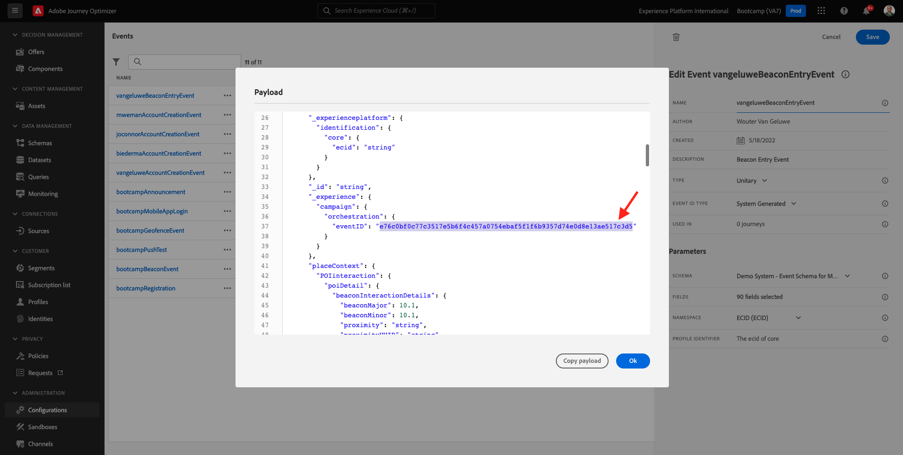

# 3.2 Crear su evento

Inicie sesión en Adobe Journey Optimizer accediendo a [Adobe Experience Cloud](https://experience.adobe.com). Clic **Journey Optimizer**.

Se le redirigirá a la variable **Inicio**  ver en Journey Optimizer. Primero, asegúrese de que está usando la zona protegida correcta. Se llama a la zona protegida que se va a utilizar `Bootcamp`. Para cambiar de una zona protegida a otra, haga clic en **Prod** y seleccione la zona protegida de la lista. En este ejemplo, la zona protegida se denomina **Bootcamp2**. Entonces estarás en el... **Inicio** vista de la zona protegida `Bootcamp`.

En el menú izquierdo, desplácese hacia abajo y haga clic en **Configuraciones**. Haga clic en el botón **Administrar** botón debajo de **Eventos**.

A continuación, verá una descripción general de todos los eventos disponibles. Clic **Crear evento** para empezar a crear su propio evento.

A continuación, aparece una nueva ventana de evento vacía.

En primer lugar, asigne a su evento un Nombre como este: `yourLastNameBeaconEntryEvent` y añada una descripción como esta `Beacon Entry Event`.

A continuación, asegúrese de que la **Tipo** se establece en **Unitario**, y para el **Tipo de ID de evento** selección, seleccionar **Sistema generado**.

A continuación se muestra la selección Esquema. Se ha preparado un esquema para este ejercicio. Utilice el esquema `Demo System - Event Schema for Mobile App (Global v1.1) v.1`.

Después de seleccionar el Esquema, verá una serie de campos seleccionados en la variable **Campos** sección. Ahora debe situarse sobre la variable **Campos** y verá 3 iconos emergentes en el menú emergente. Haga clic en **Editar** icono.

Verá una... **Campos** ventana emergente, en la que se deben seleccionar algunos de los campos necesarios para personalizar el recorrido.  Elegiremos otros atributos de perfil más adelante, utilizando los datos que ya están en Adobe Experience Platform.

Desplácese hacia abajo hasta que vea el objeto `Place context` y marque la casilla. Con esto, todo el contexto de la ubicación del cliente se pone a disposición del recorrido. Clic **Ok** para guardar los cambios.

Entonces debería ver esto. Clic **Guardar** una vez más para guardar los cambios.

El evento se ha configurado y guardado.

Vuelva a hacer clic en el evento para abrir **Editar evento** pantalla de nuevo. Pase el ratón sobre **Campos** de nuevo para ver los 3 iconos. Haga clic en **Ver** icono.

Ahora verá un ejemplo de la carga útil esperada.
El evento tiene un ID de evento de orquestación único, que puede encontrar desplazándose hacia abajo en esa carga útil hasta que vea `_experience.campaign.orchestration.eventID`.

El ID de evento es lo que debe enviarse a Adobe Experience Platform para almacenar en déclencheur el recorrido que creará en uno de los próximos ejercicios. Recuerde este ID de evento, ya que puede necesitarlo más adelante.
`"eventID": "e76c0bf0c77c3517e5b6f4c457a0754ebaf5f1f6b9357d74e0d8e13ae517c3d5"`

Clic **Ok**, seguido de un clic en **Cancelar**.

Ya ha terminado este ejercicio.

Paso siguiente: [3.3 Crear el recorrido y las notificaciones push](./ex3.md)

[Volver al flujo de usuario 3](./uc3.md)

[Volver a todos los módulos](../../overview.md)
