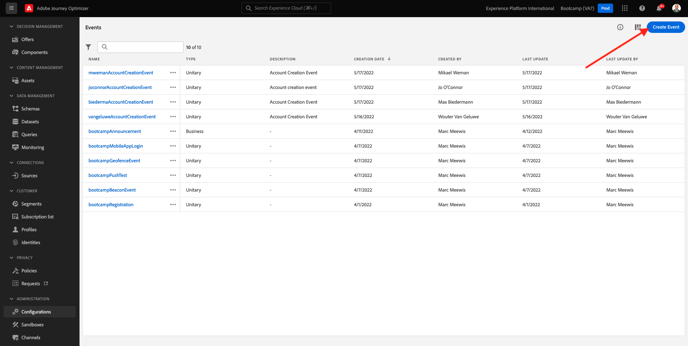
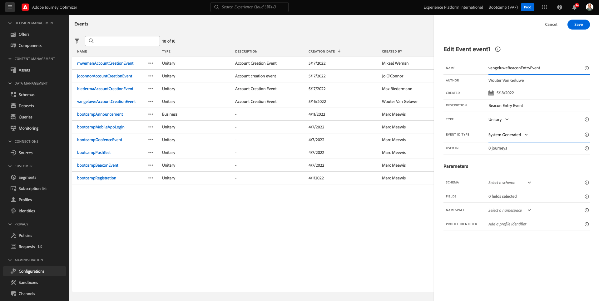

# 3.2 Crear un evento

Inicie sesión en Adobe Journey Optimizer desde [Adobe Experience Cloud](https://experience.adobe.com). Haga clic en **Journey Optimizer**.

Se le redirigirá al **Página principal**  en Journey Optimizer. En primer lugar, asegúrese de que está utilizando el simulador para pruebas correcto. El entorno limitado que se va a usar se denomina `Bootcamp`. Para cambiar de un simulador de pruebas a otro, haga clic en **Prod** y seleccione el simulador de pruebas de la lista. En este ejemplo, el simulador de pruebas recibe el nombre **Bootcamp2**. Entonces estará en el **Página principal** vista del entorno limitado `Bootcamp`.

En el menú de la izquierda, desplácese hacia abajo y haga clic en **Configuraciones**. A continuación, haga clic en el **Administrar** botón debajo de **Eventos**.

A continuación, verá una descripción general de todos los eventos disponibles. Haga clic en **Crear evento** para comenzar a crear su propio evento.

A continuación, aparece una nueva ventana de evento vacía.

En primer lugar, asigne un nombre al evento de esta manera: `yourLastNameBeaconEntryEvent` y añada una descripción como esta `Beacon Entry Event`.

A continuación, asegúrese de que la variable **Tipo** está configurado como **Unitario** y para la variable **Tipo de ID de evento** selección, seleccionar **Sistema generado**.

A continuación, se muestra la selección de Esquema. Se preparó un esquema para este ejercicio. Utilice el esquema `Demo System - Event Schema for Mobile App (Global v1.1) v.1`.

Después de seleccionar el esquema, verá una serie de campos seleccionados en el **Campos** para obtener más información. Ahora debe pasar el ratón por encima del **Campos** y verá 3 iconos emergentes. Haga clic en el **Editar** icono.

Verá un **Campos** ventana emergente, en la que debe seleccionar algunos de los campos que necesitamos para personalizar el recorrido.  Más adelante, elegiremos otros atributos de perfil, utilizando los datos que ya están en Adobe Experience Platform.

Desplácese hacia abajo hasta que vea el objeto `Place context` y marque la casilla de verificación . Con esto, todo el contexto de la ubicación del cliente estará disponible para el recorrido. Haga clic en **Ok** para guardar los cambios.

Debería ver esto. Haga clic en **Guardar** una vez más para guardar los cambios.

El evento ahora está configurado y guardado.

Vuelva a hacer clic en el evento para abrir el **Editar evento** de nuevo. Pase el ratón **Campos** para ver los 3 iconos. Haga clic en el **Ver** icono.

Ahora verá un ejemplo de la carga útil esperada.
Su evento tiene un eventID de orquestación único que puede encontrar desplazándose hacia abajo en esa carga hasta que vea `_experience.campaign.orchestration.eventID`.

El ID de evento es lo que debe enviarse a Adobe Experience Platform para almacenar en déclencheur el recorrido que creará en uno de los próximos ejercicios. Recuerde este eventID, ya que puede que lo necesite más adelante.
`"eventID": "e76c0bf0c77c3517e5b6f4c457a0754ebaf5f1f6b9357d74e0d8e13ae517c3d5"`

Haga clic en **Ok**, seguido de hacer clic en **Cancelar**.

Ya has terminado este ejercicio.

Paso siguiente: [3.3 Crear el recorrido y las notificaciones push](./ex3.md)

[Volver al flujo de usuario 3](./uc3.md)

[Volver a todos los módulos](../../overview.md)
