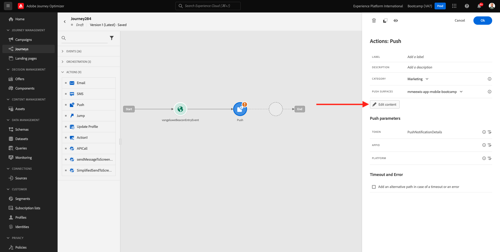
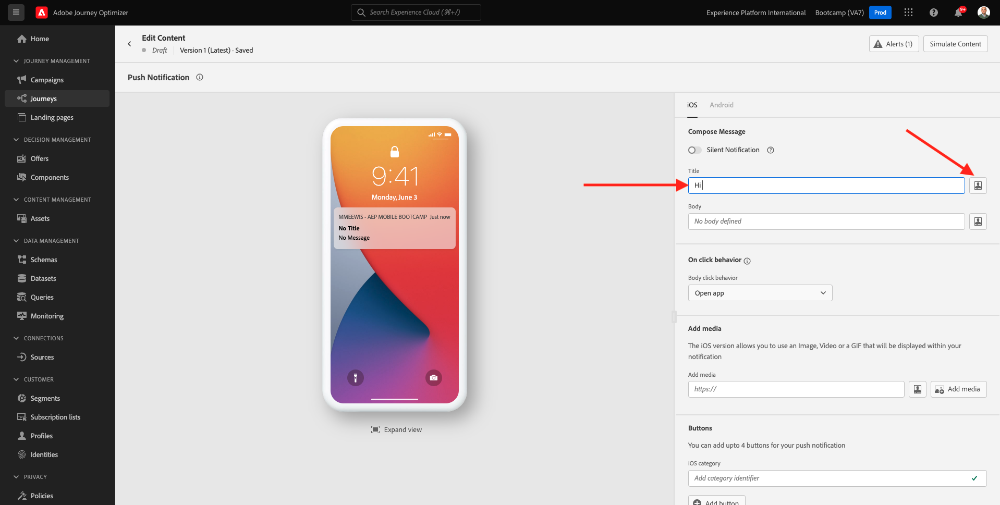
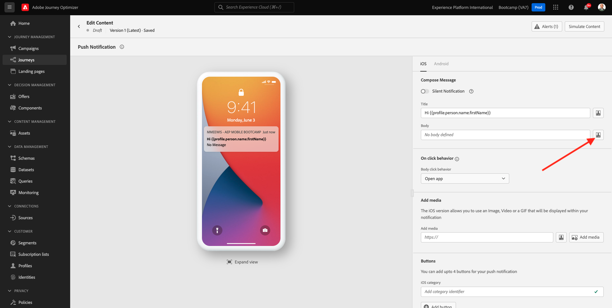
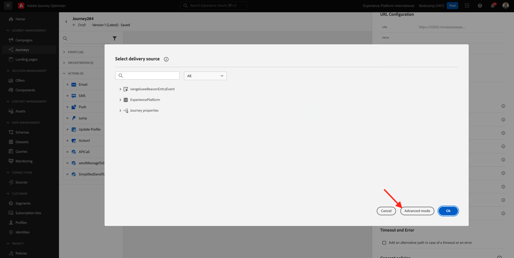
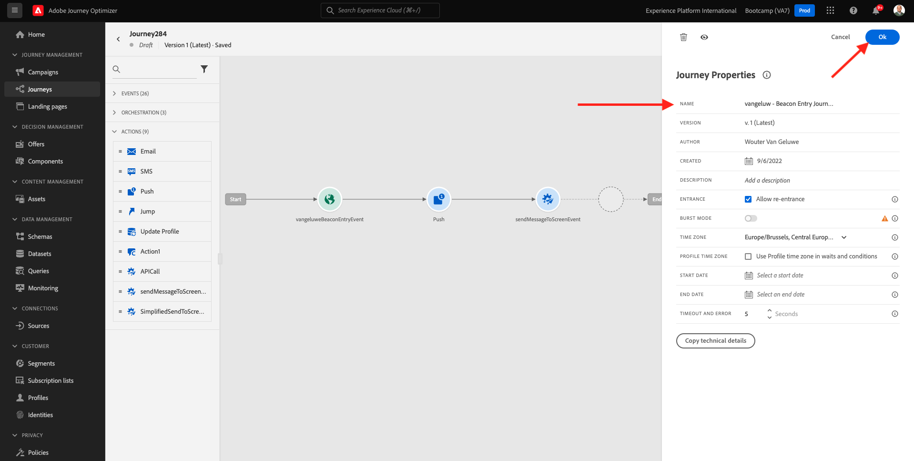
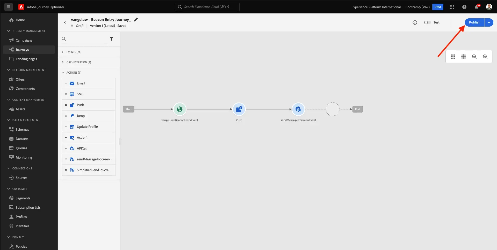

# 3.3 Crear el recorrido y las notificaciones push

En este ejercicio, configurará el recorrido y el mensaje que deben activarse cuando alguien entre en una señalización mediante la aplicación móvil.

Inicie sesión en Adobe Journey Optimizer en [Adobe Experience Cloud](https://experience.adobe.com). Haga clic en **Journey Optimizer**.

Se le redirigirá a la vista **Inicio** en Journey Optimizer. Primero, asegúrese de que está usando la zona protegida correcta. La zona protegida que se va a usar se llama `Bootcamp`. Para cambiar de una zona protegida a otra, haga clic en **Prod** y seleccione la zona protegida en la lista. En este ejemplo, la zona protegida se llama **Bootcamp**. Estará en la vista **Inicio** de su zona protegida `Bootcamp`.

## 3.3.1 Creación de un recorrido

En el menú de la izquierda, haga clic en **Recorridos**. A continuación, haga clic en **Crear Recorrido** para crear un nuevo recorrido.

A continuación, verá una pantalla de recorrido vacía.

En el ejercicio anterior creó un nuevo **evento**. Lo nombró de esta manera `yourLastNameBeaconEntryEvent` y reemplazó a `yourLastName` con su apellido. Este fue el resultado de la creación del Evento:

Ahora debe tomar este evento como inicio de este Recorrido. Para ello, vaya al lado izquierdo de la pantalla y busque el evento en la lista de eventos.

Seleccione el evento, arrástrelo y suéltelo en el lienzo de recorrido. Su recorrido ahora tiene este aspecto. Haga clic en **Aceptar** para guardar los cambios.

Como segundo paso en el recorrido, debes agregar una acción **Push**. Vaya al lado izquierdo de la pantalla para **Actions**, seleccione la acción **Push** y arrástrela y suéltela en el segundo nodo del recorrido.

A la derecha de la pantalla, debe crear la notificación push.

Establezca **Category** en **Marketing** y seleccione una superficie push que le permita enviar notificaciones push. En este caso, la superficie push que se va a seleccionar es **mmeewis-app-mobile-bootcamp**.

## 3.3.2 Crear el mensaje

Haga clic en **Editar contenido**.

A continuación, verá esto:

Definamos el contenido de la notificación push.

Haga clic en el campo de texto **Título**.

En el área de texto comienza a escribir **Hola**. Haga clic en el icono de personalización.

Ahora necesita traer el token de personalización para el campo **Nombre** que está almacenado en `profile.person.name.firstName`. En el menú de la izquierda, seleccione **Atributos de perfil**, desplácese hacia abajo o navegue hasta encontrar el elemento **Person** y haga clic en la flecha para ir un nivel más profundo hasta que llegue al campo `profile.person.name.firstName`. Haga clic en el icono **+** para agregar el campo al lienzo. Haga clic en **Guardar**.

Entonces volverás a estar aquí. Haga clic en el icono de personalización junto al campo **Cuerpo**.

En el área de texto, escriba `Welcome at the `.

A continuación, haga clic en **Atributos contextuales** y luego en **Journey Orchestration**.

Haga clic en **Eventos**.

Haga clic en el nombre del evento, que debería tener el siguiente aspecto: **yourLastNameBeaconEntryEvent**.

Haga clic en **Contexto del lugar**.

Haga clic en **Interacción POI**.

Haga clic en **Detalle del punto de interés**.

Haga clic en el icono **+** en **Nombre de punto de interés**.
Entonces verá esto... Haga clic en **Guardar**.

El mensaje ya está listo. Haga clic en la flecha de la esquina superior izquierda para volver al recorrido.

Haga clic en **Ok**.

## 3.3.2 Enviar un mensaje a una pantalla

Como tercer paso del recorrido, debe agregar una acción **sendMessageToScreen**. Vaya al lado izquierdo de la pantalla para **Actions**, seleccione la acción **sendMessageToScreen** y, a continuación, arrástrela y suéltela en el tercer nodo del recorrido. Entonces verá esto...

La acción **sendMessageToScreen** es una acción personalizada que publicará un mensaje en el extremo que utiliza la visualización en tienda. La acción **sendMessageToScreen** espera que se definan varias variables. Para ver estas variables, desplácese hacia abajo hasta que vea **Parámetros de acción**.

Ahora debe establecer los valores de cada parámetro de acción. Siga esta tabla para comprender qué valores se requieren dónde.

| Parámetro | valor |
|:-------------:| :---------------:|
| ENVÍO | `'image'` |
| ECID | `@{yourLastNameBeaconEntryEvent._experienceplatform.identification.core.ecid}` |
| NOMBRE | `#{ExperiencePlatform.ProfileFieldGroup.profile.person.name.firstName}` |
| EVENTSUBJECT | `#{ExperiencePlatform.ProductListItems.experienceevent.first(currentDataPackField.eventType == "commerce.productViews").productListItems.first().name}` |
| EVENTSUBJECTURL | `#{ExperiencePlatform.ProductListItems.experienceevent.first(currentDataPackField.eventType == "commerce.productViews").productListItems.first()._experienceplatform.core.imageURL}` |
| ZONA PROTEGIDA | `'bootcamp'` |
| CONTAINERID | `''` |
| ACTIVITYID | `''` |
| PLACEMENTID | `''` |

{style="table-layout:auto"}

Para establecer esos valores, haga clic en el icono **Editar**.

A continuación, seleccione **Modo avanzado**.

A continuación, pegue el valor en función de la tabla anterior. Haga clic en **Ok**.

Repita este proceso para agregar valores a cada campo.

>[!IMPORTANT]
>
>Para el ECID de campo, hay una referencia al evento `yourLastNameBeaconEntryEvent`. Asegúrese de reemplazar a `yourLastName` por su apellido.

El resultado final debería ser similar al siguiente:

Desplácese hacia arriba y haga clic en **Aceptar**.

Aún necesita darle un Nombre a su recorrido. Para ello, haz clic en el icono **Lápiz** en la parte superior izquierda de la pantalla.

A continuación, puede introducir el nombre del recorrido aquí. Use `yourLastName - Beacon Entry Journey`. Haga clic en **Aceptar** para guardar los cambios.

Ahora puede publicar su recorrido haciendo clic en **Publish**.

Vuelva a hacer clic en **Publish**.

A continuación, verá una barra de confirmación verde que indica que el recorrido se ha publicado.

El recorrido ya está activo y se puede activar.

Ya ha terminado este ejercicio.

Siguiente paso: [3.4 Prueba tu recorrido](./ex4.md)

[Volver al flujo de usuario 3](./uc3.md)

[Volver a todos los módulos](../../overview.md)
