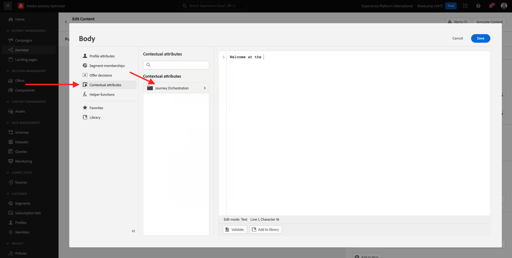

# 3.3 Crear el recorrido y las notificaciones push

En este ejercicio, debe configurar el recorrido y el mensaje que deben activarse cuando alguien introduce una señalización mediante la aplicación móvil.

Inicie sesión en Adobe Journey Optimizer desde [Adobe Experience Cloud](https://experience.adobe.com). Haga clic en **Journey Optimizer**.

Se le redirigirá al **Página principal**  en Journey Optimizer. En primer lugar, asegúrese de que está utilizando el simulador para pruebas correcto. El entorno limitado que se va a usar se denomina `Bootcamp`. Para cambiar de un simulador de pruebas a otro, haga clic en **Prod** y seleccione el simulador de pruebas de la lista. En este ejemplo, el simulador de pruebas recibe el nombre **Bootcamp**. Entonces estará en el **Página principal** vista del entorno limitado `Bootcamp`.

## 3.3.1 Crear su recorrido

En el menú de la izquierda, haga clic en **Recorridos**. A continuación, haga clic en **Crear Recorrido** para crear un nuevo recorrido.

A continuación, verá una pantalla de recorrido vacía.

En el ejercicio anterior, creó una **Evento**. Lo llamaste así `yourLastNameBeaconEntryEvent` y sustituido `yourLastName` con su apellido. Este fue el resultado de la creación del evento:

Ahora debe tomar este evento como el inicio de este Recorrido. Para ello, vaya a la izquierda de la pantalla y busque el evento en la lista de eventos.

Seleccione el evento, arrástrelo y suéltelo en el lienzo del recorrido. Tu recorrido ahora se ve así. Haga clic en **Ok** para guardar los cambios.

Como segundo paso en el recorrido, debe agregar una **Push** acción. Vaya al lado izquierdo de la pantalla para **Acciones**, seleccione **Push** a continuación, arrástrela y colóquela en el segundo nodo del recorrido.

A la derecha de la pantalla, debe crear la notificación push.

Configure las variables **Categoría** a **Marketing** y seleccione una superficie push que le permita enviar notificaciones push. En este caso, la superficie push que se va a seleccionar es **mmeeewis-app-mobile-bootcamp**.

## 3.3.2 Crear su mensaje

Haga clic en **Editar contenido**.

Verá esto:

Definamos el contenido de la notificación push.

Haga clic en el **Título** campo de texto.

En el área de texto empiece a escribir **Hi**. Haga clic en el icono de personalización.

Ahora necesita introducir el token de personalización para el campo **Nombre** que se almacenan en `profile.person.name.firstName`. En el menú de la izquierda, seleccione **Atributos de perfil**, desplácese hacia abajo o navegue hasta encontrar la variable **Persona** y haga clic en la flecha para ir un nivel más profundo hasta que alcance el campo `profile.person.name.firstName`. Haga clic en el **+** para añadir el campo al lienzo. Haga clic en **Guardar**.

Volverás aquí. Haga clic en el icono de personalización situado junto al campo . **Cuerpo**.

En el área de texto, escriba `Welcome at the `.

A continuación, haga clic en **Atributos contextuales** y luego **Journey Orchestration**.

Haga clic en **Eventos**.

Haga clic en el nombre del evento, que debería tener este aspecto: **yourLastNameBeaconEntryEvent**.

Haga clic en **Contexto del lugar**.

Haga clic en **Interacción de puntos de interés**.

Haga clic en **Detalle del punto de interés**.

Haga clic en el **+** icono **Nombre de punto de interés**.
Entonces verás esto. Haga clic en **Guardar**.

El mensaje ya está listo. Haga clic en la flecha situada en la esquina superior izquierda para volver al recorrido.

Haga clic en **Ok**.

## 3.3.2 Enviar un mensaje a una pantalla

Como tercer paso en el recorrido, debe agregar una **sendMessageToScreen** acción. Vaya al lado izquierdo de la pantalla para **Acciones**, seleccione **sendMessageToScreen** a continuación, arrástrela y suéltela en el tercer nodo del recorrido. Entonces verás esto.

La variable **sendMessageToScreen** es una acción personalizada que publica un mensaje en el extremo que usa la visualización en la tienda. La variable **sendMessageToScreen** action espera que se definan varias variables. Para ver estas variables, desplácese hacia abajo hasta que vea **Parámetros de acción**.

Ahora debe establecer los valores para cada parámetro de acción. Siga esta tabla para comprender qué valores se requieren.

| Parámetro | valor |
|:-------------:| :---------------:|
| ENTREGA | `'image'` |
| ECID | `@{yourLastNameBeaconEntryEvent._experienceplatform.identification.core.ecid}` |
| NOMBRE | `#{ExperiencePlatform.ProfileFieldGroup.profile.person.name.firstName}` |
| EVENTSUBJECT | `#{ExperiencePlatform.ProductListItems.experienceevent.first(currentDataPackField.eventType == "commerce.productViews").productListItems.first().name}` |
| EVENTSUBJECTURL | `#{ExperiencePlatform.ProductListItems.experienceevent.first(currentDataPackField.eventType == "commerce.productViews").productListItems.first()._experienceplatform.core.imageURL}` |
| SANDBOX | `'bootcamp'` |
| CONTAINERID | `''` |
| ACTIVITYID | `''` |
| PLACEMENTID | `''` |

{style=&quot;table-layout:auto&quot;}

Para establecer estos valores, haga clic en el botón **Editar** icono.

A continuación, seleccione **Modo avanzado**.

A continuación, pegue el valor en función de la tabla anterior. Haga clic en **Ok**.

Repita este proceso para añadir valores para cada campo.

>[!IMPORTANT]
>
>Para el campo ECID, hay una referencia al evento `yourLastNameBeaconEntryEvent`. Asegúrese de reemplazar `yourLastName` por su apellido.

El resultado final debería tener este aspecto:

Desplácese hacia arriba y haga clic en **Ok**.

Aún necesita darle un Nombre a su recorrido. Para ello, haga clic en el botón **Propiedades** en la parte superior derecha de la pantalla.

A continuación, puede introducir el nombre del recorrido aquí. Utilice `yourLastName - Beacon Entry Journey`. Haga clic en **OK** para guardar los cambios.

Ahora puede publicar el recorrido haciendo clic en **Publicación**.

Haga clic en **Publicación** de nuevo.

A continuación, verá una barra de confirmación verde que indica que su recorrido se ha publicado.

El recorrido ya está activo y se puede activar.

Ya has terminado este ejercicio.

Paso siguiente: [3.4 Probar el recorrido](./ex4.md)

[Volver al flujo de usuario 3](./uc3.md)

[Volver a todos los módulos](../../overview.md)
