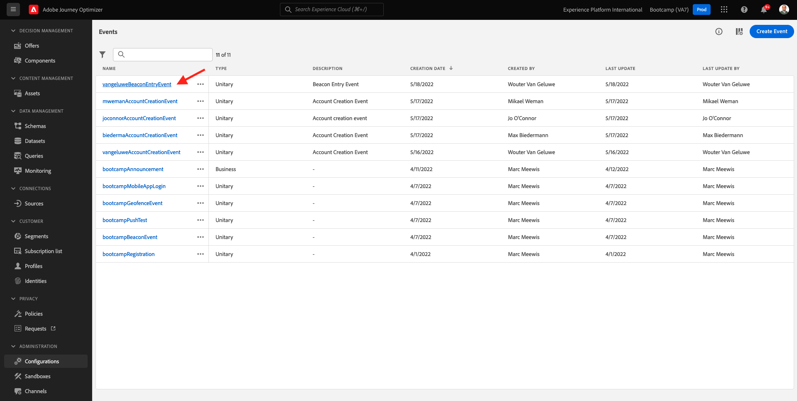
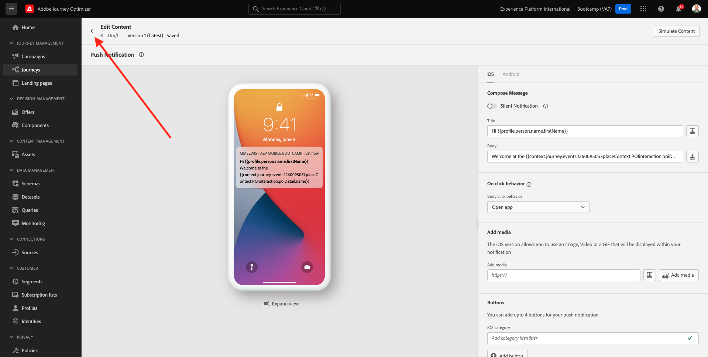
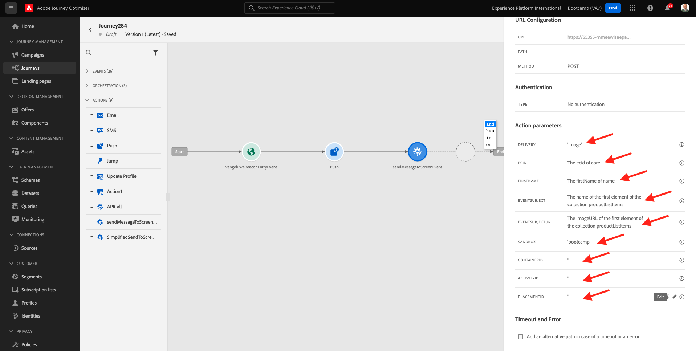

# 3.3 Crear el recorrido y las notificaciones push

En este ejercicio, configurará el recorrido y el mensaje que deben activarse cuando alguien entre en una señalización mediante la aplicación móvil.

Inicie sesión en Adobe Journey Optimizer accediendo a [Adobe Experience Cloud](https://experience.adobe.com). Clic **Journey Optimizer**.

Se le redirigirá a la variable **Inicio**  ver en Journey Optimizer. Primero, asegúrese de que está usando la zona protegida correcta. Se llama a la zona protegida que se va a utilizar `Bootcamp`. Para cambiar de una zona protegida a otra, haga clic en **Prod** y seleccione la zona protegida de la lista. En este ejemplo, la zona protegida se denomina **Bootcamp**. Entonces estarás en el... **Inicio** vista de la zona protegida `Bootcamp`.

## 3.3.1 Creación de un recorrido

En el menú izquierdo, haga clic en **Recorridos**. A continuación, haga clic en **Crear Recorrido** para crear un nuevo recorrido.

A continuación, verá una pantalla de recorrido vacía.

En el ejercicio anterior creó un nuevo **Evento**. Lo llamaste así `yourLastNameBeaconEntryEvent` y reemplazado `yourLastName` con tu apellido. Este fue el resultado de la creación del Evento:

Ahora debe tomar este evento como inicio de este Recorrido. Para ello, vaya al lado izquierdo de la pantalla y busque el evento en la lista de eventos.

Seleccione el evento, arrástrelo y suéltelo en el lienzo de recorrido. Su recorrido ahora tiene este aspecto. Clic **Ok** para guardar los cambios.

Como segundo paso en el recorrido, debe agregar un **Push** acción. Vaya al lado izquierdo de la pantalla para **Acciones**, seleccione la **Push** acción y, a continuación, arrástrela y suéltela en el segundo nodo del recorrido.

A la derecha de la pantalla, debe crear la notificación push.

Configure las variables **Categoría** hasta **Marketing** y seleccione una superficie push que le permita enviar notificaciones push. En este caso, la superficie de inserción que se va a seleccionar es **mmeewis-app-mobile-bootcamp**.

## 3.3.2 Crear el mensaje

Clic **Editar contenido**.

A continuación, verá esto:

Definamos el contenido de la notificación push.

Haga clic en **Título** campo de texto.

En el área de texto, empiece a escribir **Hola**. Haga clic en el icono de personalización.

Ahora debe introducir el token de personalización para el campo **Nombre** que se almacena en `profile.person.name.firstName`. En el menú izquierdo, seleccione **Atributos de perfil**, desplácese hacia abajo/navegue hasta encontrar la **Persona** y haga clic en la flecha para profundizar hasta llegar al campo `profile.person.name.firstName`. Haga clic en **+** para añadir el campo al lienzo. Haga clic en **Guardar**.

Entonces volverás a estar aquí. Haga clic en el icono de personalización junto al campo **Cuerpo**.

En el área de texto, escriba `Welcome at the `.

A continuación, haga clic en **Atributos contextuales** y luego **Journey Orchestration**.

Clic **Eventos**.

Haga clic en el nombre del evento, que debería tener este aspecto: **yourLastNameBeaconEntryEvent**.

Clic **Contexto del lugar**.

Clic **Interacción del PDI**.

Clic **Detalles del PDI**.

Haga clic en **+** icono en **Nombre del PDI**.
Entonces verá esto... Haga clic en **Guardar**.

El mensaje ya está listo. Haga clic en la flecha de la esquina superior izquierda para volver al recorrido.

Haga clic en **Ok**.

## 3.3.2 Enviar un mensaje a una pantalla

Como tercer paso del recorrido, debe agregar una **sendMessageToScreen** acción. Vaya al lado izquierdo de la pantalla para **Acciones**, seleccione la **sendMessageToScreen** acción y, a continuación, arrástrela y suéltela en el tercer nodo del recorrido. Entonces verá esto...

El **sendMessageToScreen** acción es una acción personalizada que publicará un mensaje en el extremo que utiliza la visualización en tienda. El **sendMessageToScreen** action espera que se definan varias variables. Puede ver esas variables desplazándose hacia abajo hasta que vea **Parámetros de acción**.

Ahora debe establecer los valores de cada parámetro de acción. Siga esta tabla para comprender qué valores se requieren dónde.

| Parámetro | valor |
|:-------------:| :---------------:|
| ENVÍO | `'image'` |
| ECID | `@{yourLastNameBeaconEntryEvent._experienceplatform.identification.core.ecid}` |
| NOMBRE | `#{ExperiencePlatform.ProfileFieldGroup.profile.person.name.firstName}` |
| EVENTSUBJECT | `#{ExperiencePlatform.ProductListItems.experienceevent.first(currentDataPackField.eventType == "commerce.productViews").productListItems.first().name}` |
| EVENTSUBJECTURL | `#{ExperiencePlatform.ProductListItems.experienceevent.first(currentDataPackField.eventType == "commerce.productViews").productListItems.first()._experienceplatform.core.imageURL}` |
| ZONA PROTEGIDA | `'bootcamp'` |
| CONTAINERID | `''` |
| ACTIVITYID | `''` |
| PLACEMENTID | `''` |

{style="table-layout:auto"}

Para definir estos valores, haga clic en **Editar** icono.

A continuación, seleccione **Modo avanzado**.

A continuación, pegue el valor en función de la tabla anterior. Haga clic en **Ok**.

Repita este proceso para agregar valores a cada campo.

>[!IMPORTANT]
>
>Para el ECID de campo, hay una referencia al evento `yourLastNameBeaconEntryEvent`. Asegúrese de reemplazar `yourLastName` por tu apellido.

El resultado final debería ser similar al siguiente:

Desplazarse arriba y hacer clic **Ok**.

Aún necesita darle un Nombre a su recorrido. Para ello, haga clic en el icono **Propiedades** en la parte superior derecha de la pantalla.

A continuación, puede introducir el nombre del recorrido aquí. Utilice `yourLastName - Beacon Entry Journey`. Clic **OK** para guardar los cambios.

Ahora puede publicar el recorrido haciendo clic en **Publish**.

Clic **Publish** otra vez.

A continuación, verá una barra de confirmación verde que indica que el recorrido se ha publicado.

El recorrido ya está activo y se puede activar.

Ya ha terminado este ejercicio.

Paso siguiente: [3.4 Probar el recorrido](./ex4.md)

[Volver al flujo de usuario 3](./uc3.md)

[Volver a todos los módulos](../../overview.md)
