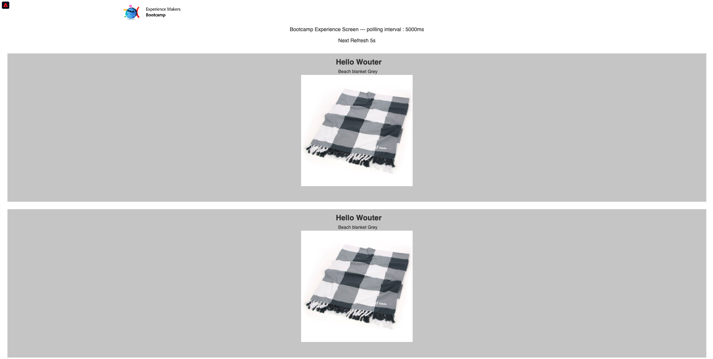

# 3.4 Probar el recorrido

Para probar el recorrido, deberá utilizar el ID de evento del evento que creó en el ejercicio 3.2, que tiene este aspecto.

El ID de evento es lo que debe enviarse a Adobe Experience Platform para almacenar el recorrido en déclencheur. En este ejemplo, el eventID es:
`e76c0bf0c77c3517e5b6f4c457a0754ebaf5f1f6b9357d74e0d8e13ae517c3d5`.

Abra la aplicación móvil y vaya a la página principal. Haga clic en el icono **Configuración**.

Pegue el ID de evento en el campo **EventID de señalización** y haga clic en **Guardar**.

Antes de continuar, abre esta página web en tu ordenador: [https://bootcamp.aepdemo.net/content/aep-bootcamp-experience/language-masters/en/screen.html](https://bootcamp.aepdemo.net/content/aep-bootcamp-experience/language-masters/en/screen.html)

A continuación, verá esto:

A continuación, vuelva a la página principal. Haga clic en **baliza** icono.

Entonces verá esto... Primero, seleccione **Señalización de pantalla de Bootcamp** y, a continuación, haga clic en **entrada** botón. Esto le permite simular una entrada de señalización.

Eche un vistazo a la pantalla de la tienda. Verá el último producto que vio aparecer allí en 5 segundos.

También ha recibido su notificación push.

Ya ha terminado este ejercicio.

[Volver al flujo de usuario 3](./uc3.md)

[Volver a todos los módulos](../../overview.md)
