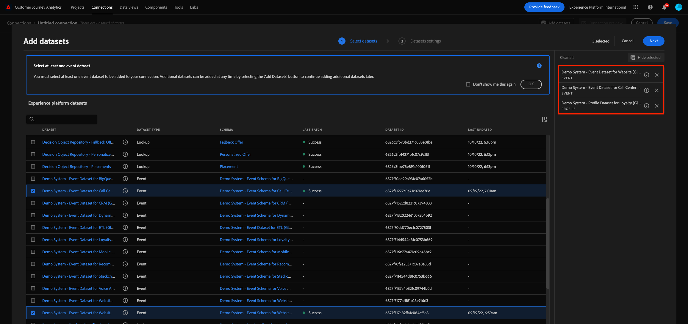
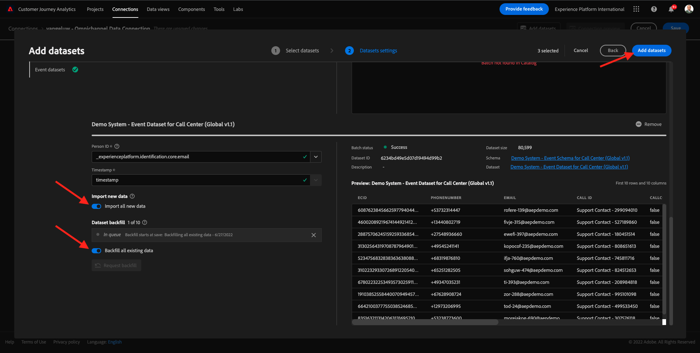

# 4.2 Conectar conjuntos de datos de Adobe Experience Platform en Customer Journey Analytics

## Objetivos

- Explicación de la interfaz de usuario de conexión de datos
- Incluir datos de Adobe Experience Platform en CJA
- Comprensión del ID de persona y la vinculación de datos
- Descubra el concepto de transmisión de datos en Customer Journey Analytics

## Conexión 4.2.1

Vaya a [analytics.adobe.com](https://analytics.adobe.com) para acceder al Customer Journey Analytics.

En la página de inicio del Customer Journey Analytics, vaya a **Conexiones**.

Aquí puede ver las diferentes conexiones hechas entre CJA y Platform. Estas conexiones tienen el mismo objetivo que los grupos de informes de Adobe Analytics. Sin embargo, la recopilación de los datos es totalmente diferente. Todos los datos proceden de conjuntos de datos de Adobe Experience Platform.

Vamos a crear su primera conexión. Haga clic en **Crear nueva conexión**.

Verá el **Crear conexión** IU.

Ahora puede asignar un nombre a la conexión.

Utilice esta convención de nombres: `yourLastName – Omnichannel Data Connection`.

Ejemplo: `vangeluw - Omnichannel Data Connection`

También debe seleccionar el simulador de pruebas correcto para utilizarlo. En el menú del simulador de pruebas, seleccione el simulador de pruebas, que debería `Bootcamp`. En este ejemplo, el simulador de pruebas que se va a usar es **Bootcamp**. Y también es necesario configurar la variable **Cantidad promedio de eventos diarios** a **menos de 1 millón**.

Después de seleccionar el simulador para pruebas, puede empezar a agregar conjuntos de datos a esta conexión. Haga clic en **Agregar conjuntos de datos**.

## 4.2.2 Seleccionar conjuntos de datos de Adobe Experience Platform

Buscar el conjunto de datos `Demo System - Event Dataset for Website (Global v1.1)`. Haga clic en **+** para agregar el conjunto de datos a esta conexión.

Ahora busque y marque las casillas de verificación `Demo System - Event Dataset for Voice Assistants (Global v1.1)` y `Demo System - Event Dataset for Call Center (Global v1.1)`.

Entonces tendrás esto. Haga clic en **Siguiente**.

## 4.2.3 ID de persona y configuración de datos

### ID de la persona

El objetivo ahora es unir estos conjuntos de datos. Para cada conjunto de datos seleccionado, verá un campo llamado **ID de persona**. Cada conjunto de datos tiene su propio campo de ID de persona .

Como puede verse, la mayoría de ellos tienen el ID de persona seleccionado automáticamente. Esto se debe a que se selecciona un identificador principal en cada esquema de Adobe Experience Platform. A modo de ejemplo, este es el esquema de `Demo System - Event Schema for Call Center (Global v1.1)`, donde puede ver que el identificador principal está establecido en `phoneNumber`.

Sin embargo, aún puede influir en qué identificador se utilizará para unir conjuntos de datos para la conexión. Puede utilizar cualquier identificador que esté configurado en el esquema vinculado al conjunto de datos. Haga clic en el menú desplegable para explorar los ID disponibles en cada conjunto de datos.

Como se ha mencionado, puede establecer distintos ID de persona para cada conjunto de datos. Esto le permite unir diferentes conjuntos de datos de varios orígenes en CJA. Imaginen traer datos de NPS o encuestas que serían muy interesantes y útiles para entender el contexto y por qué algo ha pasado.

El nombre del campo ID de persona no es importante, siempre y cuando el valor de los campos ID de persona se corresponda. Digamos que tenemos `email` en un conjunto de datos y `emailAddress` en otro conjunto de datos definido como ID de persona. If `delaigle@adobe.com` es el mismo valor para el campo ID de persona en ambos conjuntos de datos, CJA podrá unir los datos.

Actualmente hay otras limitaciones como unir el comportamiento anónimo a conocido. Consulte las preguntas frecuentes aquí: [Preguntas frecuentes](https://experienceleague.adobe.com/docs/analytics-platform/using/cja-overview/cja-faq.html?lang=es).

### Vinculación de datos mediante el ID de persona

Ahora que comprende el concepto de vincular conjuntos de datos con el ID de persona, vamos a elegir `email` como ID de persona para cada conjunto de datos.

Vaya a cada conjunto de datos para actualizar el ID de persona.

Rellene el campo ID de persona que elige la variable `email` en la lista desplegable.

Una vez que haya vinculado los tres conjuntos de datos, estaremos listos para continuar.

| Conjunto de datos | ID de la persona |
| ----------------- |-------------| 
| Sistema de demostración: conjunto de datos de evento para sitio web (Global v1.1) | email |
| Sistema de demostración: conjunto de datos de evento para asistentes de voz (Global v1.1) | email |
| Sistema de demostración: conjunto de datos de evento para el centro de llamadas (Global v1.1) | email |

También debe asegurarse de que para cada conjunto de datos, estas opciones estén habilitadas:

- Importar todos los datos nuevos
- Rellenar datos existentes

Haga clic en **Agregar conjuntos de datos**.

Haga clic en **Guardar** y vaya al siguiente ejercicio.
Después de crear el **Conexión** puede tardar unas horas en que los datos estén disponibles en CJA.

Paso siguiente: [4.3 Crear una vista de datos](./ex3.md)

[Volver al flujo de usuario 4](./uc4.md)

[Volver a todos los módulos](./../../overview.md)
