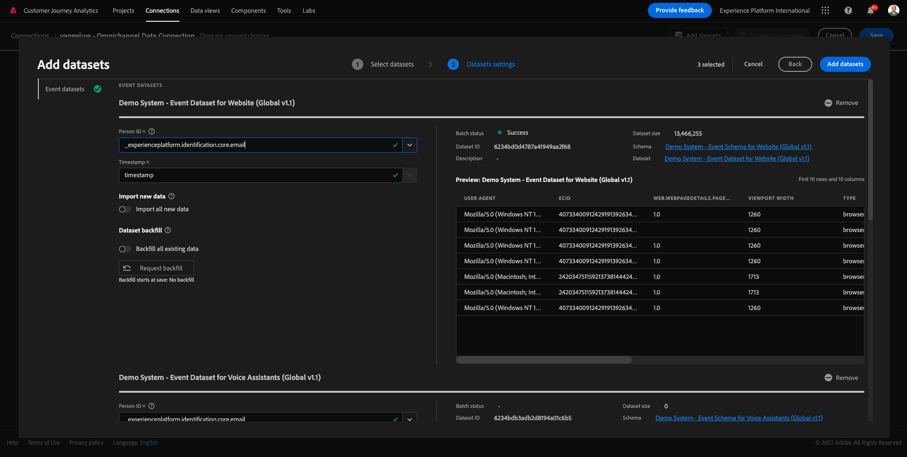

# 4.2 Conectar conjuntos de datos de Adobe Experience Platform en Customer Journey Analytics

## Objetivos

- Información sobre la IU de conexión de datos
- Introducción de datos de Adobe Experience Platform en CJA
- Explicación del ID de persona y la vinculación de datos
- Conozca el concepto de flujo de datos en Customer Journey Analytics

## 4.2.1 Conexión

Ir a [analytics.adobe.com](https://analytics.adobe.com) para acceder al Customer Journey Analytics.

En la página principal del Customer Journey Analytics, vaya a **Conexiones**.

Aquí puede ver todas las diferentes conexiones realizadas entre CJA y Platform. Estas conexiones tienen el mismo objetivo que los grupos de informes en Adobe Analytics. Sin embargo, la recopilación de los datos es totalmente diferente. Todos los datos proceden de conjuntos de datos de Adobe Experience Platform.

Vamos a crear su primera conexión. Haga clic en **Crear nueva conexión**.

A continuación, verá el **Crear conexión** IU.

Ahora puede asignar un nombre a la conexión.

Utilice esta convención de nombres: `yourLastName – Omnichannel Data Connection`.

Ejemplo: `vangeluw - Omnichannel Data Connection`

También debe seleccionar la zona protegida correcta para utilizarla. En el menú de zona protegida, seleccione la zona protegida, que debe ser `Bootcamp`. En este ejemplo, la zona protegida que se va a utilizar es **Bootcamp**. Y también debe configurar el **Promedio del número de eventos diarios** hasta **menos de 1 millón**.

Después de seleccionar el simulador para pruebas, puede empezar a agregar conjuntos de datos a esta conexión. Clic **Añadir conjuntos de datos**.

## 4.2.2 Seleccionar conjuntos de datos de Adobe Experience Platform

Buscar el conjunto de datos `Demo System - Event Dataset for Website (Global v1.1)`. Clic **+** para agregar el conjunto de datos a esta conexión.

Ahora, busque y marque las casillas de verificación de `Demo System - Profile Dataset for Loyalty (Global v1.1)` y `Demo System - Event Dataset for Call Center (Global v1.1)`.

Entonces, tendrás esto. Haga clic en **Siguiente**.

## 4.2.3 ID de persona y vinculación de datos

### ID de la persona

El objetivo ahora es unirse a estos conjuntos de datos. Para cada conjunto de datos seleccionado, verá un campo llamado **ID de persona**. Cada conjunto de datos tiene su propio campo de ID de persona.

Como puede ver, la mayoría de ellos tienen el ID de persona seleccionado automáticamente. Esto se debe a que se selecciona un identificador principal en cada esquema de Adobe Experience Platform. Por ejemplo, este es el esquema para `Demo System - Event Schema for Call Center (Global v1.1)`, donde puede ver que el Identificador principal está configurado en `phoneNumber`.

Sin embargo, aún puede influir en qué identificador se utilizará para unir conjuntos de datos para la conexión. Puede utilizar cualquier identificador que esté configurado en el esquema vinculado a su conjunto de datos. Haga clic en el menú desplegable para explorar los ID disponibles en cada conjunto de datos.

Como se ha mencionado, puede establecer diferentes ID de persona para cada conjunto de datos. Esto le permite unir diferentes conjuntos de datos de varios orígenes en CJA. Imaginen traer NPS o datos de encuestas que serían muy interesantes y útiles para entender el contexto y por qué ha pasado algo.

El nombre del campo ID de persona no es importante, siempre y cuando el valor de los campos ID de persona se corresponda con. Por ejemplo, si el ID de persona es `email` en un conjunto de datos y `emailAddress` en otro, y `dnb-bootcamp@adobe.com` tiene el mismo valor para el campo ID de persona en ambos conjuntos de datos, CJA podrá unir los datos.

Actualmente existen otras limitaciones, como vincular el comportamiento anónimo a conocido. Consulte las preguntas frecuentes aquí: [FAQ](https://experienceleague.adobe.com/docs/analytics-platform/using/cja-overview/cja-faq.html?lang=es).

### Configuración de los datos mediante el ID de persona

Ahora que comprende el concepto de vinculación de conjuntos de datos mediante el ID de persona, vamos a elegir `email` como ID de persona para cada conjunto de datos.

Vaya a cada conjunto de datos para actualizar el ID de persona.

Ahora rellene el campo ID de persona eligiendo el `email` en la lista desplegable.

Una vez que haya vinculado los tres conjuntos de datos, estamos listos para continuar.

| Conjunto de datos | ID de la persona |
| ----------------- |-------------| 
| Sistema de demostración: conjunto de datos de eventos para el sitio web (Global v1.1) | email |
| Sistema de demostración: conjunto de datos de perfil para fidelización (Global v1.1) | email |
| Sistema de demostración: conjunto de datos de eventos para el centro de llamadas (Global v1.1) | email |

También debe asegurarse de que estas opciones estén habilitadas para cada conjunto de datos:

- Importar todos los datos nuevos
- Rellenar todos los datos existentes

Clic **Añadir conjuntos de datos**.

Clic **Guardar** y vaya al siguiente ejercicio.
Después de crear su **Conexión** Es posible que pasen unas horas antes de que los datos estén disponibles en CJA.

Paso siguiente: [4.3 Crear una vista de datos](./ex3.md)

[Volver al flujo de usuario 4](./uc4.md)

[Volver a todos los módulos](./../../overview.md)
