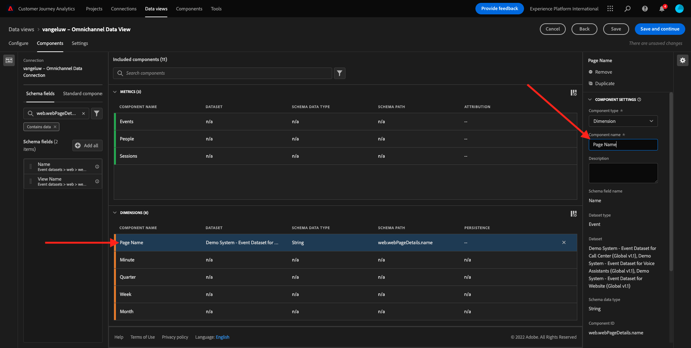
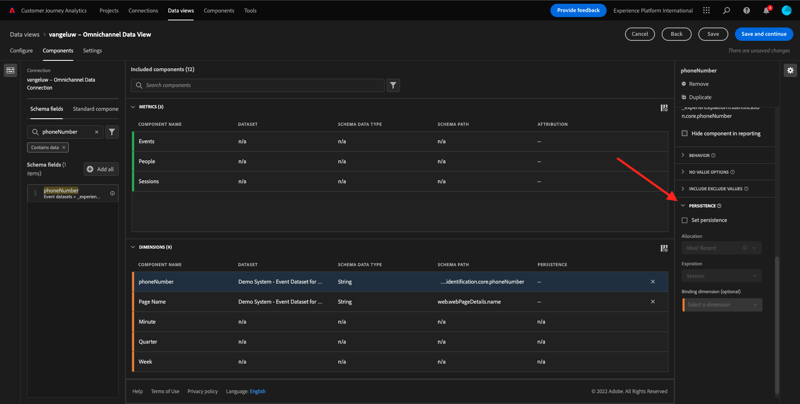
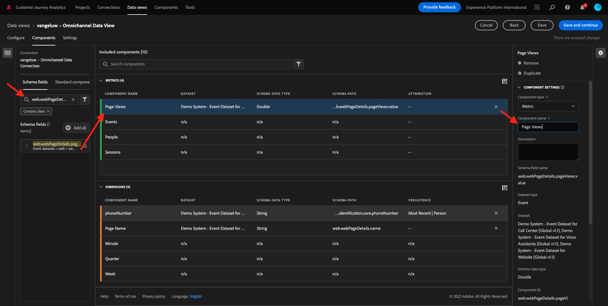
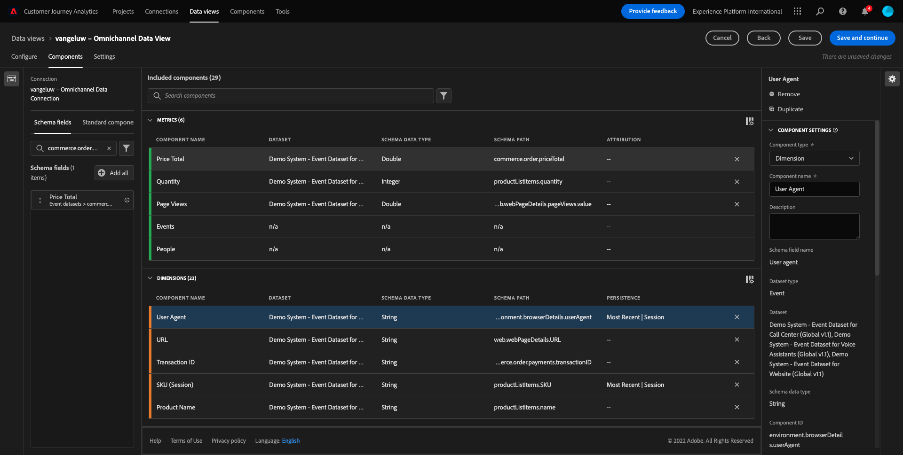

# 4.3 Crear una vista de datos

## Objetivos

- Explicación de la interfaz de usuario de la vista de datos
- Comprender la configuración básica de la definición de visita
- Comprender la atribución y la persistencia dentro de una vista de datos

## Vista de datos 4.3.1

Una vez finalizada la conexión, ahora puede progresar para influir en la visualización. Una diferencia entre Adobe Analytics y CJA es que CJA necesita una vista de datos para limpiar y preparar los datos antes de la visualización.

Una vista de datos es similar al concepto de grupos de informes virtuales en Adobe Analytics, donde se definen las definiciones de visitas según el contexto, el filtrado y también cómo se llaman los componentes.

Necesitará un mínimo de una vista de datos por conexión. Sin embargo, en algunos casos de uso, es bueno tener varias vistas de datos para la misma conexión, con el objetivo de dar diferentes perspectivas a diferentes equipos.
Si desea que su empresa se oriente por los datos, debe adaptar la forma en que se ven los datos en cada equipo. Algunos ejemplos:

- Métricas de experiencia de usuario solo para el equipo Diseño de experiencia de usuario
- Utilice los mismos nombres para KPI y métricas para Google Analytics que para Customer Journey Analytics, de modo que el equipo de análisis digital solo hable un idioma.
- La vista de datos se filtró para mostrar, por ejemplo, datos de un solo mercado, una marca o solo de dispositivos móviles.

En el **Conexiones** , marque la casilla de verificación situada delante de la conexión que acaba de crear. Haga clic en **Crear vista de datos**.

Se le redirigirá al **Crear vista de datos** flujo de trabajo.

## Definición de vista de datos 4.3.2

Ahora puede configurar las definiciones básicas de la vista de datos.

La variable **Conexión** el que creó en el ejercicio anterior ya está seleccionado. El nombre de la conexión `yourLastName – Omnichannel Data Connection`.

A continuación, asigne un nombre a la vista de datos siguiendo esta convención de nomenclatura: `yourLastName – Omnichannel Data View`.

Introduzca el mismo valor para la descripción: `yourLastName – Omnichannel Data View`.

| Nombre | Descripción |
| ----------------- |-------------| 
| `yourLastName – Omnichannel Data View` | `yourLastName – Omnichannel Data View` |

Para la variable **Zona horaria**, seleccione la zona horaria **Berlín, Estocolmo, Roma, Berna, Bruselas, Viena, Ámsterdam GMT+01:00**. Este es un entorno realmente interesante, ya que algunas compañías operan en diferentes países y regiones geográficas. Asignar el huso horario adecuado para cada país evitará errores típicos en los datos, como creer que, por ejemplo, en Perú, la mayoría de la gente compra camisetas a las 4:00 am.

También puede modificar el nombre de las métricas principales (Persona, Sesión y Evento). Esto no es necesario, pero a algunos clientes les gusta utilizar Personas, Visitas y Visitas en lugar de Persona, Sesión y Eventos (convención de nomenclatura predeterminada del Customer Journey Analytics).

Ahora debe tener configuradas las siguientes opciones:

Haga clic en **Guardar y continuar**.

## 4.3.3 Componentes de vista de datos

En este ejercicio, debe configurar los componentes necesarios para analizar los datos y visualizarlos con Analysis Workspace. En esta IU, hay tres áreas principales:

- Lado izquierdo: Componentes disponibles de los conjuntos de datos seleccionados
- Medio: Componentes añadidos a la vista de datos
- Lado derecho: Configuración de componentes

>[!IMPORTANT]
>
>Si no encuentra una métrica o dimensión específica, compruebe si el campo `Contains data` se elimina de la vista de datos. Si no es así, elimine ese campo.
>
>

Ahora tiene que arrastrar y soltar los componentes que necesita para el análisis en el **Componentes añadidos**. Para ello, debe seleccionar los componentes en el menú de la izquierda y arrastrarlos y soltarlos en el lienzo del medio.

Comencemos con el primer componente: **Nombre (web.webPageDetails.name)**. Busque este componente y arrástrelo y suéltelo en el lienzo.

Este componente es el nombre de la página, como puede derivar de la lectura del campo de esquema `(web.webPageDetails.name)`.

Sin embargo, al usar **Nombre** ya que el nombre no es la mejor convención de nombres para que un usuario empresarial comprenda rápidamente esta dimensión.

Cambiemos el nombre para que sea **Nombre de la página**. Haga clic en el componente y cambie su nombre en el **Configuración de componentes** .

Algo muy importante es que **Configuración de persistencia**. El concepto de evars y prop no existe en CJA, pero la configuración de Persistencia permite un comportamiento similar.

Si no cambia esta configuración, CJA interpretará la dimensión como un **Prop** (nivel de visita). Además, podemos cambiar la Persistencia para que la dimensión sea un **eVar** (mantiene el valor en todo el recorrido).

Si no está familiarizado con eVars y Props, puede [obtenga más información sobre ellas en la documentación](https://experienceleague.adobe.com/docs/analytics/landing/an-key-concepts.html).

Dejemos el Nombre de página como una propiedad. Como tal, no es necesario cambiar ninguna **Configuración de persistencia**.

| Nombre del componente para buscar | Nuevo nombre | Configuración de persistencia |
| ----------------- |-------------| --------------------| 
| Nombre (web.webPageDetails.name) | Nombre de página |  |

A continuación, seleccione la dimensión **phoneNumber** y suéltelo en el lienzo. El nuevo nombre debe ser **Número de teléfono**.

Finalmente, vamos a cambiar la configuración de Persistencia, ya que el número móvil debe persistir a nivel de usuario.

Para cambiar la Persistencia, desplácese hacia abajo en el menú derecho y abra el **Persistencia** pestaña:

Marque la casilla de verificación para modificar la configuración de persistencia. Select **Más reciente** y **Persona (ventana Sistema de informes)** , ya que solo nos importa el último número de móvil de esa persona. Si el cliente no completa el móvil en futuras visitas, seguirá viendo este valor rellenado.

| Nombre del componente para buscar | Nuevo nombre | Configuración de persistencia |
| ----------------- |-------------| --------------------| 
| phoneNumber | N.º de teléfono | Más reciente, Persona (ventana de informes) |

El siguiente componente es `web.webPageDetails.pageViews.value`.

En el menú de la izquierda, busque `web.webPageDetails.pageViews.value`. Arrastre y suelte esta métrica en el lienzo.

Cambiar el nombre a **Vistas de páginas** en el **Configuración de componentes**.

| Nombre del componente para buscar | Nuevo nombre | Configuración de atribución |
| ----------------- |-------------| --------------------| 
| web.webPageDetails.pageViews.value | Page Views |  |

Para la configuración de atribución, dejaremos esto vacío.

Nota: La configuración de persistencia de las métricas también se puede cambiar en Analysis Workspace. En algunos casos, puede elegir configurarlo aquí para evitar que los usuarios empresariales tengan que pensar cuál es el mejor modelo de persistencia.

A continuación, tendrá que configurar una gran cantidad de Dimension y métricas, como se indica en la tabla siguiente.

### Dimension

| Nombre del componente para buscar | Nuevo nombre | Configuración de persistencia |
| ----------------- |-------------| --------------------| 
| brandName | Nombre de la marca | Más reciente, sesión |
| llamada | Sensación de llamada |  |
| ID de llamada | Tipo de interacción de llamada |  |
| callTopic | Tema de llamada | Más reciente, sesión |
| ecid | ECID | Más reciente, Persona (ventana de informes) |
| email | ID de correo electrónico | Más reciente, Persona (ventana de informes) |
| Tipo de pago | Tipo de pago |  |
| Método de adición de productos | Método de adición de productos | Más reciente, sesión |
| Tipo de evento | Tipo de evento |  |
| Nombre (productListItems.name) | Nombre del producto |  |
| SKU | SKU (sesión) | Más reciente, sesión |
| El ID de transacción | El ID de transacción |  |
| URL (web.webPageDetails.URL) | URL |  |
| Agente de usuario | Agente de usuario | Más reciente, sesión |

### MÉTRICAS

| Nombre del componente para buscar | Nuevo nombre | Configuración de atribución |
| ----------------- |-------------| --------------------| 
| Cantidad | Cantidad |  |
| commerce.order.priceTotal | Ingresos |  |

La configuración debería tener este aspecto:

No olvides **Guardar** la vista de datos. Haga clic en **Guardar** ahora.

## 4.3.4 Métricas calculadas

Aunque hemos organizado todos los componentes de la vista de datos, aún debe adaptar algunos de ellos para que los usuarios empresariales estén listos para iniciar su análisis.

Si recuerda, no hemos introducido métricas específicas como Agregar al carro, Vista de producto o Compras en la Vista de datos.
Sin embargo, sí tenemos una dimensión llamada: **Tipo de evento**. Así que, derivemos estos tipos de interacción creando 3 Métricas calculadas.

Empecemos con la primera métrica: **Vistas del producto**.

A la izquierda, busque **Tipo de evento** y seleccione la dimensión . A continuación, arrástrela y suéltela en el **Componentes incluidos** lienzo.

Haga clic en para seleccionar la nueva métrica **Tipo de evento**.

A continuación, cambie el nombre y la descripción del componente a los siguientes valores:

| Nombre del componente | Descripción del componente |
| ----------------- |-------------| 
| Vistas del producto | Vistas del producto |

Ahora solo contaremos **Vistas del producto** eventos. Para ello, desplácese hacia abajo en el **Configuración de componentes** hasta que vea **Incluir valores de exclusión**. Asegúrese de activar la opción **Definir valores de inclusión/exclusión**.

Como solo queremos contar **Vistas del producto**, especifique **commerce.productViews** en los criterios.

La métrica calculada ya está lista.

A continuación, repita el mismo proceso durante **Agregar al carro** y **Compra** eventos.

### Agregar al carro

Primero arrastre y suelte la misma dimensión **Tipo de evento**.

Verá una alerta emergente de un campo duplicado mientras usamos la misma variable. Haga clic en **Agregar de todos modos**:

Ahora, siga el mismo proceso que hicimos con la métrica Vistas del producto:
- Cambie primero el nombre y la descripción.
- Finalmente, agregue **commerce.productListAdd** como criterios para contar solo Agregar al carro

| Nombre | Descripción | Criterios |
| ----------------- |-------------| -------------|
| Agregar al carro | Agregar al carro | commerce.productListAdds |

### Compras

Primero arrastre y suelte la misma dimensión **Tipo de evento** como lo hicimos para ambas métricas anteriores.

Verá una alerta emergente de un campo duplicado mientras usamos la misma variable. Haga clic en **Agregar de todos modos**:

Ahora, siga el mismo proceso que hicimos con las métricas Vistas del producto y Agregar al carro de compras:
- Cambie primero el nombre y la descripción.
- Finalmente, agregue **commerce.purchases** como criterios para contar solo las compras

| Nombre | Descripción | Criterios |
| ----------------- |-------------| -------------|
| Compras | Compras | commerce.purchases |

La configuración final debería tener un aspecto similar a este. Haga clic en **Guardar y continuar**.

## 4.3.5 Configuración de vista de datos

Se le debe redirigir a esta pantalla:

En esta pestaña, puede modificar algunas configuraciones importantes para cambiar la forma en que se procesan los datos. Empecemos por configurar la variable **Tiempo de espera de sesión** a 30 min. Gracias a la marca de tiempo de cada evento de experiencia, puede ampliar el concepto de sesión en todos los canales. Por ejemplo, ¿qué sucede si un cliente llama al centro de llamadas después de visitar el sitio web? Al usar tiempos de espera de sesión personalizados, tiene mucha flexibilidad para decidir qué es una sesión y cómo se combinarán los datos de esa sesión.

En esta pestaña puede modificar otras cosas, como filtrar los datos utilizando un segmento o filtro. No tendrá que hacer eso en este ejercicio.

Una vez que haya terminado, haga clic en **Guardar y finalizar**.

>[!NOTE]
>
>Puede volver a esta vista de datos posteriormente y cambiar la configuración y los componentes en cualquier momento. Los cambios afectarán a la forma en que se muestran los datos históricos.

Ahora puede continuar con la parte de visualización y análisis.

Paso siguiente: [4.4 Preparación de datos en el Customer Journey Analytics](./ex4.md)

[Volver al flujo de usuario 4](./uc4.md)

[Volver a todos los módulos](./../../overview.md)
