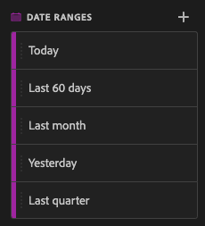

# 4.4 Preparación de datos en Analysis Workspace

## Objetivos

- Explicación de la interfaz de usuario de Analysis Workspace en CJA
- Comprender los conceptos de preparación de datos en Analysis Workspace
- Aprenda a realizar cálculos de datos

## 4.4.1 Interfaz de usuario de Analysis Workspace en CJA

Analysis Workspace elimina todas las limitaciones típicas de un único informe de Analytics. Proporciona un lienzo flexible y robusto para la creación de proyectos de análisis personalizados. Arrastre y suelte cualquier número de tablas de datos, visualizaciones y componentes (dimensiones, métricas, segmentos y granularidades de tiempo) en un proyecto. Cree de forma instantánea desgloses y segmentos, cohortes para análisis y alertas, compare segmentos, realice análisis de flujo y visitas en el orden previsto, y revise y programe informes para compartir con cualquier persona de su empresa.

Customer Journey Analytics añade esta solución a los datos de Platform. Le recomendamos encarecidamente que vea este vídeo de información general de cuatro minutos:

>[!VIDEO](https://video.tv.adobe.com/v/35109?quality=12&learn=on)

Si no ha utilizado Analysis Workspace anteriormente, le recomendamos encarecidamente que vea este vídeo:

>[!VIDEO](https://video.tv.adobe.com/v/26266?quality=12&learn=on)

### Crear un proyecto

Ahora es el momento de crear su primer proyecto de CJA. Vaya a la pestaña proyectos dentro de CJA.
Haga clic en **Crear nuevo**.

Entonces verás esto. Select **Proyecto en blanco** y haga clic en **Crear**.

A continuación, verá un proyecto vacío.

En primer lugar, asegúrese de seleccionar la vista de datos correcta en la esquina superior derecha de la pantalla. En este ejemplo, la vista de datos que se va a seleccionar es `CJA Bootcamp - Omnichannel Data View`.

A continuación, guardará el proyecto y le dará un nombre. Puede utilizar el siguiente comando para guardar:

| SO | Cortocircuito |
| ----------------- |-------------| 
| Windows | Control + S |
| Mac | Comando +S |

Verá esta ventana emergente:

Utilice esta convención de nombres:

| Nombre | Descripción |
| ----------------- |-------------| 
| `yourLastName - Omnichannel Analysis` | `yourLastName - Omnichannel Analysis` |

A continuación, haga clic en **Guardar**.

## 4.4.2 Métricas calculadas

Aunque hemos organizado todos los componentes de la vista de datos, aún debe adaptar algunos de ellos para que los usuarios empresariales estén listos para iniciar su análisis. Además, durante cualquier análisis puede crear métricas calculadas para profundizar en la búsqueda de perspectivas.

Como ejemplo, crearemos un **Tasa de conversión** usando la variable **Compras** métrica/evento que hemos definido en la vista de datos.

### Tasa de conversión

Comencemos a abrir el creador de métricas calculadas. Haga clic en el **+** para crear la primera métrica calculada en Analysis Workspace.

La variable **Creador de métricas calculadas** se mostrará:

Busque la **Compras** en la lista de Métricas del menú de la izquierda. En **Métricas** click **Mostrar todo**

A continuación, arrastre y suelte el **Compras** en a la definición de métrica calculada.

Normalmente, la tasa de conversión significa **Conversiones/Sesiones**. Por lo tanto, hagamos el mismo cálculo en el lienzo de definición de métrica calculada. Busque la **Sesiones** y arrástrela y suéltela en el generador de definiciones, en el **Compras** evento.

Observe que el operador de división se selecciona automáticamente.

La tasa de conversión suele representarse en porcentaje. Por lo tanto, cambiemos el formato a porcentaje y también seleccione 2 decimales.

Finalmente, cambie el nombre y la descripción de la métrica calculada:

| Título | Descripción |
| ----------------- |-------------| 
| yourLastName - Tasa de conversión | yourLastName - Tasa de conversión |

Tendrá algo así en la pantalla:

No olvides **Guardar** la métrica calculada.

## 4.4.3 Dimension calculados: Filtros (segmentación) e intervalos de fechas

### Filtros: Dimension calculados

Los cálculos no están pensados para ser solo para métricas. Antes de iniciar cualquier análisis, también es interesante crear algunos **Dimension calculados**. Esto significa **segmentos** en Adobe Analytics. En Customer Journey Analytics, estos segmentos se llaman **Filtros**.

La creación de filtros ayudará a los usuarios empresariales a iniciar el análisis con algunas dimensiones calculadas valiosas. Esto automatizará algunas tareas, así como la ayuda en la parte de adopción. Estos son algunos ejemplos:

1. Medios propios, medios de pago,
2. Visitas nuevas frente a visitas que regresan
3. Clientes con carro de compras abandonado

Estos filtros se pueden crear antes o durante la parte de análisis (lo que se hará en el siguiente ejercicio).

### Intervalos de fechas: Dimension de tiempo calculados

Los Dimension de tiempo son otro tipo de dimensiones calculadas. Algunos ya se han creado, pero también puede crear sus propios Dimension de tiempo personalizados en la fase de preparación de datos.

Estos Dimension de tiempo calculados le ayudaremos a los analistas y a los usuarios empresariales a recordar fechas importantes y a usarlas para filtrar y cambiar la hora de creación de informes. Preguntas y dudas típicas que nos vienen a la mente cuando hacemos análisis:

- ¿Cuándo fue el Black Friday el año pasado? ¿21-29?
- ¿Cuándo realizamos esa campaña televisiva en diciembre?
- ¿Desde cuándo realizamos las ventas de verano de 2018? Quiero compararlo con 2019. Por cierto, ¿sabes los días exactos en 2019?

Ha finalizado el ejercicio de preparación de datos con CJA Analysis Workspace.

Paso siguiente: [4.5 Visualización mediante Customer Journey Analytics](./ex5.md)

[Volver al flujo de usuario 4](./uc4.md)

[Volver a todos los módulos](./../../overview.md)
