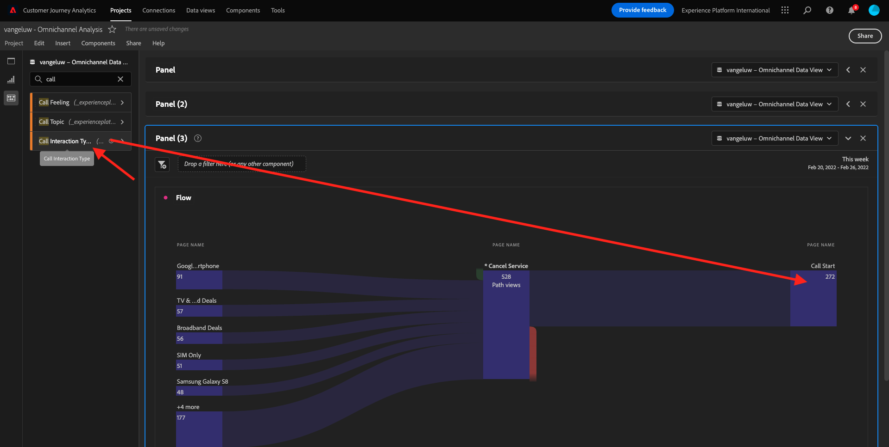

# 4.5 Visualización con el Customer Journey Analytics

## Objetivos

- Explicación de la IU de Analysis Workspace
- Conozca algunas funciones que hacen que Analysis Workspace sea tan diferente.
- Obtenga información sobre cómo analizar en CJA mediante Analysis Workspace

## Contexto

En este ejercicio utilizará Analysis Workspace dentro de CJA para analizar vistas de productos, canales de productos, pérdidas, etc.

Vamos a usar el proyecto que creó en [4.4 Preparación de datos en Analysis Workspace](./ex4.md), vaya a [https://analytics.adobe.com](https://analytics.adobe.com).

Abra su proyecto `yourLastName - Omnichannel Analysis`.

Con el proyecto abierto y la vista de datos `CJA Bootcamp - Omnichannel Data View` seleccionado, está listo para empezar a crear sus primeras visualizaciones.

## ¿Cuántas vistas de productos tenemos diariamente?

En primer lugar, es necesario seleccionar las fechas adecuadas para analizar los datos. Vaya al menú desplegable de calendario en el lado derecho del lienzo. Haga clic en él y seleccione el intervalo de fechas aplicable.

>[!IMPORTANT]
>
>Los datos más recientes disponibles se han introducido el 19/09/2022; seleccione un intervalo de fechas que incluya esta fecha.

En el menú del lado izquierdo (área de componentes), busque la Métrica calculada **Vistas del producto**. Selecciónelo, arrástrelo y suéltelo en el lienzo, en la parte superior derecha de la tabla de forma libre.

Automáticamente la dimensión **Día** se agregarán para crear la primera tabla. Ahora puedes ver tu pregunta respondida en el vuelo.

A continuación, haga clic con el botón derecho en el resumen de la métrica.

Haga clic en **Visualizar** y luego seleccione **Línea** como visualización.

Verá las vistas de sus productos por día.

Puede cambiar el ámbito de tiempo a día haciendo clic en **Configuración** dentro de la visualización.

Haga clic en el punto al lado de **Línea** hasta **Administrar la fuente de datos**.

A continuación, haga clic en **Bloquear selección** y seleccione **Elementos seleccionados** para bloquear esta visualización de modo que siempre muestre una cronología de las vistas del producto.

## Principales 4 productos vistos

¿Cuáles son los 4 productos principales vistos?

Recuerde guardar el proyecto de vez en cuando.

| SO | Método abreviado |
| ----------------- |-------------| 
| Windows | Control + S |
| Mac | Comando +S |

Empecemos a encontrar los 4 productos más vistos. En el menú de la izquierda, busque **Nombre del producto** - Dimension.

Ahora arrastre y suelte **Nombre del producto** para reemplazar el **Día** dimensión:

Este será el resultado

A continuación, intente desglosar uno de los productos por Nombre de marca. Buscar por **brandName** y arrástrelo bajo el nombre del primer producto.

A continuación, realice un desglose utilizando el nivel de lealtad. Buscar por **Nivel de fidelización** y arrástrelo bajo el nombre de la marca.

A continuación, verá esto:

Por último, puede añadir más visualizaciones. En el lado izquierdo, debajo de visualizaciones, busque `Donut`. Tomar `Donut`, arrástrelo y suéltelo en el lienzo debajo de **Línea** visualización.

A continuación, en la Tabla, seleccione el 3 **Nivel de fidelización**  filas del desglose que hemos realizado en **Smartphone Google Pixel XL negro de 32 GB** > **Señal de Citi**. Mientras selecciona las 3 filas, mantenga pulsada la tecla **CTRL** (en Windows) o el botón **Comando** botón (en Mac).

Verá que el gráfico de anillo ha cambiado:

Incluso puede adaptar el diseño para que sea más legible, haciendo que tanto la **Línea** y el **Anillo** Un gráfico un poco más pequeño para que se puedan colocar uno junto al otro:

Haga clic en el punto al lado de **Anillo** hasta **Administrar la fuente de datos**.
A continuación, haga clic en **Bloquear selección** para bloquear esta visualización de modo que siempre muestre una cronología de las vistas del producto.

Obtenga más información acerca de las visualizaciones con Analysis Workspace aquí:

- [https://experienceleague.adobe.com/docs/analytics/analyze/analysis-workspace/visualizations/freeform-analysis-visualizations.html?lang=es](https://experienceleague.adobe.com/docs/analytics/analyze/analysis-workspace/visualizations/freeform-analysis-visualizations.html?lang=es)
- [https://experienceleague.adobe.com/docs/analytics/analyze/analysis-workspace/visualizations/t-sync-visualization.html](https://experienceleague.adobe.com/docs/analytics/analyze/analysis-workspace/visualizations/t-sync-visualization.html)

## Canal de interacción de productos, desde la visualización hasta la compra

Hay muchas maneras de resolver esta pregunta. Uno de ellos es utilizar el tipo de interacción de producto y utilizarlo en una tabla de forma libre. Otra forma es utilizar un **Visualización de abandonos**. Usemos el último ya que queremos visualizar y analizar al mismo tiempo.

Cierre el panel actual haciendo clic aquí:

Ahora añada un nuevo panel en blanco haciendo clic en **+ Agregar panel en blanco**.

Haga clic en la visualización **Abandonos**.

Seleccione el mismo intervalo de fechas que en el ejercicio anterior.

Entonces verá esto...

Búsqueda de la dimensión **Tipo de evento** en los componentes del lado izquierdo:

Haga clic en la flecha para abrir la dimensión:

Verá todos los tipos de eventos disponibles.

Seleccione el elemento **commerce.productViews** y arrástrelo y suéltelo en el **Añadir Touchpoint** dentro del campo **Visualización de abandonos**.

Haga lo mismo con **commerce.productListAdds** y **commerce.purchases** y suéltelos en el **Añadir Touchpoint** dentro del campo **Visualización de abandonos**. La visualización tendrá este aspecto:

Puedes hacer muchas cosas aquí. Algunos ejemplos: compare con el paso del tiempo, compare cada paso por dispositivo o compare por fidelidad. Sin embargo, si queremos analizar cosas interesantes como por qué los clientes no compran después de agregar un artículo al carro de compras, podemos usar la mejor herramienta en CJA: hacer clic con el botón derecho.

Clic derecho en el punto de contacto **commerce.productListAdds**. Luego haga clic en **Abandonos de desglose en este punto de contacto**.

Se creará una nueva tabla de forma libre para analizar qué hicieron las personas si no realizaron la compra.

Cambie el **Tipo de evento** por **Nombre de página**, en la nueva tabla de forma libre, para ver a qué páginas van en lugar de la página de confirmación de compra.

## ¿Qué hacen las personas en el sitio antes de llegar a la página Cancelar servicio?

De nuevo, hay muchas maneras de realizar este análisis. Usemos el análisis de flujo para iniciar la parte de descubrimiento.

Cierre el panel actual haciendo clic aquí:

Ahora añada un nuevo panel en blanco haciendo clic en **+ Agregar panel en blanco**.

Haga clic en la visualización **Flujo**.

A continuación, verá esto:

Seleccione el mismo intervalo de fechas que en el ejercicio anterior.

Búsqueda de la dimensión **Nombre de página** en los componentes del lado izquierdo:

Haga clic en la flecha para abrir la dimensión:

Encontrará todas las páginas vistas. Busque el nombre de la página: **Cancelar servicio**.
Arrastrar y soltar **Cancelar servicio** en la Visualización de flujo en el campo central:

A continuación, verá esto:

Analicemos ahora si los clientes que visitaron el **Cancelar servicio** página en el sitio web también llamado el centro de llamadas, y cuál fue el resultado.

Bajo las dimensiones, vuelva atrás y luego busque **Tipo de interacción de llamada**.
Arrastrar y soltar **Tipo de interacción de llamada** para reemplazar la primera interacción a la derecha dentro de **Visualización de flujo**.

Ahora está viendo el ticket de asistencia de los clientes que llamaron al centro de llamadas después de visitar **Cancelar servicio** página.

A continuación, en las dimensiones, busque **Sensación de llamada**.  Arrástrela y suéltela para reemplazar la primera interacción a la derecha dentro de **Visualización de flujo**.

A continuación, verá esto:

Como puede ver, hemos ejecutado un análisis omnicanal utilizando la Visualización de flujo. Gracias a eso hemos encontrado que parece que algunos clientes que estaban pensando en cancelar su servicio, tuvieron una sensación positiva después de llamar al centro de llamadas. ¿Tal vez hemos cambiado de opinión con un ascenso?

## ¿Qué rendimiento tienen los clientes con un contacto del centro de llamadas positivo respecto a los KPI principales?

Primero segmentemos los datos para obtener solo usuarios con **positivo** llamadas. En CJA, los segmentos se denominan Filtros. Vaya a los filtros dentro del área del componente (en el lado izquierdo) y haga clic en **+**.

Dentro del Generador de filtros, asigne un nombre al filtro

| Nombre | Descripción |
| ----------------- |-------------| 
| Sensación de llamada: positiva | Sensación de llamada: positiva |

En los componentes (dentro del Generador de filtros), busque **Sensación de llamada** y arrástrela y suéltela en la Definición del generador de filtros.

Ahora seleccione **positivo** como valor del filtro.

Cambie el ámbito para que sea **Persona** nivel.

Para terminar, simplemente haga clic en **Guardar**.

Entonces volverás a estar aquí. Si aún no lo ha hecho, cierre el panel anterior.

Ahora añada un nuevo panel en blanco haciendo clic en **+ Agregar panel en blanco**.

Seleccione el mismo intervalo de fechas que en el ejercicio anterior.

Haga clic en **Tabla de forma libre**.

Ahora arrastre y suelte el filtro que acaba de crear.

Tiempo para añadir algunas métricas. Comience por **Vistas del producto**. Arrastre y suelte en la tabla de forma libre. También puede eliminar la variable **Eventos** métrica.

Haga lo mismo con **People**,  **Añadir al carro** y **Compras**. Vas a terminar con una mesa como esta.

Gracias al primer análisis de flujo, surgió una nueva pregunta. Por lo tanto, decidimos crear esta tabla y comparar algunos KPI con un segmento para responder esa pregunta. Como puede ver, el tiempo para obtener información es mucho más rápido que usar SQL o usar otras soluciones de BI.

## Customer Journey Analytics y resumen de Analysis Workspace

Como ha aprendido en este laboratorio, Analysis Workspace vincula los datos de todos los canales para analizar el recorrido completo del cliente. Además, recuerde que puede incluir datos en el mismo espacio de trabajo que no esté vinculado al recorrido.
Puede resultar muy útil incluir datos desconectados en el análisis para dar contexto al recorrido. Algunos ejemplos incluyen datos NPS, encuestas, eventos de Facebook Ads o interacciones sin conexión (no identificadas).

Paso siguiente: [4.6 De la información a la acción](./ex6.md)

[Volver al flujo de usuario 4](./uc4.md)

[Volver a todos los módulos](./../../overview.md)
