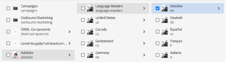

# AEM Crear página en la

AEM El entorno le proporciona dos entornos: el Entorno de autor y el Entorno de Publish. Interactúan para permitirle ofrecer contenido en su sitio web, de modo que los visitantes puedan experimentarlo.

El entorno de creación proporciona los mecanismos para crear, actualizar y revisar este contenido antes de publicarlo:

- Un autor crea y revisa el contenido (que puede ser de varios tipos; por ejemplo, páginas, recursos, publicaciones, etc.)
- que, en algún momento, se publicará en su sitio web.

AEM Como creador, deberá organizar el sitio web dentro de la organización de la creación de la página de. Esto implica crear y asignar un nombre a las páginas de contenido para que:

- Puede encontrarlos fácilmente en el entorno de creación
- Los visitantes del sitio pueden explorarlas fácilmente en el entorno de publicación

La estructura de un sitio web se puede considerar como una estructura de árbol que contiene las páginas de contenido. Los nombres de estas páginas de contenido se utilizan para formar las direcciones URL, mientras que el título se muestra cuando se visualiza el contenido de la página. En el siguiente ejemplo, la dirección URL accesible para la página es /content/adobike/language-masters/en.html

Revisemos cómo añadir algunas páginas nuevas a un sitio web existente, así como cómo reutilizar parte del contenido.

## Creación de la página principal

AEM Como se explica en la sección anterior, la jerarquía de páginas de la página de la funciona como una estructura de árbol. Esto significa que empezaremos con la página en el nivel más alto: la página principal.

- AEM Vaya al autor del en [https://author-p71057-e991028.adobeaemcloud.com/](https://author-p71057-e991028.adobeaemcloud.com/) e inicie sesión con las credenciales que proporcionamos.

- AEM En el menú Inicio de la, seleccione Navegación \> Sitios

- En primer lugar, vamos a navegar por la estructura de árbol existente hasta la ubicación en la que queremos crear nuestra página de inicio. Navegue por la estructura de árbol seleccionando &quot;Adobike&quot; en la primera columna y luego &quot;Bootcamp&quot; en la segunda. A continuación, para crear una página en esta página, haga clic en el botón &quot;Crear&quot; y seleccione &quot;Página&quot; en el menú emergente.

- Se abrirá una nueva pantalla al configurar la nueva página. En primer lugar, podemos seleccionar una plantilla de página. AEM Las plantillas de página de le permiten definir la estructura de una página, así como definir qué contenido se puede utilizar en esta página. Como queremos crear la página de inicio, que es una página de aterrizaje, seleccionaremos la plantilla de página de aterrizaje y, a continuación, hacemos clic en el botón &quot;Siguiente&quot; para continuar.

- En la siguiente pantalla, podrá rellenar la página con información inicial. La parte más importante de la información es el título (una propiedad obligatoria, indicada con un símbolo \* ), que está diseñado para que asigne a su página un nombre significativo. AEM Si no rellenas el &quot;Nombre&quot;, se generará automáticamente la dirección URL en la que tu página estará disponible, siguiendo las prácticas recomendadas de SEO. En este caso, puede dejar este campo vacío. Algunas otras propiedades también se pueden rellenar, puede explorar las otras pestañas, pero para el propósito de este bootcamp no llene ninguna otra propiedad todavía. Cuando esté listo para crear su página, simplemente haga clic en el botón &quot;Crear&quot;.

- AEM ahora creará su página de. Una vez hecho esto, obtendrá una ventana emergente que le permitirá abrir la página recién creada haciendo clic en el botón &quot;Abrir&quot;.

- AEM A continuación, llegará al Editor de la. Se trata de un editor &quot;lo que ve es lo que obtiene&quot; (o WYSIWYG), en el que puede arrastrar y soltar componentes en una página para crear la página. Echemos un vistazo a la navegación:
  
   - En el lado izquierdo, tiene el panel lateral con los recursos que puede utilizar en sus páginas, los componentes (o componentes básicos) que puede utilizar en esta página y una práctica vista de árbol que le muestra cómo está estructurada su página. Haga clic en cualquiera de estos iconos para abrir su vista.
   - En el lado derecho, verá el &quot;contenedor de diseño&quot;. Esta es un área en la que puede soltar los componentes deseados.
   - Vamos a rellenar nuestra página con algún contenido. Siéntase libre de rellenar la página de inicio como mejor le parezca. En el siguiente ejemplo, se ha utilizado un componente de imagen que se vincula a la página del producto, así como dos componentes de teaser.

## Reutilización de experiencias mediante fragmentos de experiencias

Ahora hemos creado la página principal, que está totalmente lista para el lanzamiento de Adobe. Sin embargo, parte del contenido que contiene, por ejemplo los puntos de venta únicos de nuestra moto, se puede reutilizar en varias páginas.

Idealmente, queremos crear esta experiencia de puntos de venta única solo una vez, de modo que podamos administrarla de forma centralizada y garantizar una experiencia personalizada y coherente. AEM En la práctica, podemos hacer esto con &quot;Fragmentos de experiencias&quot;. Un fragmento de experiencia es un grupo de uno o más componentes, incluido el contenido y el diseño, a los que se puede hacer referencia dentro de las páginas. Pueden contener cualquier componente.

Pongamos esto para usarlo de inmediato:

- AEM Vaya al autor del en [https://author-p71057-e991028.adobeaemcloud.com/](https://author-p71057-e991028.adobeaemcloud.com/) e inicie sesión con las credenciales que proporcionamos.

- AEM En el menú Inicio de la, seleccione Navegación \> Fragmentos de experiencias

- En la siguiente pantalla, vamos a crear una carpeta que su equipo pueda utilizar para almacenar sus experiencias reutilizables. En la vista de columna, vaya a Adobe Bike \> Bootcamp y, a continuación, haga clic en los botones Crear \> Carpeta.

- En la ventana emergente modal, indique a su carpeta el nombre de su equipo. AEM Puede dejar vacío el campo de nombre, lo que se generará automáticamente para usted. Una vez que haya asignado un nombre a la carpeta, haga clic en el botón Crear para crear la carpeta.

- Ahora debería ver la ventana emergente de su carpeta. Haga clic en él y, a continuación, en los botones Crear \> Fragmento de experiencia.

- En primer lugar, vamos a seleccionar una plantilla de fragmento de experiencia. Al igual que las páginas, los fragmentos de experiencias se pueden basar en varias plantillas, cada una de las cuales prevé una experiencia predefinida. En nuestro caso, dado que queremos reutilizar nuestro contenido en nuestro sitio web, elegimos una &quot;Plantilla de variación web de fragmento de experiencia&quot; seleccionando la casilla de verificación en la parte superior izquierda y luego haciendo clic en el botón &quot;Siguiente&quot;.

- Asigne a su fragmento de experiencia un título significativo, por ejemplo, &quot;USP de Adobe Bike&quot;, y luego haga clic en el botón Crear.

- Una vez creado el fragmento de experiencia, haga clic en el botón &quot;Abrir&quot; del modal para que podamos añadir contenido al fragmento de experiencia.

- Al igual que cuando edita una página, puede ver un contenedor de diseño en el que puede agregar contenido.

- Lo que haremos es copiar los componentes de la página de inicio. En una pestaña nueva, vaya a la página principal como se explica en el capítulo anterior, seleccione el componente que desea copiar y, a continuación, haga clic en el icono Copiar.

- A continuación, vuelva a su fragmento de experiencia, haga clic en el contenedor de diseño y en el botón Pegar.

>[!NOTE]
>
> AEM Sugerencia: le permite utilizar el &quot;modo de diseño&quot; en cualquier página o fragmento de experiencia. Esto le permite cambiar el tamaño de los componentes y optimizar las experiencias para cualquier dispositivo.

- En el menú superior, abra la lista desplegable y seleccione &quot;Diseño&quot; para acceder al modo de diseño.

- A continuación, puede seleccionar cualquier componente y cambiar su tamaño arrastrando los controladores de ambos lados del componente para ajustarlo a las columnas visibles en la pantalla.

- De forma predeterminada, está editando para todos los puntos de interrupción. Sin embargo, si desea editar para un punto de interrupción específico, puede seleccionar un dispositivo coincidente en la barra de herramientas de la parte superior de la página. El punto de interrupción para el que se crea se resaltará en ese momento.

- Como puede ver, un diseño de dos columnas en dispositivos móviles no tiene un aspecto fantástico. Vamos a crear un diseño de una columna en el móvil. Como puede ver en el escritorio, nuestra experiencia sigue siendo la misma, pero en el móvil ahora tenemos una mejor experiencia con solo una columna de contenido.

- Por último, ahora podemos reutilizar esta experiencia en la página principal. Arrastre y suelte un componente &quot;Fragmento de experiencia&quot; en la página, en la ubicación donde desee que se muestre el contenido. Puede eliminar el contenido que hemos copiado, ya que lo utilizaremos desde el fragmento de experiencia.

- Abra el cuadro de diálogo de configuración del componente Fragmento de experiencia y utilice el selector de rutas para seleccionar la ubicación donde creó el fragmento de experiencia.

- Y, finalmente, ahora tenemos nuestra experiencia reutilizable en nuestra página.

## Creación de la página del producto

Cuando se utiliza Adobe Commerce AEM integrado con la, puede tener una página de detalles del producto genérica que se utiliza al navegar por el sitio desde las descripciones generales generadas. Sin embargo, a veces también queremos ver una página inspiradora que combine contenido específico de un producto con contenido inspirador. Vamos a copiar sobre la tienda como prehecho por nosotros, luego vamos a crear una página de producto inspirador.

- AEM Vaya al autor del en [https://author-p71057-e991028.adobeaemcloud.com/](https://author-p71057-e991028.adobeaemcloud.com/) e inicie sesión con las credenciales que proporcionamos.

- AEM En el menú Inicio de la, seleccione Navegación \> Sitios

- En la descripción general de la columna, navegue por el sitio web prediseñado hasta la tienda: Adobe > Idioma > Maestros > Adobe > Tienda. A continuación, seleccione la página Tienda con la casilla de verificación y haga clic en Crear \> Live Copy. AEM Sin entrar en demasiados detalles específicos, esto creará una copia de la página que puede utilizar en su sitio para que pueda reutilizar las páginas y el contenido ya existentes, utilizando el Administrador de varios sitios de.

- En la pantalla que aparece, seleccione el sitio de sus equipos como destino seleccionando la casilla de verificación junto a su nombre. A continuación, haga clic en el botón Next.

- Como no vamos a profundizar en el Administrador de varios sitios, puede hacerse cargo de esta configuración.\
  Título: Tienda\
  Nombre: tienda\
  Configuraciones de despliegue: configuración de despliegue estándar\
  Una vez configurada la Live Copy, haga clic en el botón Crear.

>[!NOTE]
>
> ¿Quiere saber más sobre las Live Copies? Consulte [&quot;Creación y sincronización de Live Copies&quot;.](https://experienceleague.adobe.com/docs/experience-manager-cloud-service/content/sites/administering/reusing-content/msm/creating-live-copies.html?lang=en)

- Una vez finalizado, debería ver la tienda disponible en el sitio web. Selecciónelo y haga clic en Crear \> página para crear la página inspiradora del producto.

- Dado que queremos mostrar información del producto en la página, vamos a crear una página con la plantilla de página del producto. Selecciónelo y haga clic en el botón Next.

- Rellene los metadatos de la página y, a continuación, haga clic en el botón Crear, igual que para la página principal. Una vez creada, puede abrir la página haciendo clic en el botón de apertura. Como puede ver, ya se ha rellenado con un componente de detalles del producto.

- En primer lugar, agregaremos el fragmento de experiencia que hemos creado anteriormente. A continuación, podemos añadir cualquier contenido adicional que aún queramos en la página. Finalmente, configuraremos el componente de detalles del producto para mostrar nuestro producto de Adobe Bike seleccionando el buscador de productos en el cuadro de diálogo de configuración, luego seleccionando la categoría de Adobe y marcando la casilla junto al producto. A continuación, haga clic en el botón Add.

- Ahora tenemos nuestra página de inspiración completa, que incluye contenido administrado centralmente e información de productos proveniente de Adobe Commerce.

Paso siguiente: [Fase 3 - Entrega: Campaign GO/NO-GO](./go-nogo.md)

[Volver a la fase 3: Entrega: verificar la aplicación móvil](./app.md)

[Volver a todos los módulos](../../overview.md)
