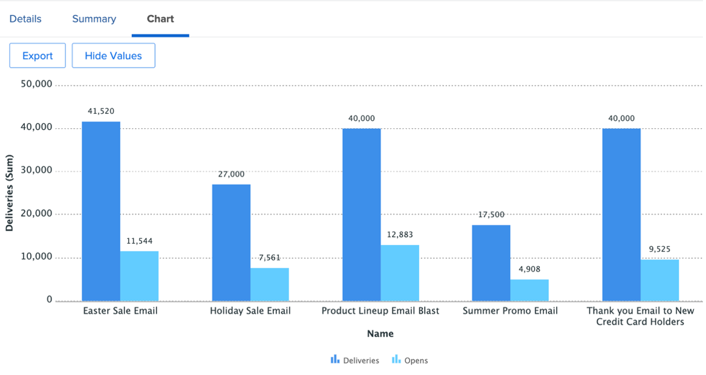

# Perspectivas para un administrador de marketing

## Vista semanal del líder del proyecto

En la columna izquierda, haga clic en &quot;Vista semanal del líder del proyecto&quot;:

Esto abarca una amplia gama de informes, en los que siempre se puede hacer clic o actuar para obtener más información:

- La variable **tareas que vencen esta semana por proyecto**

- La variable **Próximos hitos de la administración de proyectos** :

- La variable **Problemas abiertos por prioridad**

- La variable **Tareas atrasadas por departamento**

- La variable **Tareas atrasadas por individuo**

## Perspectivas relacionadas con SCRUM

En la columna izquierda, haga clic en Estado de iteración.

Si sus equipos trabajan con la metodología SCRUM, este es un interesante conjunto de informes de Administración:

- **Velocidad por iteración**

- **Velocidad media por equipo**

- **Iteraciones actuales totales por hora completadas por usuario asignado**

- **Iteraciones por equipo**

## Informes de eficiencia

En la columna de la izquierda, haga clic en &quot;Eficiencia&quot;

- **Proporción planificada/no planificada** (del trabajo realizado)

- **Solicitudes completadas por semana**

## Perspectivas del proyecto en vuelo

En la columna de la izquierda, haga clic en &quot;Marketing - Proyectos a bordo&quot;

- **Estado de los proyectos en vuelo**

- **Proyectos Por Condición Por Mes**

- Lista, progreso y detalles financieros del **Proyectos a bordo**

## Visualizar dependencias (entre proyectos)

De vuelta a la línea &quot;PIN&quot;, haga clic en &quot;Vista de Gant Portfolio&quot;:

Aquí tiene un **Vista Gant Chart de un grupo de proyectos** con posibles dependencias (predecesores) entre proyectos

## Perspectivas de integración de terceros

>[!NOTE]
>
> Este es un ejemplo de integración con un software de terceros. Se trata de una integración con Adobe Campaign como ilustración. Importa los resultados de las campañas completadas en Adobe Campaign.

En la línea &quot;PIN&quot;, haga clic en &quot;Resumen de campaña&quot;:

- **Resumen de Adobe Campaign**

- **Adobe Campaign enviado a aperturas**

- **Adobe Campaign se abre a los clics**

Paso siguiente: [Conclusión](../../conclusion.md)

[Volver a la fase 4: perspectivas para un administrador de proyectos](./project-manager.md)

[Volver a todos los módulos](../../overview.md)
