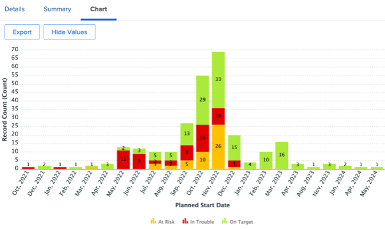
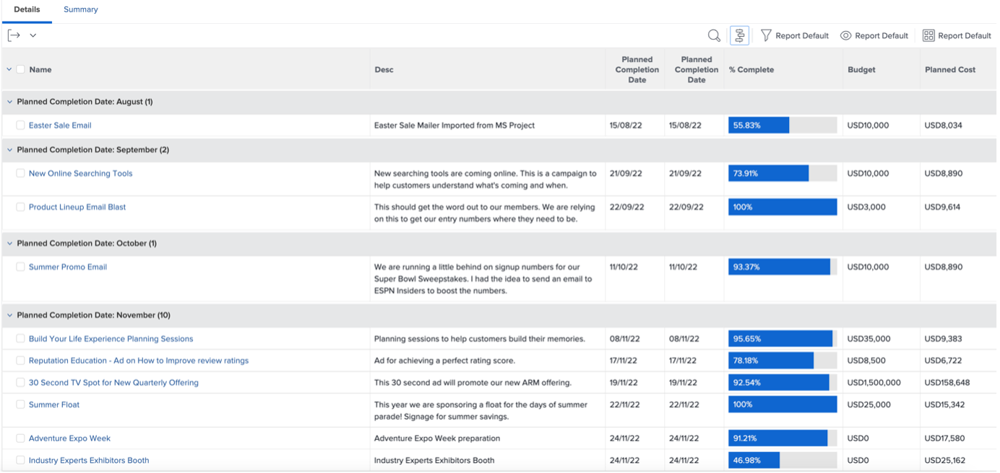

# Perspectivas de un responsable de marketing

## Vista semanal del jefe de proyecto

En la columna izquierda, haga clic en &quot;Vista semanal del jefe de proyecto&quot;:

Esto cubre una amplia gama de informes, siempre disponibles para clics/acciones para obtener más información:

- Las **tareas que vencen esta semana por proyecto**

- Los próximos hitos de **Administración de proyectos** :

- **Problemas pendientes por prioridad**

- Las **tareas atrasadas por departamento**

- Las **tareas atrasadas de la persona**

## Perspectivas relacionadas con SCRUM

En la columna de la izquierda, haga clic en &#39;Estado de iteración&#39;

Si sus equipos trabajan con la metodología SCRUM, este es un interesante conjunto de informes de administración:

- **Velocidad por iteración**

- **Velocidad promedio por equipo**

- **Totales de horas completadas de iteraciones actuales por usuario asignado**

- **Iteraciones por equipo**

## Informes de eficiencia

En la columna de la izquierda, haga clic en &quot;Eficiencia&quot;.

- **Proporción planificada/no planificada** (del trabajo realizado)

- **Solicitudes completadas por semana**

## Perspectivas del proyecto en vuelo

En la columna de la izquierda, haga clic en &quot;Marketing - Proyectos en vuelo&quot;

- **Estado de los proyectos en vuelo**

- **Proyectos Por Condición Por Mes**

- Lista, progreso y detalles financieros de **Proyectos en vuelo**

## Visualizar dependencias (entre proyectos)

De nuevo a la línea &#39;PIN&#39;, haga clic en &#39;Vista de Gantt de Portfolio&#39;:

Aquí tiene una vista de gráfico Gantt **de un grupo de proyectos** con posibles dependencias (predecesoras) entre proyectos

## Perspectivas de integración de terceros

>[!NOTE]
>
> Este es un ejemplo de integración con un software de terceros. Esta es una integración con Adobe Campaign a modo de ilustración. Importa los resultados de las campañas completadas en Adobe Campaign.

En la línea &quot;PIN&quot;, haga clic en &quot;Resumen de campaña&quot;:

- **Resumen de Adobe Campaign**

- **Adobe Campaign enviado a las aperturas**

- **Adobe Campaign se abre a los clics**

Paso siguiente: [Conclusión](../../conclusion.md)

[Volver a la fase 4: perspectivas para un gestor de proyectos](./project-manager.md)

[Volver a todos los módulos](../../overview.md)
