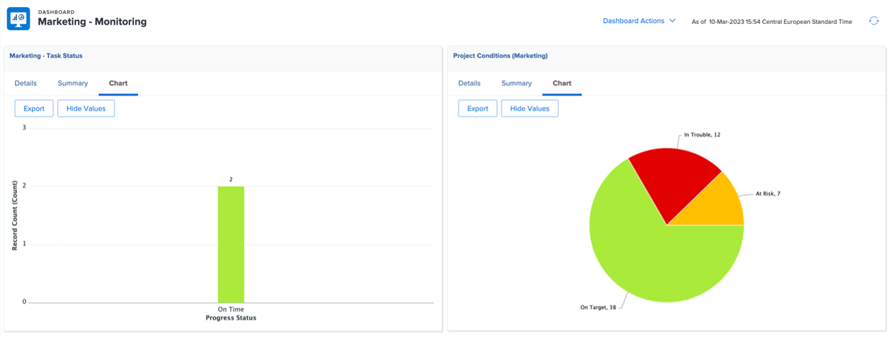

# Perspectivas para un gestor de proyectos

## Informes interactivos de progreso del proyecto

En la línea &quot;PIN&quot;, haga clic en &quot;Conocimiento de las aplicaciones móviles&quot; y, a continuación, haga clic en &quot;Métricas&quot;:

Aquí tiene una vista gráfica del estado de un solo proyecto o campaña.

>[!NOTE]
>
> Se puede hacer clic en cada área para obtener más información; este es el caso de la mayoría de las perspectivas en Workfront. ¡Dale una oportunidad!

## Informes específicos de la campaña

En la línea &#39;PIN&#39;, haga clic en &#39;Proyectos:

En la columna de la izquierda, haga clic en &quot;Estado de la campaña&quot;:

La parte superior le ofrece información sobre 1 sola campaña acerca de 1/ **horas planificadas vs. reales** y 2/ La **condición de la campaña** para cada canal:

La parte inferior le ofrece información sobre el estado de **Entregables de campaña**:

## Perspectivas basadas en varios proyectos

En la columna de la izquierda, haga clic en &quot;Monitorización&quot;.

La parte superior le ofrece información sobre el estado de un grupo de proyectos, tanto desde el punto de vista del **estado de las tareas** como desde el punto de vista de la **condición del proyecto**:

Información general del 

La parte inferior muestra todas las **aprobaciones en riesgo** y deberán ser perseguidas:

## El panel de contenido

En la columna de la izquierda, haga clic en &quot;PANEL DE CONTENIDO&quot;:

La parte superior proporciona una buena perspectiva sobre el estado de la aprobación de pruebas de su **documento** (si está aprobado, cuántas versiones necesitamos, etc.)

La parte inferior es una **revisión de aprobación de pruebas** que proporciona otro ángulo de visión para los estados de aprobación de pruebas:

Paso siguiente: [Fase 4: perspectivas para un administrador de marketing](./marketing-manager.md)

[Volver a la fase 4: Información general](./overview.md)

[Volver a todos los módulos](../../overview.md)
