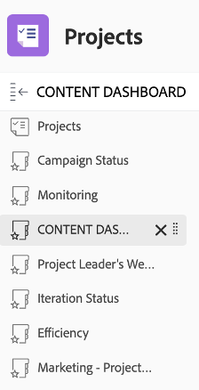

# Perspectivas para un administrador de proyectos

## Informes interactivos de progreso del proyecto

En la línea &quot;PIN&quot;, haga clic en &quot;Conciencia de aplicaciones móviles&quot; y, a continuación, haga clic en &quot;Métricas&quot;:

Aquí tiene una vista gráfica del estado de un solo proyecto o campaña.

>[!NOTE]
>
> Se puede hacer clic en cada área para obtener más información; este es el caso para la mayoría de las perspectivas de Workfront. ¡Pásame!

## Informes específicos de campaña

En la línea &quot;PIN&quot;, haga clic en &quot;Proyectos:

En la columna de la izquierda, haga clic en &quot;Estado de la campaña&quot;:

La parte superior le proporciona información sobre una sola campaña acerca de 1/ Campaign **planificado frente a real** horas de trabajo y 2/ **Condición de la campaña** para cada canal:

La parte inferior le proporciona información sobre el **Entregas de Campaign** estado:

## Perspectivas basadas en varios proyectos

En la columna de la izquierda, haga clic en &quot;Monitorización&quot;

La parte superior le proporciona información sobre el estado de un grupo de proyectos, ambos desde la **Estado de las tareas** punto de vista y desde el **Condición del proyecto** punto de vista:

Información general del 

La parte inferior muestra todas las **en aprobaciones de riesgo** y necesitará perseguir:

## Panel de contenido

En la columna de la izquierda, haga clic en &#39;CONTENT DASHBOARD&#39;:

La parte superior ofrece una buena perspectiva de todas sus **aprobación de la prueba del documento** (se aprueba, cuántas versiones necesitamos, etc.)

La parte inferior es un **Revisión de aprobación de prueba** que proporciona otro ángulo de visión para los estados de aprobación de la prueba:

Paso siguiente: [Fase 4: Perspectivas para un administrador de marketing](./marketing-manager.md)

[Volver a la fase 4: Perspectivas: Información general](./overview.md)

[Volver a todos los módulos](../../overview.md)
