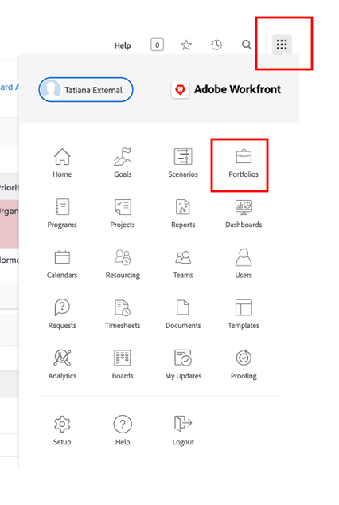

# Planificación

>[!NOTE]
>
> Durante el Bootcamp, te pondrás varios sombreros: Solicitante, Administrador de proyectos, Diseñador y Administración superior. Esto le dará una mirada a la experiencia de usuario de cada perfil.

Veamos ahora la plataforma de administración de trabajo de Adobe Workfront. Workfront hace que sus objetivos sean visibles para toda la organización, de modo que todos puedan priorizar el trabajo de forma estratégica, realizar un seguimiento del progreso y medir los resultados. Y a medida que sus objetivos evolucionan, Workfront envía información en cascada a equipos que ejecutan trabajo en el terreno. ¿El resultado? Buena alineación, enfoque y velocidad para alcanzar el éxito.

Inicie sesión en su perfil de Workfront navegando hasta [adobebootcampemea-02032301.testdrive.workfront.com](https://adobebootcampemea-02032301.testdrive.workfront.com) e inicie sesión con las credenciales que le proporcionó el equipo de Adobe.

Se encontrará con esta página de inicio de sesión.  Inicie sesión con su dirección de correo electrónico profesional con la que se suscribió a bootcamp como nombre de usuario:

Tras iniciar sesión con éxito, se encontrará con esta página principal:

## Preparación de Workfront para su uso

Ahora prepararemos nuestra página de inicio como si estuviéramos utilizando Workfront de forma regular.  Esto significa que vamos a obtener páginas relevantes para nuestro flujo de trabajo de más tarde y &quot;PIN&quot; sobre nuestra página principal.

En primer lugar, vamos a buscar la página de carga de trabajo de nuestro EQUIPO.  Haga clic en el gofre en la parte superior derecha y seleccione &quot;Equipos&quot;

Una vez que nuestro EQUIPO (Marketing - Digital) esté en la pantalla, simplemente &quot;PIN&quot; a su cinta superior:

La cinta superior debería tener este aspecto:

Vamos a fijar un proyecto que analizaremos más de cerca más adelante.  Haga clic en la página Proyectos INNED y haga clic en el botón de búsqueda.  Escriba &quot;Campaña de reconocimiento de aplicaciones móviles&quot; y haga clic en el nombre del proyecto:

Una vez que el proyecto esté en la pantalla, agrúpelo a la cinta superior como hicimos antes:

La cinta superior debería tener este aspecto:

Finalmente, haga clic en el gofre superior derecho una vez más y seleccione PORTFOLIO.

Haga clic en el botón de búsqueda y escriba &quot;TRANSFORM&quot;.  Haga clic en el Portfolio &quot;Transformar la experiencia del cliente&quot; para abrirla:

Una vez abierto el Portfolio, póngalo en la cinta superior:

La cinta superior debería tener este aspecto:

Ahora estamos listos para iniciar nuestro flujo de trabajo con una interfaz que nos muestre exactamente lo que necesitamos de forma regular.

## Solicitante

Ahora empezaremos la ingesta real de trabajo con el sombrero del Solicitante. Un solicitante, por ejemplo un administrador de productos, nos gustaría formalizar una solicitud para nuestra nueva campaña de Adobe y proporcionar la información del resumen de marketing.

- En la parte superior izquierda, haga clic en Solicitudes:

- A continuación, haga clic en &quot;Nueva solicitud&quot;:

- Como tipo de solicitud, seleccione &quot;Solicitudes de marketing&quot; y luego &quot;CSB - Solicitudes de campaña&quot;:

- Introduzca el asunto: &quot;Campaña de Adobe - \*equipo\*&quot; (rellene su número de equipo). Puede añadir una descripción y una prioridad.

- Todo lo que se encuentra debajo del encabezado &quot;CSB - Informe de campaña de marketing&quot; es totalmente personalizable. En este caso, estos son todos campos personalizados que puede adaptar a sus propias necesidades de informe de marketing. Estos son los campos breves que hemos creado para este Bootcamp:

- Empecemos a completar el resumen:

   - Establezca la fecha de inicio en 06/01/2023 - Establezca la fecha de finalización en 06/30/2023:

   

   - Seleccione AEM Assets, ya que tendrá algunos recursos disponibles para su uso en esta campaña:

   

   - En &quot;Nuevo contenido&quot;, tenga en cuenta que si hace clic en sí, aparece un campo adicional (condicional) con una advertencia de línea temporal:

   

   - Como estamos en un plazo limitado, cambiemos nuestra elección a &quot;NO&quot;:

   

   - En los canales, elegimos preseleccionar algunos de forma predeterminada. Y esos son los que necesitaremos para el próximo paso, así que no se necesita cambio alguno aquí:

   

   - Adobe Commerce, seleccione sí:

   

- Por último, en la sección de documentos, puede añadir cualquier documentación relevante para su solicitud.  Aquí, vamos a utilizar el conector de AEM para mostrarle cómo puede obtener contenido existente de nuestra instancia de AEM Assets.

   - Haga clic en &quot;Agregar o vincular archivos&quot; y seleccione Vínculo en &quot;experience-manager&quot;.

   

   - Ahora se encuentra con las carpetas de AEM Assets y puede examinarlas (o utilizar el motor de búsqueda) para obtener los documentos o recursos que necesita para su solicitud:

   

   - No dude en adjuntar cualquier elemento de AEM Assets que considere que pueda ser relevante para este proyecto, si lo hay. Cuando haya terminado, haga clic en &quot;Vínculo&quot; para vincular a los recursos o en &quot;Cerrar&quot; si no vincula ninguna carpeta.

   

- Ya hemos completado nuestra solicitud y estamos listos para enviarla:

## Gestor de proyecto

Ahora que hemos enviado nuestra solicitud como &quot;Solicitante&quot; (por ejemplo, el Administrador de productos), vamos a cambiar el sombrero y ponernos el del Administrador de proyectos.

- Haga clic en el logotipo &quot;Adobe&quot; y llegará a la página &quot;Nuevas solicitudes de marketing&quot; (esta es la página de inicio típica del &quot;Administrador de proyectos&quot;):

- En la sección &quot;Marketing - Nuevas solicitudes de campaña&quot;, puede encontrar la solicitud recién creada:

- Haga clic en el nombre de la solicitud:

- Haga clic en &quot;Detalles de la solicitud&quot;:

- Desplácese hacia abajo hasta la sección &quot;CSB - Informe de campaña de marketing&quot; y amplíelo:

- Puede ver todos los detalles del informe del solicitante y, con esta información, puede iniciar un plan de proyecto basado en una plantilla.
   - En la parte superior, junto al nombre de la solicitud, haga clic en los tres puntos:

   

   - Haga clic en &quot;Convertir en proyecto desde plantilla&quot;:

   

   - Seleccione &quot;CSB - Campaña de marketing&quot; y haga clic en &quot;Usar plantilla&quot;:

   

   - Haga clic en &quot;Convertir en proyecto&quot; en la parte inferior de la página:

   

- Ahora tenemos nuestro flujo de trabajo de proyecto de Campaign basado en la plantilla . Vamos a fijar nuestro proyecto para más adelante. Haga clic en &quot;Fijar página actual&quot;:

- Algunas esferas de atención:

1. Noción de duración : es la ventana de oportunidad para completar una tarea.\
   Noción de horas planificadas: es el tiempo real necesario para completar una tarea.

1. Noción de Predecesores (también es decir, dependencias): estas son las restricciones que las tareas pueden tener entre sí (normalmente, esta tarea no se puede iniciar antes de que se complete esta otra). Lo que nos permite tener un gráfico Gant claro con la ruta crítica para cada proyecto. Haga clic en el icono de abajo para ver el Gant Chart:
   

1. Noción de Asignaciones : en el momento en que se crea el proyecto, las asignaciones siguen siendo generalistas, ya que provienen de una plantilla. Se realizan para funciones de trabajo (representadas por el icono de martillo (es decir, un grupo de personas que tienen las habilidades para completar esta tarea en particular) o para equipos, representadas por el icono de personas (es decir, un grupo definido por el grupo de personas de su empresa). Ahora es el momento de asignar esas tareas a personas.

- Hoy vamos a concentrarnos en las asignaciones de equipos y en cómo asignarlas a personas.

- Como puede ver, la tarea 11 &quot;Producir publicidad de medios sociales&quot; está asignada al equipo &quot;Marketing - Digital&quot;:
   

- Veamos cómo esto se refleja en la planificación de este equipo abriendo su página Gestión de Recursos . Haga clic en el PIN &quot;Marketing - Digital&quot; en la parte superior de la página:
   

- Ahora tiene esta vista de planificación de equipos:

1. La parte superior cubre el trabajo sin asignar para ese equipo en particular. Enumera los proyectos que el Equipo tiene asignados en y haciendo clic en la flecha aquí, tiene la visibilidad de las tareas exactas que deben ser cubiertas por el proyecto:
   

1. La parte inferior cubre el trabajo asignado para las personas del equipo, pero no solo: de hecho muestra la carga de trabajo real de cada miembro del equipo, pero también su horario (por ejemplo, lunes a viernes o lunes a sábado), sus vacaciones, etc.
   

- Para asignar una tarea a un individuo, simplemente arrastre la tarea de la parte superior a una línea individual en la parte inferior. Vea cómo se ha ajustado la carga de trabajo de Bea y cómo se han añadido los detalles de sus tareas:
   

Paso siguiente: [Fase 1: Planificación: Otros trabajos previos](./prework.md)

[Volver al resumen creativo](../../creative-brief.md)

[Volver a todos los módulos](../../overview.md)
