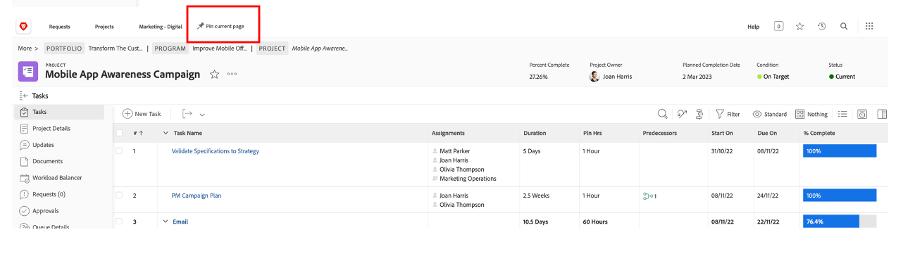
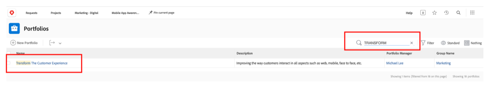
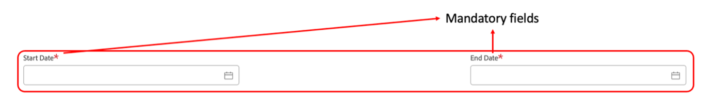
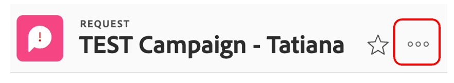

# Planificación

>[!NOTE]
>
> Durante el Bootcamp, llevarás varios sombreros: Requestor, Gestor de proyectos, Designer y Alta Dirección. Esto le ofrece una visión general de la experiencia de usuario de cada perfil.

Ahora vamos a echar un vistazo a la plataforma de administración de trabajo, Adobe Workfront. Workfront hace que sus objetivos sean visibles para toda la organización, de modo que todos puedan priorizar estratégicamente el trabajo, rastrear el progreso y medir los resultados. Y a medida que evolucionan sus objetivos, Workfront envía información en cascada a los equipos que ejecutan el trabajo sobre el terreno. ¿El resultado? Mayor alineación, enfoque y velocidad para alcanzar el éxito.

Inicie sesión en su perfil de Workfront en [adobebootcampemea-02032301.testdrive.workfront.com](https://adobebootcampemea-02032301.testdrive.workfront.com) e inicie sesión con las credenciales que le proporcionó el equipo de Adobe.

Se enfrentará a esta página de inicio de sesión.  Inicie sesión con su dirección de correo electrónico profesional con la que se suscribió al bootcamp como nombre de usuario:

Después de iniciar sesión correctamente, usted se enfrentará a esta página de inicio:

## Preparación de Workfront para su uso

Ahora prepararemos nuestra página de inicio como si estuviéramos utilizando Workfront de forma regular.  Esto significa que vamos a ir y obtener páginas relevantes para nuestro flujo de trabajo de más adelante y &quot;PIN&quot; en la parte superior de nuestra página de inicio.

En primer lugar, vamos a buscar la página de carga de trabajo de nuestro EQUIPO.  Haga clic en el gofre en la parte superior derecha y seleccione &quot;Equipos&quot;

Una vez que nuestro EQUIPO (Marketing - Digital) esté en la pantalla, simplemente &#39;PIN&#39; a su cinta superior:

La cinta superior debería tener un aspecto similar al siguiente:

Ahora fijemos un proyecto que vamos a analizar más de cerca más adelante.  Haga clic en la página Proyectos anclados y haga clic en el botón de búsqueda.  Escriba &quot;Campaña de sensibilización de la aplicación móvil&quot; y haga clic en el nombre del proyecto:

Una vez que el proyecto esté en pantalla, péguelo a la cinta superior como hicimos antes:

La cinta superior debería tener un aspecto similar al siguiente:

Finalmente, haga clic en el gofre superior derecho una vez más y seleccione PORTFOLIO.

Haga clic en el botón de búsqueda y escriba &quot;TRANSFORM&quot;.  Haga clic en el Portfolio &quot;Transformar la experiencia del cliente&quot; para abrirlo:

Una vez abierto el Portfolio, pínchelo en la cinta superior:

La cinta superior debería tener un aspecto similar al siguiente:

Ahora estamos listos para iniciar nuestro flujo de trabajo con una interfaz que nos muestra exactamente lo que necesitamos de forma regular.

## Solicitante

Ahora empezaremos la admisión de trabajo real con el sombrero del solicitante. Como solicitante, por ejemplo, un gestor de producto, nos gustaría formalizar una solicitud para nuestra nueva campaña de Adobe y proporcionar la información del informe de marketing.

- En la parte superior izquierda, haga clic en Solicitudes:

- A continuación, haga clic en &quot;Nueva solicitud&quot;:

- Como tipo de solicitud, seleccione &quot;Solicitudes de marketing&quot; y luego &quot;CSB - Solicitudes de campaña&quot;:

- Introduzca el asunto: &quot;Adobe Campaign - \*team\*&quot; (indique el número de su equipo). Puede añadir una descripción y una prioridad.

- Todo lo que hay debajo del encabezado &quot;CSB - Resumen de campaña de marketing&quot; es totalmente personalizable. En este caso, todos estos son campos personalizados que puede adaptar a sus propias necesidades de información de marketing. Estos son los campos Breves que hemos creado para este Bootcamp:

- Empecemos a rellenar el resumen:

   - Establezca la fecha de inicio en 06/01/2023 - Establezca la fecha de finalización en 30/06/2023:

  

   - Seleccione AEM Assets, ya que tenemos algunos recursos disponibles para utilizar en esta campaña:

  

   - En &quot;Nuevo contenido&quot;, tenga en cuenta que si hace clic en sí, aparece un campo adicional (condicional) con una advertencia de cronología:

  

   - Ya que estamos en un plazo ajustado, cambiemos nuestra opción a &quot;NO&quot;:

  

   - En los canales, hemos elegido preseleccionar algunos de forma predeterminada. Y esos son los que necesitaremos para el siguiente paso, así que no se necesita ningún cambio aquí:

  

   - Adobe Commerce, seleccione sí:

  

- Por último, en la sección de documentos, puede agregar cualquier documentación relevante para la solicitud.  AEM En este caso, vamos a utilizar el conector de para mostrarle cómo puede obtener contenido existente de nuestra instancia de AEM Assets.

   - Haga clic en &quot;Añadir o vincular archivos&quot; y seleccione &quot;Vínculo&quot; en &quot;experience-manager&quot;.

  

   - Ahora se encuentra con las carpetas de AEM Assets y puede explorarlas (o utilizar el motor de búsqueda) para obtener los documentos o recursos que necesita para su solicitud:

  

   - No dude en adjuntar cualquier elemento de AEM Assets que considere que podría ser relevante para este proyecto, si lo hay. Cuando haya terminado, haga clic en &quot;Vincular&quot; para vincular a los recursos o en &quot;Cerrar&quot; si no va a vincular ninguna carpeta.

  

- Ya hemos completado nuestra solicitud y estamos listos para enviarla:

## Gestor de proyecto

Ahora que hemos enviado nuestra solicitud como &#39;Solicitante&#39; (por ejemplo, gerente de producto), vamos a cambiar de sombrero y ponernos la de gerente de proyecto.

- Haga clic en el logotipo &quot;Adobe&quot; y llegará a la página &quot;Nuevas solicitudes de marketing&quot; (la página de inicio &quot;Administrador de proyectos&quot; es típica):

- En la sección &quot;Marketing - Nuevas solicitudes de campaña&quot;, puede encontrar la solicitud recién creada:

- Haga clic en el nombre de la solicitud:

- Haga clic en &quot;Detalles de la solicitud&quot;:

- Desplácese hacia abajo hasta la sección &quot;CSB - Resumen de campaña de marketing&quot; y expanda la sección:

- Puede ver todos los detalles del informe del solicitante y, con esta información, puede iniciar un plan de proyecto basado en una plantilla.
   - En la parte superior, junto al nombre de la solicitud, haga clic en los tres puntos:

  

   - Haga clic en &quot;Convertir a proyecto desde la plantilla&quot;:

  

   - Seleccione &quot;CSB - Campaña de marketing&quot; y haga clic en &quot;Usar plantilla&quot;:

  

   - Haga clic en &quot;Convertir a proyecto&quot; en la parte inferior de la página:

  

- Ahora, nuestro flujo de trabajo del proyecto de Campaign se basa en la plantilla. Vamos a fijar nuestro proyecto para más tarde. Haga clic en &quot;Anclar página actual&quot;:

- Algunas áreas de atención:

1. Noción de duración: es la ventana de oportunidad para completar una tarea.\
   Noción de horas planificadas: es el tiempo real necesario para completar una tarea.

1. Noción de predecesoras (es decir, dependencias): estas son las restricciones que las tareas pueden tener entre sí (normalmente, esta tarea no se puede iniciar antes de que se complete la otra). Lo que nos permite tener un gráfico Gantt claro con la ruta crítica para cada proyecto. Haga clic en el siguiente icono para ver el gráfico Gantt:
   

1. Noción de asignaciones: en el momento en que se crea el proyecto, las asignaciones siguen siendo generalistas, ya que provienen de una plantilla. Se crean para roles (representados por el icono de martillo, es decir, un grupo de personas que tienen las habilidades para completar esta tarea en particular) o para equipos (representados por el icono de personas (definido por el grupo de personas de su compañía). Ahora es el momento de asignar esas tareas a individuos.

- Hoy, nos vamos a concentrar en las asignaciones previas de los equipos y en cómo asignarlas a las personas.

- Como puede ver, la tarea 11 &quot;Producir anuncio de medios sociales&quot; se asigna al equipo &quot;Marketing - Digital&quot;:
  

- Veamos cómo se refleja esto en la planificación de este equipo abriendo su página de Administración de recursos. Haga clic en el PIN &quot;Marketing digital&quot; en la parte superior de la página:
  

- Ahora tiene esta vista de planificación de equipos:

1. La parte superior abarca el trabajo no asignado para ese equipo en particular. Enumera los proyectos en los que el equipo tiene asignaciones y, al hacer clic en la flecha aquí, tiene la visibilidad de las tareas exactas que debe cubrir el proyecto:
   

1. La parte inferior cubre el trabajo asignado para las personas del equipo, pero no solo: muestra la carga de trabajo real de cada miembro del equipo, sino también su horario (por ejemplo, de lunes a viernes o de lunes a sábado), sus vacaciones, etc.
   

- Para asignar una tarea a un individuo, simplemente arrastre la tarea desde la parte superior a la línea de un individuo en la parte inferior. Vea cómo se ha ajustado la carga de trabajo de Bea y los detalles de sus asignaciones de tareas se han añadido:
  

Paso siguiente: [Fase 1 - Planificación: Otro trabajo previo](./prework.md)

[Volver al resumen creativo](../../creative-brief.md)

[Volver a todos los módulos](../../overview.md)
