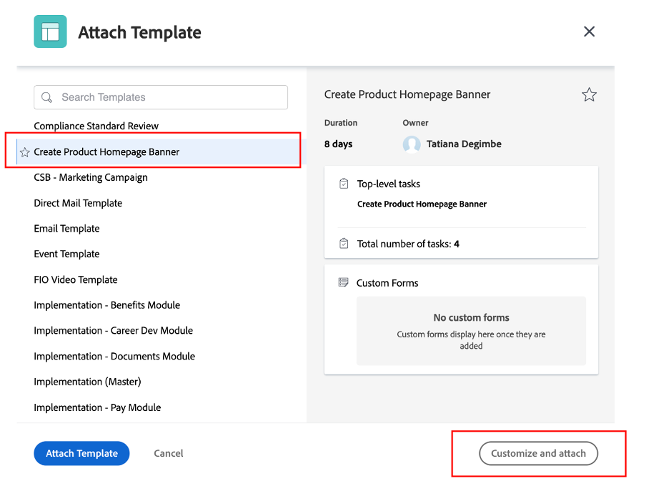

# Otros trabajos previos

## Seleccionar recursos de marca

Como se describe en el informe creativo, se necesitarán algunos recursos para iniciar nuestra campaña de forma eficaz. Estos recursos de marca se agregarán a la campaña en Workfront para que podamos acceder a ellos de forma centralizada.

- Expanda la tarea 1, &quot;TAREAS INICIALES&quot;, y luego abra la tarea &quot;Seleccionar 5 recursos de marca (anverso, reverso, ...)&quot; haciendo clic en ella.

- Haga clic en &quot;Documentos&quot; y luego en &quot;Agregar nuevo&quot;:

- Seleccione &quot;De experience-manager&quot;; esto nos permitirá elegir los recursos de marca que ya están disponibles en AEM Assets:

- Una vez que aparezca la jerarquía de carpetas de AEM, vaya a la siguiente ruta: experience-manager > Recursos Adobe > Capturas de bicicletas Seleccione 5 recursos y haga clic en &quot;Vincular&quot;.

- Ahora tenemos nuestros activos de marca en nuestra tarea. Esto significa que podemos configurar la tarea 2 como 100 % completada:

## Demostración de Adobe Commerce

Adobe Commerce es uno de los muchos productos de Adobe Experience Cloud que puede ayudarle a ofrecer las mejores experiencias digitales a sus clientes. Sin embargo, simplemente había poco tiempo para hacer todo juntos durante el campamento.

Este vídeo le hace familiarizarse con Adobe Commerce y muestra el producto que creamos para usar durante el bootcamp. En una situación real, cargaría los recursos de marca seleccionados anteriormente en Adobe Commerce a la configuración del producto.

>[!VIDEO](https://video.tv.adobe.com/v/3418945?quality=12&learn=on)

Una vez finalizada esta tarea, puede marcar la tarea 3 como 100% completa en Workfront.

## Las campañas flexibles son un requisito previo

Al revisar nuestro plan de trabajo, notamos un pequeño problema: nuestro gestor de productos (el solicitante) ha puesto una actualización que olvidó solicitar un &quot;titular de página de inicio de producto&quot;.  Añadiremos esto a nuestro plan de proyecto.

- Vaya a la lista Tareas y añada nuestra tarea &quot;Crear titular de producto&quot; justo debajo de la tarea 4 &quot;PRODUCCIÓN&quot;. Para ello, seleccione la tarea &quot;Preparar contenido de aplicación móvil&quot; y haga clic en el icono &quot;Añadir tarea arriba&quot;:

- Asigne un nombre significativo a la tarea agregada, como &quot;Crear titular de página del producto&quot;.

- Ahora que hemos creado la tarea, vamos a agregarle algo de contenido. Haga clic en los tres puntos a la derecha del título del proyecto y seleccione &quot;Adjuntar plantilla&quot;:

- Seleccione &quot;Crear titular de página de inicio de producto&quot; y haga clic en &quot;Personalizar y adjuntar&quot;:

- En la pantalla de personalización, asegúrese de mencionar la tarea &quot;Crear titular de página principal del producto&quot; como principal:

- Por último, asegúrese de marcar la tarea principal &quot;Crear página de inicio de producto&quot; con un predecesor de la tarea 3, ya que no se puede iniciar ninguna producción hasta que el producto se cree en Adobe Commerce:

Ahora tenemos una campaña completa y planificada, lo que significa que ahora podemos empezar con la producción y entrega de nuestra campaña.

Paso siguiente: [Fase 2 - Producción: Crear banner de página de inicio del producto](../production/banner.md)

[Volver a la fase 1 - Planificación: Planificación](./planning.md)

[Volver a todos los módulos](../../overview.md)