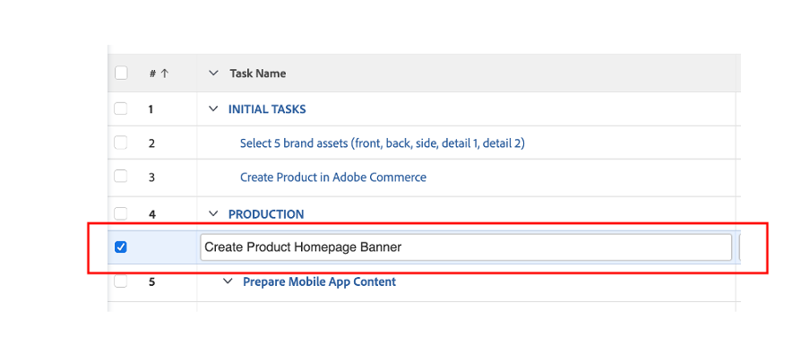

# Otros trabajos previos al trabajo

## Seleccione Brand Assets

Como se describe en el informe creativo, hay algunos activos que se necesitarán para iniciar nuestra campaña de forma eficaz. Estos activos de marca se añadirán a la campaña en Workfront para que tengamos acceso a ellos de forma centralizada.

- Expanda la tarea 1, &quot;TAREAS INICIALES&quot;, a continuación, abra la tarea &quot;Seleccionar 5 recursos de marca (anterior, posterior, ...)&quot; haciendo clic en ella.

- Haga clic en &#39;Documentos&#39; y luego en &#39;Añadir nuevo:

- Seleccione &quot;De experience-manager&quot;, lo que nos permite elegir los activos de marca que ya están disponibles en los AEM Assets:

- Una vez que aparezca la jerarquía de carpetas de AEM, vaya a la siguiente ruta: experience-manager > Adobe Assets > Bike shots Seleccione 5 recursos y haga clic en &quot;Vincular&quot;.

- Ahora tenemos nuestros recursos de marca en nuestra tarea. Esto significa que podemos establecer la tarea 2 como 100% completada:

## Demostración de Adobe Commerce

Adobe Commerce es uno de los muchos productos de Adobe Experience Cloud que puede ayudarle a ofrecer las mejores experiencias digitales a sus clientes. Sin embargo, simplemente hubo muy poco tiempo para hacer todo juntos durante el bootcamp.

Este vídeo le hará familiarizarse con Adobe Commerce y le mostrará el producto que hemos creado para utilizarlo durante el bootcamp. En un escenario en tiempo real, cargaría los recursos de marca seleccionados anteriormente en Adobe Commerce a la configuración del producto.

>[!VIDEO](https://video.tv.adobe.com/v/3418945?quality=12&learn=on&enablevpops)

Una vez completada esta tarea, puede marcar la tarea 3 como completada al 100 % en Workfront.

## Las campañas flexibles son un requisito previo

Al revisar nuestro plan de trabajo, observamos un pequeño problema: nuestro gestor de producto (el solicitante) ha puesto una actualización que olvidó solicitar para un &quot;titular de la página principal del producto&quot;.  Esto se agregará al plan del proyecto.

- Vaya a la lista de tareas y añada la tarea &quot;Crear titular de la página principal del producto&quot; justo debajo de la tarea 4 &quot;PRODUCCIÓN&quot;. Para ello, seleccione la tarea &quot;Preparar contenido de la aplicación móvil&quot; y haga clic en el icono &quot;Añadir tarea arriba&quot;:

- Asigne un nombre significativo a la tarea agregada, como &quot;Crear titular de página principal del producto&quot;.

- Ahora que hemos creado la tarea, vamos a agregarle algo de contenido. Haga clic en los tres puntos a la derecha del título del proyecto y seleccione &quot;Adjuntar plantilla&quot;:

- Seleccione &quot;Crear titular de la página de inicio del producto&quot; y haga clic en &quot;Personalizar y adjuntar&quot;:

- En la pantalla de personalización, asegúrese de mencionar la tarea &quot;Crear titular de la página de inicio del producto&quot; como principal:

- Finalmente, asegúrese de marcar la tarea principal &quot;Crear página de inicio del producto&quot; con una tarea predecesora de la tarea 3, ya que no se puede iniciar ninguna producción hasta que se cree el producto en Adobe Commerce:

Ahora tenemos una campaña completa y planificada, lo que significa que ahora podemos empezar con la producción y entrega de nuestra campaña.

Paso siguiente: [Fase 2 - Producción: Crear titular de la página principal del producto](../production/banner.md)

[Volver a la fase 1: Planificación: Planificación](./planning.md)

[Volver a todos los módulos](../../overview.md)
