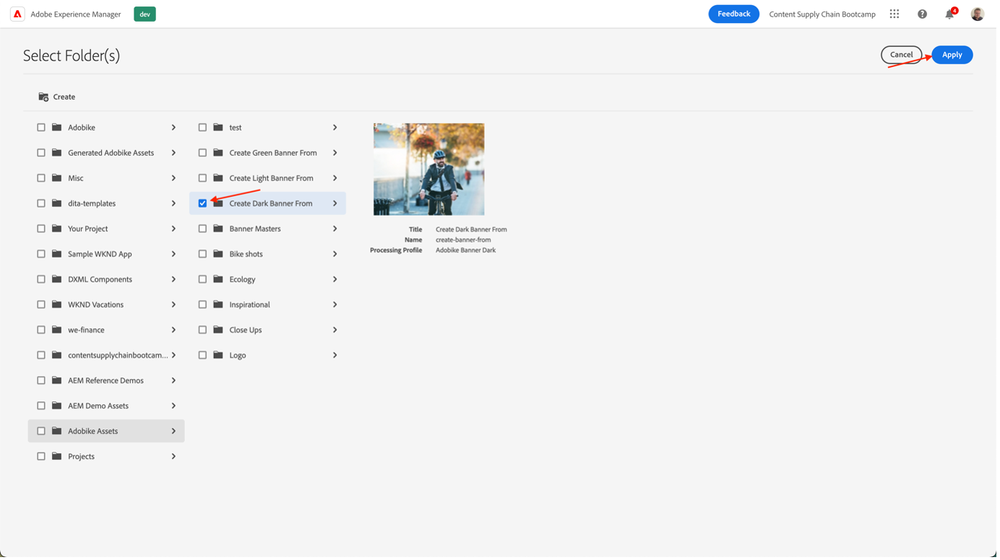
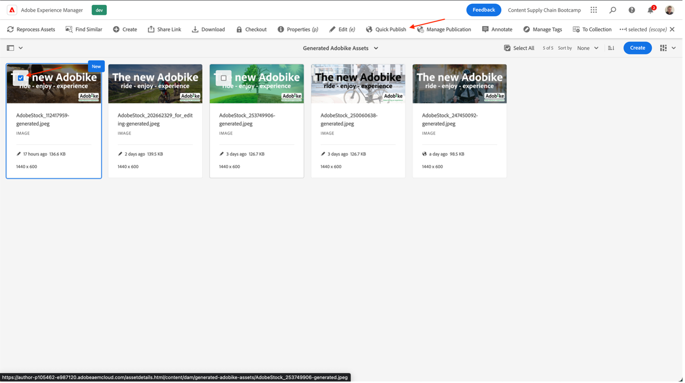

# Crear titular de página principal del producto

## Producción del titular

La automatización de contenido lleva la potencia de Adobe Creative Cloud a Experience Manager Assets, lo que permite a los especialistas en marketing automatizar la producción de recursos a escala, lo que acelera considerablemente la creación de variaciones. ¡Usemos estas funcionalidades para generar un banner que se usará en la página principal!

- AEM Vaya al autor del en [https://author-p105462-e991028.adobeaemcloud.com/](https://author-p105462-e991028.adobeaemcloud.com/) e inicie sesión con las credenciales que proporcionamos.

- En la página de inicio, vaya a Herramientas \> Assets \> Perfiles de procesamiento.

- En la interfaz, verá todos los perfiles de procesamiento existentes. Pueden utilizarse hasta para habilitar determinadas automatizaciones.

- Los siguientes son de interés para usted:
   - Adobike Banner Dark: crea un banner de Adobike con una superposición oscura, en función del recurso seleccionado

     
   - Adobike Banner Light: crea un banner de Adobike con una superposición de luz en función del recurso seleccionado

     
   - Adobike Banner Green: crea un banner de Adobike con una superposición verde, en función del recurso seleccionado

     

- Una vez que haya elegido el tipo de titular que desea crear, seleccione ese perfil de procesamiento y, a continuación, seleccione &quot;Aplicar perfil a las carpetas&quot;.

- En la pantalla siguiente, vaya a la carpeta de su equipo en AEM Assets. A continuación, en la parte superior izquierda, seleccione el botón &quot;Crear&quot; para crear una nueva carpeta y asignarle un nombre significativo, por ejemplo, &quot;Crear titular oscuro&quot;.

- Después de crear la carpeta, marque la casilla junto a su nombre y luego haga clic en el botón &quot;Aplicar&quot; en la parte superior derecha.

Ahora que hemos realizado la configuración necesaria, vamos a generar nuestro banner.

- AEM Haga clic en el logotipo de la, en la esquina superior izquierda, para abrir el menú de navegación y, a continuación, vaya a Navegación \> Assets \> Archivos.

- Busque la carpeta &quot;Generated Adobe Assets&quot; y ábrala haciendo clic en la tarjeta. Aquí es donde aparecerán los titulares generados.

- Abra una pestaña nueva y vuelva a navegar a AEM Assets. A continuación, vaya a la carpeta a la que aplicamos el perfil de procesamiento.

- En la carpeta, cargue la imagen para la que desee crear un titular arrastrándola y soltándola en el explorador o haciendo clic en Crear \> archivos en la esquina superior derecha de la interfaz.

- Espere un minuto para que el recurso se procese y vuelva a cargar la pantalla. Si ve el recurso en estado &quot;Nuevo&quot;, sabe que ya se ha procesado.

- Vuelva a la pestaña anterior y vuelva a cargar la pantalla aquí también. Debe ver un nuevo recurso con el estado &quot;Nuevo&quot;. Este es nuestro banner generado, todo desde DAM. ¿No lo ves todavía? Espere otro minuto y vuelva a cargar la pantalla.

>[!NOTE]
>
> ¿No está satisfecho con el resultado? No dude en aplicar otro perfil de procesamiento a su carpeta y volver a cargar su recurso para generar un titular diferente (o cargar otro recurso, por supuesto). Durante la recarga, el sistema le preguntará qué desea hacer con el recurso existente y seleccionará &quot;Reemplazar&quot;.
>  existente

Ahora tenemos nuestro banner generado que podemos usar más adelante durante la entrega de nuestra campaña. Asegúrese de publicar el banner seleccionándolo y haciendo clic en el botón &quot;Quick Publish&quot; en la cinta de opciones.

## Seguimiento en Workfront

Si necesita un proceso formal y auditable de revisión y aprobación de su Assets, Workfront es el lugar para estar.

>[!NOTE]
>
> Aunque lo mencionamos aquí explícitamente, es la intención actualizar las tareas en Workfront después de haberlas finalizado. Siempre debe esforzarse por lograr un flujo de trabajo Crear > Revisar > Aprobar.

- Volvamos a nuestro proyecto y expandamos el acordeón &quot;Go/No Go Banner Review&quot; para abrir dicha tarea haciendo clic en ella:

- Haga clic en la sección de documentos de la tarea (columna izquierda) y, a continuación, haga clic en la carpeta vinculada de AEM Assets &quot;Final&quot;. Seleccione el recurso haciendo clic en su zona y luego en &quot;Crear prueba&quot;. Una prueba es la capacidad de revisar el contenido, por ejemplo, imágenes, textos, vídeos, sitios web, etc., de forma estructurada y colaborativa, donde se recopilan los comentarios, las correcciones, las modificaciones de las partes interesadas, las versiones y los resultados se pueden comparar y aprobar definitivamente con un solo clic.

- Como queremos un proceso de aprobación detallado, seleccione &quot;Advanced Proof&quot;.

>[!NOTE]
>
> Vamos a decidir manualmente quién revisará y/o aprobará nuestra prueba en este bootcamp. En la mayoría de los casos de uso reales, utilizaríamos una plantilla preestablecida de flujos de aprobación ya definidos para cada tipo de prueba.

- De forma predeterminada, estamos en un flujo de trabajo de tipo &quot;básico&quot; y vamos a seleccionar a su Workfront Bootcamp Specialist como revisor y aprobador. Escriba el nombre de su especialista de Bootcamp Workfront donde dice &#39;Escriba el nombre de contacto o la dirección de correo electrónico para agregar un destinatario:

- Configúrelos como &quot;Revisor y aprobador&quot;:

- Haga clic en &quot;Crear revisión&quot;. Workfront tardará unos momentos en generar la revisión:

- Su especialista de Workfront habrá recibido una nueva notificación que le informará de que tiene una prueba que revisar o aprobar:

- Después de hacer clic en la notificación, se enfrentan a su prueba y pueden hacer algunos comentarios y / o aprobar esta prueba.

   - Pueden hacer clic en &quot;Agregar comentario&quot; en la parte superior de la pantalla si tienen comentarios:

  

   - Así, podrán no solo añadir comentarios, sino también utilizar los pequeños punteros-barra de herramientas para definir claramente qué área necesita cambiar.

  

   - Al agregar el comentario, pueden hacerle saber que necesita hacer algún trabajo adicional en una nueva versión de la prueba. Actualice la pestaña Workfront y tendrá una nueva notificación que le informará exactamente de eso. AEM Una vez que sepa qué cambios tiene que hacer, realice los cambios en la versión de y, a continuación, venga y cargue la nueva versión aquí:

  

   - Seleccione el recurso actualizado (si no es necesario realizar cambios en el escenario de bootcamp, vuelva a cargar el mismo recurso) y haga clic en &quot;Link&quot;:

  

   - A continuación, haga clic en &quot;crear prueba&quot; en la parte derecha.

  

   - Una vez generada la revisión (puede tardar unos momentos), su especialista de Workfront recibirá una notificación y podrá revisarla y, con suerte, aprobarla.  Por ejemplo, usando el botón de comparación de pruebas, pueden ver una comparación de V1 y V2 en paralelo con todos los comentarios realizados.

  

  

  

Ahora tenemos una aprobación formal para el uso de nuestro banner. Es fácil seguir en qué parte del proceso nos encontramos, y las actualizaciones que hace automáticamente almacenan en déclencheur las notificaciones, para que pueda trabajar de una manera lo más eficiente posible.

Paso siguiente: [Fase 2 - Producción: Crear anuncio de medios sociales](./social.md)

[Volver a la fase 1: Planificación: otros trabajos previos](../planning/prework.md)

[Volver a todos los módulos](../../overview.md)
