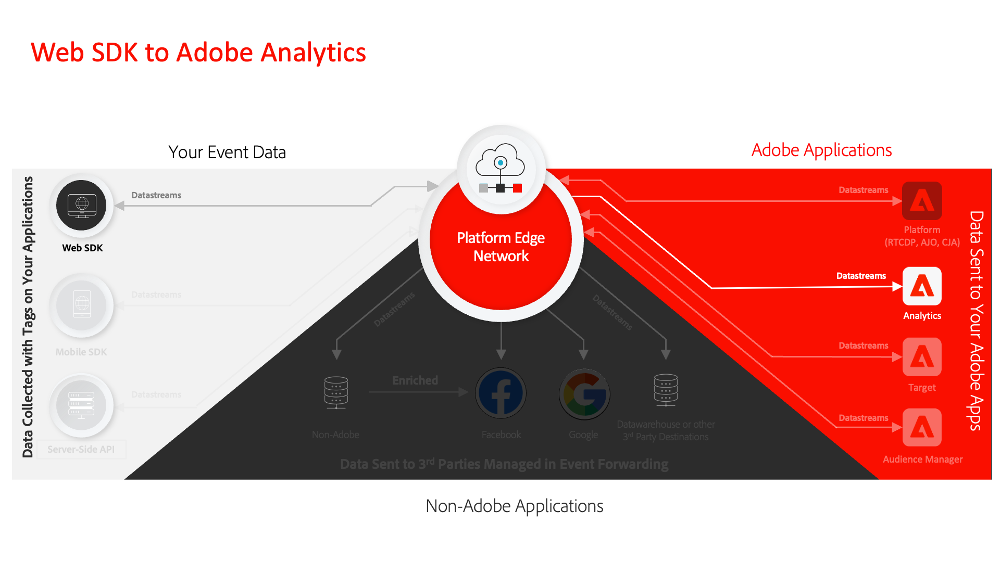

# Tutoriales de recopilación de datos

La recopilación de datos es la próxima generación de funcionalidades de administración de etiquetas de sitios web y SDK móvil de Adobe. La recopilación de datos ofrece a los clientes una alternativa sencilla para implementar y gestionar las soluciones de análisis, marketing y publicidad necesarias para potenciar las importantes experiencias del cliente. Utilice estos vídeos y tutoriales para aprender sobre esta tecnología esencial.

## Guías de migración

<table>
<tr>
  <td>
    
    

      <a href="https://experienceleague.adobe.com/es/docs/platform-learn/migrate-target-to-websdk/introduction" target="_blank">
    <strong>Migrar Adobe Target a Web SDK</strong>
    </a>
    

    

    <em>Reemplazar at.js por Web SDK</em>
    

  </td>
  <td>
    
    

      <a href="https://experienceleague.adobe.com/es/docs/platform-learn/migrate-analytics-to-websdk/migration-to-websdk-overview" target="_blank">
    <strong>Migrar Adobe Analytics a Web SDK en etiquetas</strong>
    </a>
    

    

    <em>Reemplazar AppMeasurement.js por Web SDK con etiquetas</em>
    

  </td>
  <td>
      
    </a>
    

      <strong>Migrar Adobe Audience Manager a Web SDK</strong>
    

    

    <em>Reemplazar <a href="https://experienceleague.adobe.com/es/docs/audience-manager/user-guide/migrate-to-web-sdk/dil-extension-to-web-sdk" target="_blank">dil.js</a> o <a href="https://experienceleague.adobe.com/es/docs/audience-manager/user-guide/migrate-to-web-sdk/appmeasurement-to-web-sdk" target="_blank">actualizar reenvío del lado del servidor</a></em>
    

  </td>
</tr>
<tr>
  <td>
    
    

      <a href="https://experienceleague.adobe.com/es/docs/platform-learn/migrate-target-to-mobile-sdk-decisioning/overview" target="_blank">
    <strong>Migrar Adobe Target a SDK móvil en Edge Network</strong>
    </a>
    

    

    <em>Reemplace la extensión de Target con la extensión Journey Optimizer - Decisioning</em>
    

  </td>
  <td>
  </td>
  <td>
  </td>
  </tr>
</table>

## Guías de implementación

<table>
<tr>
  <td>
    
    

      <a href="https://experienceleague.adobe.com/es/docs/platform-learn/implement-web-sdk/overview" target="_blank">
    <strong>Implementar Experience Cloud con Web SDK</strong>
    </a>
    

    

    <em>Usar etiquetas para implementar Platform Web SDK</em>
    

  </td>
  <td>
    
    

      <a href="https://experienceleague.adobe.com/es/docs/platform-learn/implement-mobile-sdk/overview" target="_blank">
    <strong>Implementar Experience Cloud en aplicaciones móviles</strong>
    </a>
    

    

    <em>Usar etiquetas para implementar Platform Mobile SDK</em>
    

  </td>
  <td>
    
    

      <a href="https://experienceleague.adobe.com/es/docs/platform-learn/migrate-target-to-websdk/introduction" target="_blank">
    <strong>Implementar bibliotecas heredadas con etiquetas</strong>
    </a>
    

    

    <em>Use etiquetas para implementar bibliotecas heredadas de Analytics, Target y Audience Manager</em>
    

  </td>
</tr>
</table>

*Apple, el logotipo de Apple, iPad, iPhone, iPod y iPod Touch son marcas comerciales de Apple Inc., registradas en Estados Unidos y otros países. Swift y el logotipo de Swift son marcas comerciales de Apple Inc.*
