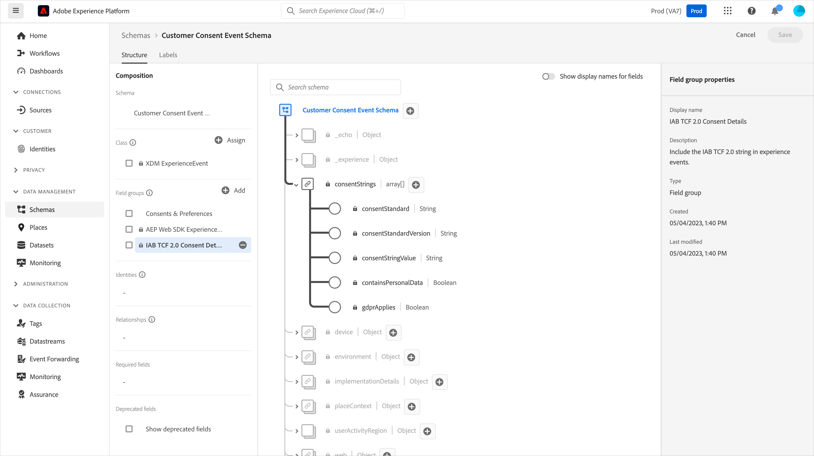
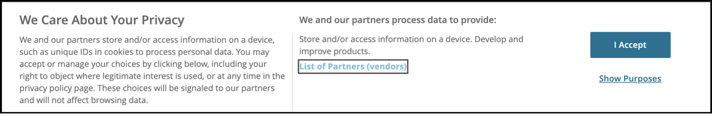
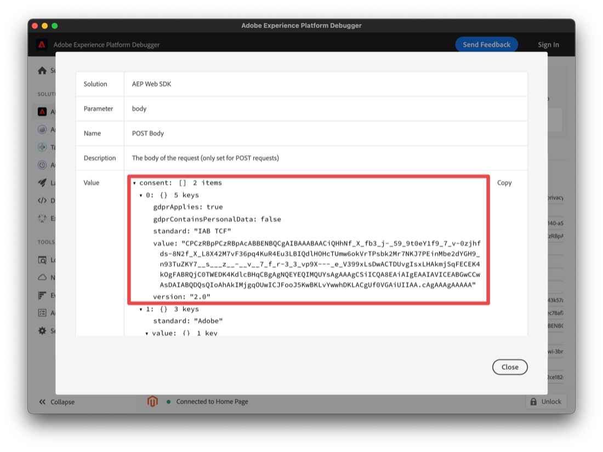

# Implemente el consentimiento con una plataforma de administración de consentimiento (CMP) mediante la extensión web SDK de Platform

Muchas regulaciones legales de privacidad han introducido requisitos para el consentimiento activo y específico cuando se trata de recopilación de datos, personalización y otros casos de uso de marketing. Para satisfacer estos requisitos, Adobe Experience Platform le permite capturar información de consentimiento en perfiles de clientes individuales y utilizar esas preferencias como factor determinante en el modo en que los datos de cada cliente se utilizan en flujos de trabajo de Platform descendentes.

>[!NOTE]
>
>Adobe Experience Platform Launch se está integrando en Adobe Experience Platform como un conjunto de tecnologías de recopilación de datos. Se han implementado varios cambios terminológicos en la interfaz que debe tener en cuenta al usar este contenido:
>
> * El platform launch (lado del cliente) ya está **[[!DNL tags]](https://experienceleague.adobe.com/docs/experience-platform/tags/home.html?lang=es)**
> * El servidor de platform launch está ahora **[[!DNL event forwarding]](https://experienceleague.adobe.com/docs/experience-platform/tags/event-forwarding/overview.html)**
> * Las configuraciones de Edge ahora **[[!DNL datastreams]](https://experienceleague.adobe.com/docs/experience-platform/edge/fundamentals/datastreams.html?lang=es)**


Este tutorial muestra cómo implementar y activar datos de consentimiento obtenidos de una plataforma de administración de consentimiento (CMP) mediante la extensión del SDK web de plataforma en la recopilación de datos. Haremos esto utilizando tanto los estándares de Adobe como el estándar de consentimiento IAB TCF 2.0, con OneTrust o Sourcepoint como CMP de ejemplo.

Este tutorial utiliza la extensión web SDK de Platform para enviar datos de consentimiento a Platform. Para obtener una descripción general del SDK web, consulte [esta página](https://experienceleague.adobe.com/docs/experience-platform/edge/home.html?lang=es).

## Requisitos previos

Se enumeran los requisitos previos para utilizar el SDK web [here](https://experienceleague.adobe.com/docs/experience-platform/edge/fundamentals/prerequisite.html#fundamentals).

En esa página, existe un requisito para un &quot;conjunto de datos de evento&quot; y, al igual que parece, este es un conjunto de datos para contener los datos de evento de experiencia. Para enviar información de consentimiento con eventos, la variable [Detalles de consentimiento TCF 2.0 de IAB](https://experienceleague.adobe.com/docs/experience-platform/landing/governance-privacy-security/consent/iab/dataset.html) el grupo de campos debe agregarse al esquema de Experience Event :



Para el estándar de consentimiento de plataforma v2.0, también necesitamos acceso a Adobe Experience Platform para crear un esquema y conjunto de datos de perfil individual XDM. Para ver un tutorial sobre la creación de esquemas, consulte [Creación de un esquema mediante el Editor de esquemas](https://experienceleague.adobe.com/docs/experience-platform/xdm/tutorials/create-schema-ui.html#tutorials) y para el grupo de campos Detalles de consentimiento y preferencia requerido, consulte [Configuración de un conjunto de datos para capturar datos de consentimiento y preferencias](https://experienceleague.adobe.com/docs/experience-platform/landing/governance-privacy-security/consent/adobe/dataset.html).

Este tutorial supone que tiene acceso a la recopilación de datos y ha creado una propiedad Etiquetas del lado del cliente con la extensión SDK web instalada y una biblioteca de trabajo creada para el desarrollo. Estos temas se detallan y se muestran en estos documentos:

* [Creación o configuración de una propiedad](https://experienceleague.adobe.com/docs/experience-platform/tags/admin/companies-and-properties.html?lang=en#create-or-configure-a-property)
* [Resumen de las bibliotecas](https://experienceleague.adobe.com/docs/experience-platform/tags/publish/libraries.html)
* [Información general sobre la publicación](https://experienceleague.adobe.com/docs/experience-platform/tags/publish/overview.html?lang=es)

También usaremos el [Platform Debugger](https://chrome.google.com/webstore/detail/adobe-experience-platform/bfnnokhpnncpkdmbokanobigaccjkpob) Extensión de Chrome para inspeccionar y validar nuestra implementación.

Para implementar el ejemplo de TCF de IAB con una CMP en su propio sitio, necesitará acceder a una CMP como OneTrust o Sourcepoint para generar los datos que proporcionan, o simplemente puede seguir aquí y ver los resultados a continuación.

## Uso del SDK web con el estándar de consentimiento de Adobe (v1.0 o v2.0)

>[!NOTE]
>
>El estándar 1.0 se está eliminando gradualmente en favor de v2.0. El estándar 2.0 permite agregar datos de consentimiento adicionales que se pueden utilizar para aplicar manualmente las preferencias de consentimiento. Las capturas de pantalla siguientes de la extensión web SDK de Platform son de la versión . [2.4.0](https://experienceleague.adobe.com/docs/experience-platform/edge/release-notes.html#version-2.4.0) de la extensión compatible con v1.0 o v2.0 del estándar de consentimiento de Adobe.

Para obtener más información sobre estos estándares, consulte [Compatibilidad con las preferencias de consentimiento del cliente](https://experienceleague.adobe.com/docs/experience-platform/edge/consent/supporting-consent.html).

### Paso 1: Configurar el consentimiento en la extensión web SDK

Después de instalar la extensión web SDK de Platform en una propiedad Tags , podemos configurar las opciones para abordar los datos de consentimiento en la pantalla de configuración de la extensión:


La sección &quot;Privacidad&quot; establece el nivel de consentimiento del SDK si el usuario no ha proporcionado previamente preferencias de consentimiento. Esto establece el estado predeterminado para la recopilación de datos de consentimiento y evento en el SDK. La configuración elegida responde a la pregunta &quot;¿qué debe hacer el SDK si el usuario aún no ha proporcionado preferencias de consentimiento explícitas?&quot;

* En : recopile eventos que se producen antes de que el usuario proporcione preferencias de consentimiento.
* Salida : suelte los eventos que se producen antes de que el usuario proporcione las preferencias de consentimiento.
* Pendiente : eventos de cola que se producen antes de que el usuario proporcione las preferencias de consentimiento.
* Proporcionado por un elemento de datos

Si la configuración de consentimiento predeterminada es &quot;En&quot;, esto indica al SDK que no debe esperar al consentimiento explícito y que debe recopilar los eventos que se producen antes de que el usuario proporcione las preferencias de consentimiento. Estas preferencias generalmente se gestionan y almacenan en una CMP.

Si la configuración de consentimiento predeterminada es &quot;Fuera&quot;, esto indica al SDK que no debe recopilar ningún evento que se produzca antes de que se establezcan las preferencias de inclusión del usuario. La actividad de visitante que se produce antes de establecer la preferencia de consentimiento no se incluye en ningún dato enviado por el SDK después de que se haya establecido el consentimiento. Por ejemplo, si se desplaza y ve una página web antes de seleccionar el banner de consentimiento y se utiliza esta configuración &quot;Fuera&quot;, la actividad de desplazamiento y el tiempo de visualización no se enviarán si el usuario proporciona más adelante un consentimiento explícito para la recopilación de datos.

Si la configuración de consentimiento predeterminada es &quot;Pendiente&quot;, el SDK pondrá en cola los eventos que se produzcan antes de que el usuario proporcione preferencias de consentimiento, de modo que los eventos se puedan enviar después de establecer las preferencias de consentimiento y después de que el SDK se haya configurado inicialmente durante una visita.

Con esta configuración &quot;Pendiente&quot;, al intentar ejecutar cualquier comando que requiera preferencias de inclusión del usuario (por ejemplo, el comando event), el comando se pondrá en cola dentro del SDK. Estos comandos no se procesan hasta que no haya comunicado las preferencias de inclusión del usuario al SDK.

Una vez que una CMP recopila las preferencias del usuario, podemos comunicar dichas preferencias al SDK. En una sección posterior a continuación, se muestra cómo obtener esos datos de inclusión y utilizarlos con la extensión Web SDK.

&quot;Proporcionado por elemento de datos&quot; nos permite acceder a un elemento de datos que contiene cualquier dato de preferencia de consentimiento capturado por código personalizado o una CMP en su sitio o en su capa de datos. Un elemento de datos usado para este propósito debe resolver en &quot;in&quot;, &quot;out&quot; o &quot;pending&quot;.

Tenga en cuenta: esta configuración para el SDK no se mantiene en los perfiles de los usuarios, sino que es específica para establecer el comportamiento del SDK antes de que el visitante proporcione las preferencias de consentimiento explícito.

Para obtener más información sobre la configuración de la extensión del SDK web, consulte la [Información general sobre la extensión del SDK web de plataforma](https://experienceleague.adobe.com/docs/experience-platform/edge/extension/web-sdk-extension-configuration.html?lang=en#configure-the-extension) y [Compatibilidad con las preferencias de consentimiento del cliente](https://experienceleague.adobe.com/docs/experience-platform/edge/consent/supporting-consent.html).

Para este ejemplo, vamos a elegir la opción &quot;Pendiente&quot; y seleccione **Guardar** para guardar los ajustes de configuración.

### Paso 2: Comunicar preferencias de consentimiento

Ahora que hemos establecido el comportamiento predeterminado del SDK, podemos utilizar etiquetas para enviar las preferencias de consentimiento explícito de un visitante a Platform. El envío de datos de consentimiento mediante el Adobe 1.0 o 2.0 estándar se implementa fácilmente mediante el `setConsent` acción del SDK web en las reglas de etiquetas.

#### Configuración del consentimiento con Platform Consent Standard 1.0

Vamos a crear una regla para demostrarlo. En la propiedad de etiquetas de Platform, seleccione Reglas y, a continuación, en el botón azul Agregar reglas . Asignemos a la regla el nombre &quot;setAdobeConsent&quot; y seleccione esta opción para agregar un evento. Para el Tipo de evento, elija &quot;Window Loaded&quot; (Ventana cargada) que almacenará en déclencheur esta regla cada vez que se cargue una página en nuestro sitio web. A continuación, en &quot;Acciones&quot;, seleccione &quot;Agregar&quot; para abrir la pantalla de configuración de acciones. Aquí es donde estableceremos los datos de consentimiento. Seleccione la lista desplegable &quot;Extensión&quot; y seleccione &quot;Platform Web SDK&quot;, luego seleccione &quot;Tipo de acción&quot; y seleccione &quot;Establecer consentimiento&quot;.

En &quot;Información de consentimiento&quot;, elija &quot;Rellenar un formulario&quot;. En esta acción de regla, se utilizará el SDK web para establecer el consentimiento para el estándar de consentimiento de Adobe 1.0 rellenando el formulario mostrado:


Podemos elegir pasar &quot;En&quot;, &quot;Fuera&quot; o &quot;Proporcionado por elemento de datos&quot; con esta acción Definir consentimiento. Un elemento de datos aquí debe resolver en &quot;in&quot; o &quot;out&quot;.

En este ejemplo, seleccione &quot;En&quot; para indicar que el visitante ha consentido en permitir que el SDK web envíe datos a Platform. Seleccione el botón azul &quot;Conservar cambios&quot; para guardar esta acción y luego &quot;Guardar&quot; para guardar esta regla.

Nota: Una vez que el visitante de un sitio web se ha excluido, el SDK no le permite establecer el consentimiento de los usuarios en .

Las reglas de etiquetas se pueden activar mediante una variedad de elementos integrados o personalizados [events](https://experienceleague.adobe.com/docs/experience-platform/tags/extensions/adobe/core/overview.html) que se puede utilizar para pasar estos datos de consentimiento en el momento adecuado durante una sesión del visitante. En el ejemplo anterior, se ha utilizado el evento window loaded para almacenar en déclencheur la regla. En una sección posterior, se utilizará un evento de preferencia de consentimiento de una CMP para almacenar en déclencheur una acción de Establecer consentimiento. Puede utilizar una acción Definir consentimiento en una regla activada por cualquier evento que prefiera que indique una configuración de preferencia de inclusión.

#### Configuración del consentimiento con Platform Consent Standard 2.0

La versión 2.0 del estándar de consentimiento de Platform funciona con [XDM](https://experienceleague.adobe.com/docs/platform-learn/tutorials/schemas/schemas-and-experience-data-model.html?lang=es) datos. También requiere añadir el grupo de campos Consentimiento y Detalles de preferencia al esquema de perfil en Platform. Consulte [Procesamiento de consentimiento en Platform](https://experienceleague.adobe.com/docs/experience-platform/landing/governance-privacy-security/consent/adobe/overview.html) para obtener más información sobre Adobe standard versión 2.0 y este grupo de campos.

Crearemos un elemento de datos de código personalizado para pasar datos a las propiedades de recopilación y metadatos del objeto de consentimientos mostrado en el esquema siguiente:


Este grupo de campos Consentimientos y Detalles de preferencia contiene campos para la variable [Tipo de datos XDM consentimientos y preferencias](https://experienceleague.adobe.com/docs/experience-platform/xdm/data-types/consents.html#prerequisites) que contendrán los datos de preferencia de consentimiento que enviamos a Platform con la extensión web SDK de Platform en nuestra acción de regla. Actualmente, las únicas propiedades necesarias para implementar Platform Consent Standard 2.0 son el valor recopilado (val) y el valor de tiempo de los metadatos, resaltados arriba en rojo.

Vamos a crear un elemento de datos para estos datos. Seleccione Elementos de datos y el botón azul Añadir elemento de datos . Llamemos a esto &quot;xdm-permission 2.0&quot; y, utilizando la extensión principal, seleccionaremos un tipo de código personalizado. Puede introducir o copiar y pegar los siguientes datos en la ventana del editor de código personalizado:

```js
var dateString = new Date().toISOString();

return {
  collect: {
    val: "y"
  },
  metadata: {
    time: dateString
  }
}
```

El campo de hora debe especificar cuándo el usuario actualizó por última vez sus preferencias de consentimiento. Aquí estamos creando una marca de tiempo como ejemplo utilizando un método estándar en el objeto JavaScript Date. Seleccione Guardar para guardar el código personalizado y vuelva a seleccionar Guardar para guardar el elemento de datos.

A continuación, vamos a seleccionar Reglas y, a continuación, el botón azul Agregar regla e introduzca el nombre &quot;setConsent onLoad - Consent 2.0&quot;. Vamos a elegir el evento Window Loaded como nuestro déclencheur de reglas y, a continuación, seleccione Add en Actions. Elija la extensión del SDK web de plataforma y, en Tipo de acción, seleccione Establecer consentimiento. El Estándar debe ser Adobe y la Versión debe ser 2.0. Para Value, utilizaremos el elemento de datos que acabamos de crear que contiene los valores de tiempo y recopilación que necesitamos enviar a Platform:


Para revisar esta acción de ejemplo, estamos llamando a Set Consent desde la extensión web SDK de Platform y pasando el Standard y la Version desde el formulario, mientras se pasan los valores para recopilar y el tiempo desde el elemento de datos que hemos creado anteriormente.

Seleccione el botón azul Guardar y, de nuevo, para guardar la regla.

Ahora tenemos dos reglas, una para cada uno de los estándares de consentimiento de plataforma. En la práctica, es probable que elija un estándar en los sitios. A continuación, crearemos un ejemplo con el estándar de consentimiento IAB TCF 2.0.

## Uso del SDK web con el estándar de consentimiento TCF 2.0 de IAB

Puede obtener más información sobre la versión 2.0 del marco de transparencia y consentimiento de IAB en la [Sitio web de la IAB Europe](https://iabeurope.eu/transparency-consent-framework/).

Para establecer los datos de preferencias de consentimiento mediante este estándar, se debe añadir el grupo de campos de esquema de detalles de consentimiento TCF de IAB 2.0 a nuestro esquema de eventos de experiencia en Platform:


Este grupo de campos contiene los campos de preferencia de consentimiento requeridos por el estándar IAB TCF 2.0. Para obtener más información sobre esquemas y grupos de campos, consulte la [Información general del sistema XDM](https://experienceleague.adobe.com/docs/experience-platform/xdm/home.html?lang=es).

### Paso 1: Creación de un elemento de datos de consentimiento

Para enviar datos de evento de consentimiento desde etiquetas utilizando el estándar de consentimiento IAB TCF 2.0, primero configuramos un elemento de datos xdm con los campos de consentimiento necesarios:


En la propiedad del lado del cliente de etiquetas, seleccione Elementos de datos y el botón azul &quot;Añadir elemento de datos&quot;. Para este ejemplo, llamaremos a este elemento de datos &quot;xdm-permissionStrings&quot;. Estos campos xdm contendrán los datos de consentimiento del usuario requeridos para el estándar IAB TCF 2.0.

En el menú desplegable Extensión , elija &quot;Platform Web SDK&quot; y, para Tipo de elemento de datos, elija &quot;XDM Object&quot;. El mapeador xdm debería aparecer, permitiéndole seleccionar y expandir el elemento &quot;permissionStrings&quot; como se muestra en la captura de pantalla anterior.

Estableceremos cada una de las cadenas de consentimiento de la siguiente manera:

* **`consentStandard`**:  `IAB TCF`
* **`consentStandardVersion`**:  `2.0`
* **`consentStringValue`**:  `%IAB TCF Consent String%`
* **`containsPersonalData`**:  `False` (seleccionado en el botón Seleccionar valor )
* **`gdprApplies`**:  `%IAB TCF Consent GDPR%`

La variable `consentStandard` y `consentStandardVersion` los campos son solo cadenas de texto para el estándar que estamos utilizando, que es IAB TCF versión 2.0. La variable `consentStringValue` hace referencia a un elemento de datos llamado &quot;Cadena de consentimiento TCF de IAB&quot;. Los signos porcentuales que rodean el texto indican el nombre de un elemento de datos y lo veremos en un momento. La variable `containsPersonalData` El campo indica si la cadena de consentimiento TCF 2.0 de IAB contiene datos personales con &quot;True&quot; o &quot;False&quot;. La variable `gdprApplies` El campo indica que se aplica &quot;true&quot; para el RGPD, que no se aplica &quot;false&quot; para el RGPD o que no se define si se aplica el RGPD. Actualmente, el SDK web tratará &quot;undefined&quot; como &quot;true&quot;, por lo que los datos de consentimiento enviados con &quot;gdprApplied: undefined&quot; se tratará como si el visitante estuviera ubicado en un área donde se aplica el RGPD.

Consulte la [documentación de consentimiento](https://experienceleague.adobe.com/docs/experience-platform/edge/consent/iab-tcf/with-launch.html#getting-started) para obtener más información sobre estas propiedades y sobre IAB TCF 2.0 en las etiquetas .

### Paso 2: Crear una regla para establecer el consentimiento con el estándar IAB TCF 2.0

A continuación, creamos una regla para establecer el consentimiento con el SDK web cuando un visitante del sitio web establece o cambia los datos de consentimiento para este estándar. En esta regla, también veremos cómo capturar esas señales de cambio de consentimiento de una CMP como [OneTrust](https://www.onetrust.com/products/cookie-consent/) o [Punto de origen](https://www.sourcepoint.com/cmp/).

#### Agregar un evento de regla

Seleccione la sección Reglas de la propiedad de etiqueta Plataforma y, a continuación, en el botón azul Agregar regla . Asignemos un nombre a la regla setConsent - IAB y seleccione Agregar en Eventos. Asigne un nombre a este evento tcfapi addEventListener y seleccione Abrir editor para abrir el editor de código personalizado.

Copie y pegue el siguiente código en la ventana del editor:

```js
// Wait for window.__tcfapi to be defined, then trigger when the customer has completed their consent and preferences.
function addEventListener() {
  if (window.__tcfapi) {
    window.__tcfapi("addEventListener", 2, function (tcData, success) {
      if (success && (tcData.eventStatus === "useractioncomplete" || tcData.eventStatus === "tcloaded")) {
        // save the tcData.tcString properties in data elements
        _satellite.setVar("IAB TCF Consent String", tcData.tcString);
        _satellite.setVar("IAB TCF Consent GDPR", tcData.gdprApplies);
        trigger();
      }
    });
  } else {
    // window.__tcfapi wasn't defined. Check again in 100 milliseconds
    setTimeout(addEventListener, 100);
  }
}
addEventListener();
```

Este código simplemente crea y ejecuta una función llamada `addEventListener`. La función comprueba si la variable `window.__tcfapi` existe, y si lo hace, añade un detector de eventos según las especificaciones de la API. Puede leer más sobre esas especificaciones en la [Repositorio IAB](https://github.com/InteractiveAdvertisingBureau/GDPR-Transparency-and-Consent-Framework) en GitHub. Si este detector de eventos se agrega correctamente y el visitante del sitio web ha completado sus opciones de consentimiento y preferencias, el código establece etiquetas variables personalizadas para la variable `tcData.tcString`y el indicador para las regiones del RGPD. De nuevo, para obtener más información sobre el TCF de IAB, consulte la IAB [sitio web](https://iabeurope.eu/transparency-consent-framework/) y [Repositorio de GitHub](https://github.com/InteractiveAdvertisingBureau/GDPR-Transparency-and-Consent-Framework) para obtener más información técnica. Después de establecer estos valores, el código ejecuta la función de déclencheur que déclencheur esta regla para ejecutarse.

Si la variable `window.__tcfapi` no existía la primera vez que se ejecutó esta función, la función la volverá a buscar cada 100 milisegundos, de modo que se pueda agregar el detector de eventos. La última línea de código simplemente ejecuta el `addEventListener` definida en las líneas de código que están encima de ella.

En resumen, creamos una función para comprobar el estado de consentimiento que establece un visitante del sitio web mediante un banner de consentimiento CMP (o personalizado). Cuando se establece esa preferencia de consentimiento, este código crea dos variables personalizadas (elementos de datos de código personalizado) que podemos utilizar en nuestra acción de regla. Después de pegar el código anterior en la ventana del editor de código personalizado de nuestro evento, seleccione el botón azul Guardar para guardar el evento de regla.

Ahora vamos a configurar la acción Configurar regla de consentimiento para utilizar estos valores y enviarlos a Platform.

#### Agregar una acción de regla

Seleccione Agregar en la sección Acciones . En Extensión, seleccione Platform Web SDK en la lista desplegable. En Tipo de acción, seleccione Definir consentimiento. Asignemos un nombre a esta acción setConsent.

En la configuración de acción en Información de consentimiento, seleccione Rellenar un formulario. Para Standard, elija IAB TCF y, para la versión, introduzca 2.0. Para el valor, utilizaremos la variable personalizada de nuestro evento e introduciremos `%IAB TCF Consent String%` que proviene del [tcData](https://github.com/InteractiveAdvertisingBureau/GDPR-Transparency-and-Consent-Framework/blob/master/TCFv2/IAB%20Tech%20Lab%20-%20CMP%20API%20v2.md#tcdata) hemos capturado en nuestro evento de regla, función personalizada anteriormente.

En Solicitudes de RGPD , utilizaremos la otra variable personalizada de nuestro evento e introduciremos `%IAB TCF Consent GDPR%` que también proviene del `tcData` hemos capturado en nuestro evento de regla, función personalizada anteriormente. Si sabe que el RGPD definitivamente se aplicará o no a los visitantes de este sitio web, puede seleccionar Sí o No, según corresponda, en lugar de usar la opción de variable personalizada (elemento de datos). También puede utilizar la lógica condicional en un elemento de datos para comprobar si se aplica el RGPD y devolver el valor adecuado.

En RGPD Contiene datos personales, seleccione la opción para indicar si los datos de este usuario contienen o no datos personales. Un elemento de datos aquí debe resolverse como verdadero o falso.


Seleccione el botón azul Guardar para guardar la acción y el botón azul Guardar (o Guardar en biblioteca) para guardar la regla. En este punto, ha implementado correctamente el elemento de datos y la regla en etiquetas para establecer el consentimiento mediante la extensión web SDK con el estándar de consentimiento IAB TCF 2.0.

### Paso 3: Guardar en biblioteca y crear

Si está utilizando la variable [biblioteca de trabajo](https://experienceleague.adobe.com/docs/launch-learn/implement-in-websites-with-launch/configure-tags/launch-data-elements-rules.html?lang=en#use-the-working-library-feature) requisito previo, ya ha guardado estos cambios y ha creado su biblioteca de desarrollo:


### Paso 4: Inspect y validación de la recopilación de datos

En nuestro sitio, actualizamos la página y confirmamos la compilación de la biblioteca en el [Debugger](https://chrome.google.com/webstore/detail/adobe-experience-cloud-de/ocdmogmohccmeicdhlhhgepeaijenapj) Extensión de Chrome, en la sección de menú de etiquetas:


También podemos inspeccionar la llamada setConsent para los estándares Adobe 1.0 o 2.0 en la sección Debugger Platform Web SDK, seleccionando en la línea de trabajo del POST en la solicitud de red donde ve `{"consent":[{"value":{"general":"in"},"version…`:


Para validar la llamada setConsent y nuestra regla para el estándar IAB TCF 2.0, utilizaremos el banner de consentimiento OneTrust en nuestro sitio de prueba para establecer nuestras preferencias de consentimiento y crear el tcData descrito anteriormente:



Después de seleccionar &quot;Acepto&quot;, podemos inspeccionar la llamada setConsent para el estándar IAB TCF 2.0 en la sección Debugger Platform Web SDK, seleccionando en la línea de trabajo del POST en la solicitud de red donde verá `{"consent":[{"value":"someAlphaNumericCharacters…`.



Aquí vemos los datos que configuramos anteriormente en nuestros elementos de datos y en la regla de etiquetas. La propiedad value contiene los datos codificados de tcString que vimos anteriormente.

OneTrust, Sourcepoint y otras CMP que implementan el estándar IAB TCF 2.0 producirán datos similares en nuestras páginas. Podemos capturar esos datos y utilizarlos con la extensión Web SDK en etiquetas mediante el evento de código personalizado en la regla que hemos creado anteriormente. El código personalizado será el mismo independientemente de la CMP utilizada para generar los datos de IAB TCF 2.0. El código personalizado también se puede utilizar con cualquiera de los estándares de consentimiento de plataforma (1.0 o 2.0).

## Envío de datos de consentimiento con eventos de experiencia

Puede que haya notado que no hacemos referencia al elemento de datos &quot;xdm-permissionStrings&quot; que hemos creado anteriormente en un campo de elemento de datos en cualquiera de nuestras reglas. Este elemento de datos se utiliza cuando necesita enviar datos de consentimiento con un evento de experiencia.


Dado que este elemento de datos contiene todos los campos requeridos para el estándar IAB TCF 2.0, simplemente puede hacer referencia al elemento de datos al enviar estos datos xdm con sus eventos de experiencia:


## Conclusión

Ahora que hemos inspeccionado y validado los datos, debe ver cómo implementar y activar los datos de consentimiento obtenidos de una CMP con la extensión web SDK de Platform para Platform.
