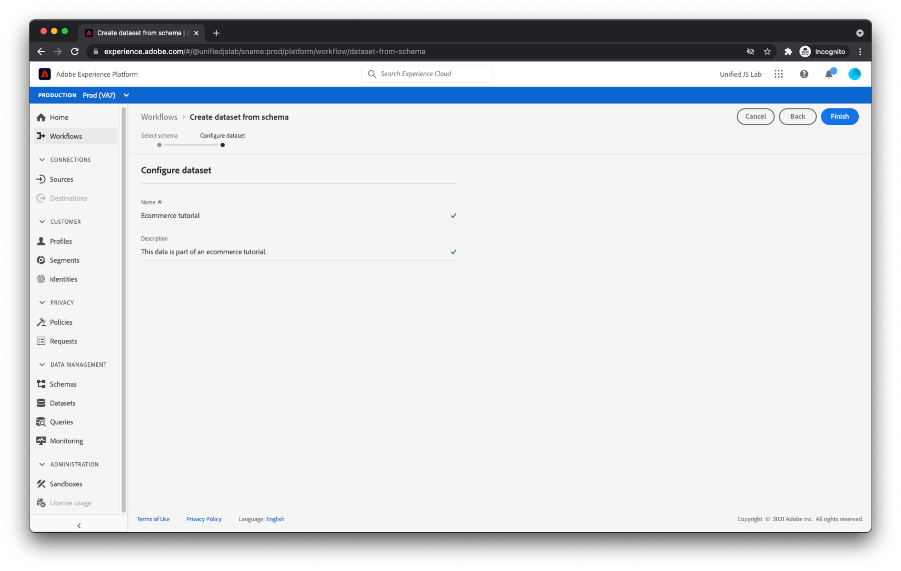

# Crear un conjunto de datos

Además de describir los datos que enviará a Adobe Experience Platform, necesita un lugar donde conservarlos. En Adobe Experience Platform, estos bloques en los que se pueden colocar datos se denominan conjuntos de datos.

Para crear un conjunto de datos, vaya a la [!UICONTROL Conjuntos de datos] dentro de Adobe Experience Platform.

Haga clic en [!UICONTROL Crear conjunto de datos] en la esquina superior derecha.

Durante el proceso de creación del conjunto de datos, seleccione [!UICONTROL Crear conjunto de datos a partir del esquema] y seleccione [el esquema que creó anteriormente](create-a-schema.md).

Haga clic en [!UICONTROL Siguiente] y proporcione un nombre y una descripción.

Haga clic en [!UICONTROL Finalizar]. El conjunto de datos se ha creado y está listo para recibir datos.

A medida que empiece a enviar datos a un conjunto de datos, Adobe Experience Platform validará que los datos que intenta colocar en el conjunto de datos se ajustan al esquema aplicado. Si los datos no se ajustan al esquema, los datos se rechazan y no se colocan en el conjunto de datos. Como resultado de este paso de validación, los consumidores del conjunto de datos (productos de Adobe, terceros o su propia empresa) pueden tener cierto nivel de certeza con respecto a la estructura y limpieza de los datos del conjunto de datos.

Para obtener más información sobre la creación de conjuntos de datos, consulte [Guía de la interfaz de usuario de conjuntos de datos](https://experienceleague.adobe.com/docs/experience-platform/catalog/datasets/user-guide.html?lang=es).
