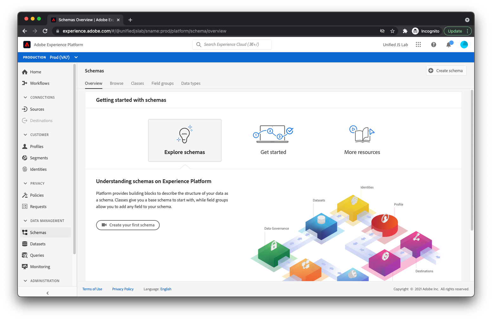

# Creación de un esquema

Como se explica en [Estructurar los datos](../structuring-your-data.md), los datos enviados a Adobe Experience Platform deben estar en XDM. Más específicamente, los datos deben coincidir con un _esquema_. Un esquema es básicamente una descripción del aspecto que deben tener los datos. Describe los nombres de los campos y dónde deben ubicarse dentro de los datos. También describe el tipo de valor que cada campo debe tener (por ejemplo, un booleano, una cadena con una longitud de 12 caracteres, una matriz de números).

Adobe Experience Platform proporciona algunos componentes básicos listos para usar conocidos como grupos de campos que son comunes en el sector. Por ejemplo, para el sector de los servicios financieros, existen grupos de campo para transferencias de saldos y solicitudes de préstamos. Para la industria de viajes y hospitalidad, hay grupos de campo para reservas de vuelo y alojamiento.

Se recomienda utilizar los grupos de campos integrados siempre que sea posible al crear el esquema. También comprendemos que puede necesitar campos específicos de su propia empresa. Por este motivo, puede crear sus propios grupos de campos personalizados para utilizarlos en los esquemas que cree.

Analicemos la creación de un esquema para un sitio web de comercio electrónico típico.

En primer lugar, vaya a la [!UICONTROL Esquemas] dentro de Adobe Experience Platform.

Select [!UICONTROL Crear esquema] en la esquina superior derecha. Se muestra un menú . Select [!UICONTROL XDM ExperienceEvent].

En este punto, se debería mostrar un cuadro de diálogo preguntando qué grupos de campos desea agregar al esquema. El primer grupo de campos que debe seleccionar es el grupo de campos denominado [!UICONTROL ExperienceEvent del SDK web de AEP]. Este grupo de campos agrega un conjunto de campos que admiten los datos recopilados automáticamente por el SDK web de Adobe Experience Platform.

Dado que el sitio web de este tutorial es un sitio web de comercio electrónico, también debe seleccionar la variable [!UICONTROL Detalles del comercio] grupo de campos. Este grupo le permite enviar datos de comercio típicos como los productos que se están viendo, añadidos al carro y comprados.

Haga clic en el [!UICONTROL Agregar grupos de campos] en la parte superior derecha del cuadro de diálogo. En este punto, debería ver la estructura del esquema.

Los grupos de campos que ha agregado se muestran a la izquierda. Al seleccionar un grupo de campos, se resaltan los campos de la derecha proporcionados por ese grupo de campos. Dedique un momento a explorar los campos disponibles.

Finalmente, seleccione [!UICONTROL Esquema sin título] hacia la izquierda de la pantalla, proporcione un nombre y una descripción a la derecha de la pantalla y haga clic en [!UICONTROL Guardar].

Se ha creado el esquema . A continuación, vamos a aprender a crear un conjunto de datos para albergar sus datos.

Para obtener más información sobre la creación de esquemas, consulte [Creación de un esquema (IU)](https://experienceleague.adobe.com/docs/experience-platform/xdm/tutorials/create-schema-ui.html?lang=es).
